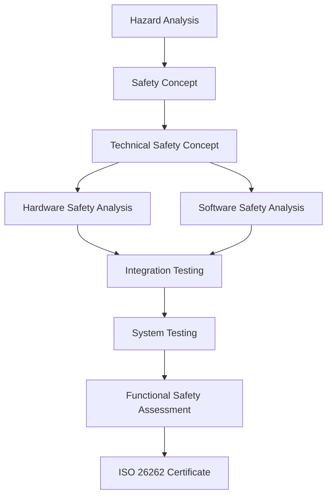
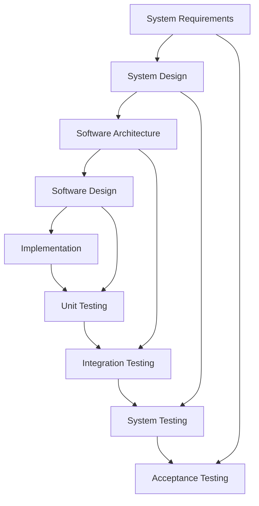
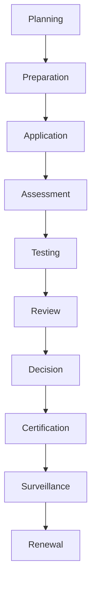

# Electronic Braking System (EBS) - Certification Plan

## Document Information
- **Document Title**: EBS Certification Plan
- **Version**: 1.0
- **Date**: 2025-07-29
- **Classification**: Certification Document
- **Related Documents**: EBS_Requirements_Specification.md, EBS_Test_Specification.md, EBS_Validation_Verification_Plan.md

## Table of Contents
1. [Introduction](#introduction)
2. [Certification Strategy](#certification-strategy)
3. [Regulatory Requirements](#regulatory-requirements)
4. [Certification Scope](#certification-scope)
5. [Testing and Validation](#testing-and-validation)
6. [Documentation Requirements](#documentation-requirements)
7. [Certification Process](#certification-process)
8. [Quality Management](#quality-management)
9. [Risk Management](#risk-management)
10. [Project Management](#project-management)

---

## 1. Introduction

### 1.1 Purpose
This Certification Plan defines the comprehensive strategy, processes, and requirements for obtaining all necessary certifications for the Electronic Braking System (EBS) to ensure compliance with international automotive safety standards and regulatory requirements.

### 1.2 Scope
This plan covers certification activities for:
- **Functional Safety**: ISO 26262 compliance and certification
- **Regional Regulations**: ECE, FMVSS, and other regional requirements
- **Quality Standards**: ISO/TS 16949 and ASPICE compliance
- **Cybersecurity**: ISO/SAE 21434 compliance
- **Environmental**: ISO 14001 environmental management
- **Type Approval**: Vehicle type approval processes

### 1.3 Certification Objectives
The EBS certification program aims to:
- Ensure full regulatory compliance in target markets
- Demonstrate functional safety to ASIL-D requirements
- Achieve quality system certification for manufacturing
- Obtain cybersecurity certification for connected features
- Enable global market access and customer acceptance
- Maintain competitive advantage through certification excellence

### 1.4 Success Criteria
Certification success will be measured by:
- **Regulatory Approval**: All required certifications obtained
- **Timeline Achievement**: Certification completed on schedule
- **Cost Management**: Certification within approved budget
- **Quality Standards**: Zero critical non-conformances
- **Market Access**: Unrestricted access to target markets

---

## 2. Certification Strategy

### 2.1 Strategic Approach

#### 2.1.1 Integrated Certification Strategy
- **Parallel Processing**: Multiple certifications pursued simultaneously
- **Risk-Based Prioritization**: Critical certifications addressed first
- **Resource Optimization**: Shared activities across certification streams
- **Early Engagement**: Certification bodies engaged early in development

#### 2.1.2 Global Market Strategy
**Primary Markets**:
- **Europe**: ECE regulations, EU type approval
- **North America**: FMVSS compliance, DOT approval
- **Asia-Pacific**: Local regulations and standards
- **Emerging Markets**: Regional requirement compliance

**Market Entry Sequence**:
1. **Phase 1**: Europe and North America (Months 1-24)
2. **Phase 2**: Japan, Australia, South Korea (Months 18-30)
3. **Phase 3**: China, India, Brazil (Months 24-36)
4. **Phase 4**: Additional markets as required (Months 30+)

#### 2.1.3 Certification Body Selection
**Selection Criteria**:
- **Technical Competence**: Expertise in automotive safety systems
- **Global Recognition**: International accreditation and recognition
- **Market Access**: Ability to facilitate market entry
- **Cost Effectiveness**: Competitive pricing and value
- **Timeline Capability**: Ability to meet project schedules

**Preferred Certification Bodies**:
- **TÜV SÜD**: Functional safety and type approval
- **SGS**: Quality management and environmental
- **Bureau Veritas**: Cybersecurity and process assessment
- **UL**: North American market access
- **JQA**: Asia-Pacific market requirements

### 2.2 Certification Portfolio

#### 2.2.1 Functional Safety Certification
**ISO 26262 Certification**:
- **Scope**: Complete EBS system to ASIL-D
- **Certification Body**: TÜV SÜD
- **Timeline**: 18 months
- **Investment**: €500,000

**Key Activities**:
- Hazard analysis and risk assessment
- Safety concept development and validation
- Technical safety concept implementation
- Hardware and software safety analysis
- Production and operation safety measures

#### 2.2.2 Regulatory Compliance Certification
**ECE Regulation Compliance**:
- **ECE R13**: Heavy vehicle braking systems
- **ECE R13-H**: Electronic braking systems
- **ECE R79**: Steering equipment
- **Timeline**: 12 months
- **Investment**: €300,000

**FMVSS Compliance**:
- **FMVSS 105**: Hydraulic and electric brake systems
- **FMVSS 126**: Electronic stability control systems
- **Timeline**: 15 months
- **Investment**: €400,000

#### 2.2.3 Quality System Certification
**ISO/TS 16949 Certification**:
- **Scope**: Complete quality management system
- **Certification Body**: SGS
- **Timeline**: 12 months
- **Investment**: €200,000

**ASPICE Assessment**:
- **Scope**: Software development processes
- **Target Level**: Level 3 capability
- **Timeline**: 9 months
- **Investment**: €150,000

#### 2.2.4 Cybersecurity Certification
**ISO/SAE 21434 Certification**:
- **Scope**: Cybersecurity management system
- **Certification Body**: Bureau Veritas
- **Timeline**: 15 months
- **Investment**: €250,000

### 2.3 Certification Dependencies

#### 2.3.1 Sequential Dependencies

#### 2.3.2 Parallel Activities
- **Quality System**: Can proceed in parallel with technical development
- **Cybersecurity**: Integrated with functional safety activities
- **Regional Compliance**: Can be pursued simultaneously
- **Environmental**: Independent of other certifications

#### 2.3.3 Critical Path Analysis
**Critical Path Items**:
1. **Functional Safety Concept** (Month 6)
2. **Hardware Safety Analysis** (Month 12)
3. **Software Safety Analysis** (Month 15)
4. **System Integration Testing** (Month 18)
5. **Functional Safety Assessment** (Month 21)
6. **Final Certification** (Month 24)

---

## 3. Regulatory Requirements

### 3.1 International Standards

#### 3.1.1 ISO 26262 - Functional Safety
**Standard Overview**:
- **Purpose**: Functional safety for automotive systems
- **Scope**: Complete safety lifecycle management
- **ASIL Level**: ASIL-D for EBS system
- **Applicability**: Global automotive industry standard

**Key Requirements**:
- **Management**: Safety management throughout lifecycle
- **Concept Phase**: Hazard analysis and safety concept
- **Product Development**: Technical safety concept implementation
- **Production**: Safety measures in production
- **Operation**: Safety measures during operation
- **Support Processes**: Configuration management, verification, validation

**Compliance Strategy**:
- **Early Integration**: Safety activities from project start
- **Systematic Approach**: Structured safety lifecycle implementation
- **Documentation**: Comprehensive safety case development
- **Assessment**: Independent functional safety assessment

#### 3.1.2 ISO/TS 16949 - Quality Management
**Standard Overview**:
- **Purpose**: Quality management for automotive industry
- **Scope**: Complete quality management system
- **Integration**: ISO 9001 with automotive-specific requirements
- **Applicability**: Automotive supply chain requirement

**Key Requirements**:
- **Customer Focus**: Customer satisfaction and requirements
- **Process Approach**: Process-based quality management
- **Continuous Improvement**: Systematic improvement processes
- **Risk Management**: Risk-based thinking integration
- **Supply Chain**: Supplier quality management

#### 3.1.3 ISO/SAE 21434 - Cybersecurity
**Standard Overview**:
- **Purpose**: Cybersecurity engineering for automotive
- **Scope**: Complete cybersecurity lifecycle
- **Integration**: Functional safety and cybersecurity alignment
- **Applicability**: Connected and automated vehicles

**Key Requirements**:
- **Governance**: Cybersecurity governance and culture
- **Risk Assessment**: Cybersecurity risk analysis
- **Concept Phase**: Cybersecurity concept development
- **Product Development**: Cybersecurity implementation
- **Production**: Cybersecurity in production
- **Operation**: Cybersecurity monitoring and response

### 3.2 Regional Regulations

#### 3.2.1 European Regulations (ECE)
**ECE R13 - Braking Systems**:
- **Scope**: Braking systems for M and N category vehicles
- **Requirements**: Performance, construction, and testing
- **Testing**: Prescribed test procedures and criteria
- **Approval**: Type approval process and documentation

**ECE R13-H - Electronic Braking**:
- **Scope**: Electronic braking systems
- **Requirements**: Additional requirements for electronic systems
- **Testing**: Electronic system-specific tests
- **Integration**: Coordination with ECE R13 requirements

**ECE R79 - Steering Equipment**:
- **Scope**: Steering systems and ESC integration
- **Requirements**: Steering system performance and safety
- **Testing**: Steering-related test procedures
- **Coordination**: Integration with braking system requirements

#### 3.2.2 North American Regulations (FMVSS)
**FMVSS 105 - Hydraulic and Electric Brake Systems**:
- **Scope**: Brake system performance requirements
- **Requirements**: Stopping distance and performance criteria
- **Testing**: Standardized test procedures
- **Compliance**: DOT compliance and certification

**FMVSS 126 - Electronic Stability Control**:
- **Scope**: ESC system requirements
- **Requirements**: ESC performance and functionality
- **Testing**: ESC-specific test procedures
- **Integration**: Coordination with brake system requirements

#### 3.2.3 Asia-Pacific Regulations
**Japan (JMVSS)**:
- **Alignment**: Generally aligned with ECE regulations
- **Specific Requirements**: Japan-specific modifications
- **Testing**: Local testing and certification requirements
- **Market Access**: MLIT approval process

**Australia (ADR)**:
- **Alignment**: Based on ECE regulations
- **Local Adaptation**: Australian-specific requirements
- **Testing**: Local testing or mutual recognition
- **Certification**: ACMA certification process

**China (GB Standards)**:
- **GB 12676**: Braking system requirements
- **GB 21670**: ESC system requirements
- **Testing**: China-specific testing requirements
- **Certification**: CCC certification process

### 3.3 Industry Standards

#### 3.3.1 ASPICE - Automotive Software Process
**Standard Overview**:
- **Purpose**: Software process assessment and improvement
- **Scope**: Software development lifecycle processes
- **Levels**: Capability levels 0-5
- **Target**: Level 3 capability for EBS software

**Key Process Areas**:
- **Engineering Processes**: Requirements, design, implementation, testing
- **Supporting Processes**: Configuration management, quality assurance
- **Management Processes**: Project management, risk management
- **Organizational Processes**: Process improvement, training

#### 3.3.2 AUTOSAR - Automotive Software Architecture
**Standard Overview**:
- **Purpose**: Standardized software architecture
- **Scope**: Software platform and methodology
- **Compliance**: AUTOSAR-compliant software architecture
- **Benefits**: Interoperability and reusability

**Key Components**:
- **Runtime Environment**: Standardized runtime platform
- **Basic Software**: Operating system and communication
- **Application Layer**: Application software components
- **Methodology**: Development methodology and tools

---

## 4. Certification Scope

### 4.1 System Scope Definition

#### 4.1.1 EBS System Boundaries
**Included Components**:
- **Electronic Control Units**: Primary and secondary ECUs
- **Hydraulic Modulator Unit**: Complete HMU assembly
- **Sensors**: All EBS-related sensors (wheel speed, yaw rate, etc.)
- **Actuators**: Brake actuators and control valves
- **Software**: All EBS control software and algorithms
- **Communication**: CAN bus interfaces and protocols

**Excluded Components**:
- **Base Brake System**: Mechanical brake components (pads, rotors, calipers)
- **Master Cylinder**: Hydraulic master cylinder (unless EBS-specific)
- **Brake Pedal**: Mechanical brake pedal assembly
- **Vehicle Integration**: Vehicle-specific integration components
- **Third-Party Components**: Components supplied by other manufacturers

#### 4.1.2 Functional Scope
**Core Functions**:
- **Anti-lock Braking System (ABS)**: Wheel lockup prevention
- **Electronic Stability Control (ESC)**: Vehicle stability management
- **Traction Control System (TCS)**: Wheel spin prevention
- **Brake Assist**: Emergency braking assistance
- **Hill Hold Control**: Hill start assistance

**Advanced Functions**:
- **Autonomous Emergency Braking**: Collision avoidance braking
- **Adaptive Cruise Control**: Speed and distance control
- **Electronic Brake Distribution**: Brake force optimization
- **Brake Fade Compensation**: Performance maintenance
- **Trailer Stability Assist**: Trailer sway control

#### 4.1.3 Operational Scope
**Operating Conditions**:
- **Temperature Range**: -40°C to +85°C
- **Voltage Range**: 9V to 16V (12V nominal)
- **Speed Range**: 0 to 250 km/h
- **Load Range**: 0 to maximum vehicle capacity
- **Environmental**: IP67 protection rating

**Vehicle Applications**:
- **Passenger Cars**: M1 category vehicles
- **Light Commercial**: N1 category vehicles
- **Weight Range**: Up to 3500 kg gross vehicle weight
- **Drive Types**: Front-wheel, rear-wheel, all-wheel drive

### 4.2 Certification Boundaries

#### 4.2.1 Hardware Certification Scope
**Electronic Components**:
- **ECU Hardware**: Microcontrollers, memory, interfaces
- **Power Supply**: Voltage regulation and protection
- **Communication**: CAN transceivers and interfaces
- **Input/Output**: Sensor interfaces and actuator drivers
- **Protection**: EMC protection and safety circuits

**Mechanical Components**:
- **HMU Assembly**: Hydraulic valves, pump, accumulator
- **Sensor Mounting**: Mechanical sensor interfaces
- **Connectors**: Electrical connection systems
- **Housing**: Environmental protection enclosures
- **Mounting**: Component mounting systems

#### 4.2.2 Software Certification Scope
**Application Software**:
- **Control Algorithms**: ABS, ESC, TCS control logic
- **Safety Functions**: Safety monitoring and fault detection
- **Diagnostic Functions**: System diagnostics and fault codes
- **Communication**: CAN message handling and protocols
- **Calibration**: Parameter management and adaptation

**System Software**:
- **Operating System**: Real-time operating system
- **Device Drivers**: Hardware abstraction layer
- **Communication Stack**: CAN communication software
- **Diagnostic Services**: UDS diagnostic services
- **Boot Loader**: Software update and recovery

#### 4.2.3 Process Certification Scope
**Development Processes**:
- **Requirements Management**: Requirements definition and traceability
- **Design Processes**: System and software design
- **Implementation**: Hardware and software implementation
- **Testing**: Verification and validation testing
- **Configuration Management**: Version and change control

**Production Processes**:
- **Manufacturing**: Component and system manufacturing
- **Quality Control**: Production testing and inspection
- **Calibration**: System calibration and setup
- **Packaging**: Product packaging and protection
- **Logistics**: Supply chain and distribution

---

## 5. Testing and Validation

### 5.1 Testing Strategy

#### 5.1.1 V-Model Testing Approach

**Testing Levels**:
- **Unit Testing**: Individual component verification
- **Integration Testing**: Component interaction verification
- **System Testing**: Complete system verification
- **Acceptance Testing**: Customer requirement validation

#### 5.1.2 Test Categories
**Functional Testing**:
- **Performance Testing**: System performance verification
- **Behavioral Testing**: Functional behavior validation
- **Interface Testing**: Interface specification compliance
- **Scenario Testing**: Real-world scenario validation

**Non-Functional Testing**:
- **Safety Testing**: Safety requirement verification
- **Reliability Testing**: System reliability validation
- **Environmental Testing**: Operating condition verification
- **EMC Testing**: Electromagnetic compatibility validation

**Compliance Testing**:
- **Regulatory Testing**: Regulation compliance verification
- **Standard Testing**: Industry standard compliance
- **Certification Testing**: Certification requirement validation
- **Type Approval Testing**: Official approval testing

### 5.2 Test Planning

#### 5.2.1 Test Phases
**Phase 1: Component Testing** (Months 12-15)
- **Hardware Testing**: Individual component verification
- **Software Testing**: Software module verification
- **Interface Testing**: Component interface validation
- **Environmental Testing**: Component environmental validation

**Phase 2: Integration Testing** (Months 15-18)
- **Hardware Integration**: Hardware component integration
- **Software Integration**: Software module integration
- **System Integration**: Complete system integration
- **Vehicle Integration**: Vehicle-level integration

**Phase 3: System Testing** (Months 18-21)
- **Functional Testing**: Complete functional verification
- **Performance Testing**: System performance validation
- **Safety Testing**: Safety requirement verification
- **Durability Testing**: Long-term reliability validation

**Phase 4: Certification Testing** (Months 21-24)
- **Regulatory Testing**: Official regulation compliance testing
- **Type Approval Testing**: Official type approval testing
- **Third-Party Testing**: Independent certification testing
- **Witness Testing**: Certification body witness testing

#### 5.2.2 Test Resources
**Test Facilities**:
- **Laboratory Testing**: Controlled environment testing
- **Proving Ground**: Vehicle dynamics testing
- **Climatic Chamber**: Environmental condition testing
- **EMC Chamber**: Electromagnetic compatibility testing

**Test Equipment**:
- **Hardware-in-Loop**: Real-time system simulation
- **Vehicle Dynamometer**: Controlled vehicle testing
- **Data Acquisition**: Test data collection and analysis
- **Measurement Equipment**: Precision measurement tools

**Test Vehicles**:
- **Development Vehicles**: Early development testing
- **Prototype Vehicles**: System integration testing
- **Production Vehicles**: Final validation testing
- **Fleet Vehicles**: Extended durability testing

### 5.3 Test Execution

#### 5.3.1 Test Procedures
**Standard Test Procedures**:
- **ISO 26262**: Functional safety testing procedures
- **ECE Regulations**: Regulatory testing procedures
- **FMVSS**: North American testing procedures
- **Company Standards**: Internal testing procedures

**Test Documentation**:
- **Test Plans**: Detailed test planning documentation
- **Test Procedures**: Step-by-step test instructions
- **Test Reports**: Comprehensive test result documentation
- **Traceability Matrix**: Requirement-to-test traceability

#### 5.3.2 Test Management
**Test Scheduling**:
- **Resource Planning**: Test resource allocation and scheduling
- **Milestone Tracking**: Test milestone monitoring and control
- **Risk Management**: Test risk identification and mitigation
- **Progress Reporting**: Regular test progress reporting

**Quality Assurance**:
- **Test Review**: Test procedure and result review
- **Independent Testing**: Third-party test validation
- **Audit Support**: Certification audit support
- **Continuous Improvement**: Test process improvement

---

## 6. Documentation Requirements

### 6.1 Documentation Strategy

#### 6.1.1 Document Management Approach
**Integrated Documentation**:
- **Single Source**: Centralized document repository
- **Version Control**: Comprehensive version management
- **Traceability**: Complete requirement traceability
- **Access Control**: Controlled document access and distribution

**Quality Standards**:
- **Consistency**: Standardized document formats and templates
- **Completeness**: Comprehensive coverage of all requirements
- **Accuracy**: Technical accuracy and correctness
- **Clarity**: Clear and understandable documentation

#### 6.1.2 Document Categories
**Technical Documentation**:
- **System Specifications**: Complete system requirement specifications
- **Design Documentation**: Detailed design and architecture documents
- **Test Documentation**: Comprehensive test plans and reports
- **Safety Documentation**: Functional safety analysis and evidence

**Process Documentation**:
- **Quality Manual**: Quality management system documentation
- **Process Procedures**: Detailed process procedures and work instructions
- **Training Materials**: Comprehensive training and competency documentation
- **Audit Records**: Quality audit and assessment records

**Certification Documentation**:
- **Compliance Matrix**: Requirement compliance demonstration
- **Evidence Package**: Supporting evidence and documentation
- **Assessment Reports**: Independent assessment and audit reports
- **Certificates**: Official certification and approval documents

### 6.2 Required Documentation

#### 6.2.1 ISO 26262 Documentation
**Management Documentation**:
- **Safety Plan**: Comprehensive safety planning documentation
- **Safety Case**: Complete safety case and argumentation
- **Safety Manual**: Safety management system documentation
- **Assessment Report**: Independent functional safety assessment

**Technical Documentation**:
- **Item Definition**: System definition and operational environment
- **Hazard Analysis**: Hazard analysis and risk assessment
- **Safety Goals**: Safety goal definition and allocation
- **Safety Concept**: Functional and technical safety concepts
- **Safety Analysis**: Hardware and software safety analysis
- **Verification Report**: Safety verification and validation evidence

#### 6.2.2 Quality System Documentation
**Quality Manual**:
- **Quality Policy**: Organizational quality policy and objectives
- **Process Map**: Complete process map and interactions
- **Responsibility Matrix**: Roles and responsibility definition
- **Resource Management**: Resource planning and allocation

**Process Procedures**:
- **Development Procedures**: Product development process procedures
- **Production Procedures**: Manufacturing and production procedures
- **Support Procedures**: Supporting process procedures
- **Improvement Procedures**: Continuous improvement procedures

#### 6.2.3 Regulatory Documentation
**Type Approval Documentation**:
- **Technical File**: Complete technical documentation package
- **Test Reports**: Official test reports and certificates
- **Conformity Declaration**: Declaration of conformity
- **Installation Instructions**: Official installation and operation instructions

**Compliance Documentation**:
- **Compliance Matrix**: Regulation compliance demonstration
- **Gap Analysis**: Compliance gap analysis and closure
- **Evidence Package**: Supporting compliance evidence
- **Approval Certificates**: Official approval and certification documents

### 6.3 Document Control

#### 6.3.1 Version Management
**Version Control System**:
- **Document Identification**: Unique document identification system
- **Version Numbering**: Systematic version numbering scheme
- **Change Control**: Formal change control process
- **Approval Process**: Document review and approval process

**Configuration Management**:
- **Baseline Management**: Document baseline establishment and control
- **Change Management**: Systematic change management process
- **Release Management**: Controlled document release process
- **Archive Management**: Document archive and retention management

#### 6.3.2 Quality Assurance
**Document Review**:
- **Technical Review**: Technical accuracy and completeness review
- **Editorial Review**: Language and format review
- **Compliance Review**: Regulatory and standard compliance review
- **Management Review**: Management approval and authorization

**Audit Trail**:
- **Change History**: Complete change history and rationale
- **Review Records**: Document review and approval records
- **Distribution Records**: Document distribution and access records
- **Feedback Records**: Document feedback and improvement records

---

## 7. Certification Process

### 7.1 Process Overview

#### 7.1.1 Certification Lifecycle

**Process Phases**:
1. **Planning**: Certification strategy and planning
2. **Preparation**: Documentation and evidence preparation
3. **Application**: Formal certification application
4. **Assessment**: Certification body assessment
5. **Testing**: Required testing and validation
6. **Review**: Assessment review and evaluation
7. **Decision**: Certification decision and issuance
8. **Surveillance**: Ongoing surveillance and monitoring
9. **Renewal**: Certification renewal and maintenance

#### 7.1.2 Stakeholder Roles
**Internal Stakeholders**:
- **Project Manager**: Overall certification project management
- **Technical Team**: Technical documentation and evidence preparation
- **Quality Manager**: Quality system and process compliance
- **Safety Manager**: Functional safety compliance and evidence

**External Stakeholders**:
- **Certification Body**: Independent assessment and certification
- **Testing Laboratory**: Independent testing and validation
- **Regulatory Authority**: Official approval and authorization
- **Notified Body**: European conformity assessment

### 7.2 Certification Activities

#### 7.2.1 Pre-Assessment Activities
**Readiness Assessment**:
- **Gap Analysis**: Compliance gap identification and analysis
- **Readiness Review**: Certification readiness evaluation
- **Risk Assessment**: Certification risk identification and mitigation
- **Resource Planning**: Resource allocation and scheduling

**Documentation Preparation**:
- **Evidence Collection**: Supporting evidence compilation
- **Document Review**: Documentation completeness and accuracy review
- **Compliance Matrix**: Requirement compliance demonstration
- **Submission Package**: Certification submission preparation

#### 7.2.2 Assessment Activities
**Stage 1 Assessment**:
- **Documentation Review**: Initial documentation review
- **System Understanding**: System and process understanding
- **Planning Review**: Assessment planning and scheduling
- **Readiness Confirmation**: Assessment readiness confirmation

**Stage 2 Assessment**:
- **On-Site Assessment**: Detailed on-site assessment
- **Evidence Review**: Comprehensive evidence review
- **Interview Process**: Personnel interview and competency assessment
- **Observation**: Process observation and evaluation

**Testing Activities**:
- **Witness Testing**: Certification body test witnessing
- **Independent Testing**: Third-party independent testing
- **Test Review**: Test result review and evaluation
- **Compliance Verification**: Test-based compliance verification

#### 7.2.3 Post-Assessment Activities
**Assessment Review**:
- **Finding Review**: Assessment finding review and analysis
- **Corrective Action**: Non-conformance corrective action
- **Evidence Submission**: Additional evidence submission
- **Closure Verification**: Corrective action closure verification

**Certification Decision**:
- **Technical Review**: Technical assessment review
- **Compliance Confirmation**: Final compliance confirmation
- **Certificate Issuance**: Official certificate issuance
- **Public Notification**: Certification public notification

### 7.3 Certification Maintenance

#### 7.3.1 Surveillance Activities
**Annual Surveillance**:
- **System Review**: Quality system review and assessment
- **Process Audit**: Key process audit and evaluation
- **Performance Review**: System performance review
- **Continuous Improvement**: Improvement activity review

**Change Management**:
- **Change Notification**: Significant change notification
- **Change Assessment**: Change impact assessment
- **Re-Assessment**: Change-based re-assessment
- **Certificate Update**: Certificate update and reissuance

#### 7.3.2 Renewal Process
**Renewal Planning**:
- **Renewal Schedule**: Certification renewal scheduling
- **Preparation Activities**: Renewal preparation activities
- **Documentation Update**: Documentation update and review
- **Assessment Planning**: Renewal assessment planning

**Renewal Assessment**:
- **Comprehensive Review**: Complete system review
- **Performance Evaluation**: System performance evaluation
- **Compliance Verification**: Continued compliance verification
- **Certificate Renewal**: Certificate renewal and extension

---

## 8. Quality Management

### 8.1 Quality Management System

#### 8.1.1 QMS Framework
**ISO/TS 16949 Implementation**:
- **Process Approach**: Process-based quality management
- **Customer Focus**: Customer satisfaction and requirements
- **Leadership**: Management leadership and commitment
- **Engagement**: Personnel engagement and competency
- **Process Management**: Process planning and control
- **Improvement**: Continuous improvement and innovation

**Quality Objectives**:
- **Customer Satisfaction**: >95% customer satisfaction rating
- **Defect Rate**: <10 PPM defect rate in production
- **On-Time Delivery**: >98% on-time delivery performance
- **Cost Performance**: Quality cost <2% of revenue
- **Certification Compliance**: 100% certification maintenance

#### 8.1.2 Quality Planning
**Quality Plan Development**:
- **Quality Objectives**: Specific, measurable quality objectives
- **Quality Metrics**: Key quality performance indicators
- **Quality Activities**: Planned quality assurance activities
- **Resource Allocation**: Quality resource planning and allocation

**Risk-Based Planning**:
- **Risk Assessment**: Quality risk identification and assessment
- **Risk Mitigation**: Risk mitigation planning and implementation
- **Contingency Planning**: Quality contingency planning
- **Monitoring Plan**: Risk monitoring and review planning

### 8.2 Quality Processes

#### 8.2.1 Design Quality
**Design Controls**:
- **Design Planning**: Systematic design planning and control
- **Design Review**: Regular design review and approval
- **Design Verification**: Design verification and validation
- **Design Changes**: Controlled design change management

**Quality Gates**:
- **Gate 1**: Concept approval and requirements freeze
- **Gate 2**: Design approval and specification freeze
- **Gate 3**: Prototype approval and testing completion
- **Gate 4**: Production approval and launch readiness

#### 8.2.2 Production Quality
**Production Controls**:
- **Process Control**: Statistical process control implementation
- **Inspection Planning**: Comprehensive inspection planning
- **Testing Requirements**: Production testing requirements
- **Non-Conformance**: Non-conforming product control

**Supplier Quality**:
- **Supplier Selection**: Supplier qualification and selection
- **Supplier Development**: Supplier capability development
- **Supplier Monitoring**: Ongoing supplier performance monitoring
- **Supplier Improvement**: Supplier improvement and development

#### 8.2.3 Service Quality
**Service Controls**:
- **Service Planning**: Service quality planning and control
- **Service Delivery**: Consistent service delivery processes
- **Service Monitoring**: Service performance monitoring
- **Service Improvement**: Continuous service improvement

**Customer Feedback**:
- **Feedback Collection**: Systematic customer feedback collection
- **Feedback Analysis**: Customer feedback analysis and evaluation
- **Improvement Actions**: Customer-driven improvement actions
- **Feedback Closure**: Customer feedback closure and communication

### 8.3 Quality Assurance

#### 8.3.1 Internal Audits
**Audit Program**:
- **Audit Planning**: Annual audit program planning
- **Audit Scheduling**: Systematic audit scheduling
- **Auditor Qualification**: Auditor training and qualification
- **Audit Execution**: Professional audit execution

**Audit Process**:
- **Preparation**: Audit preparation and planning
- **Execution**: On-site audit execution
- **Reporting**: Audit finding reporting and communication
- **Follow-up**: Corrective action follow-up and closure

#### 8.3.2 Management Review
**Review Process**:
- **Review Planning**: Management review planning and scheduling
- **Input Preparation**: Review input preparation and analysis
- **Review Meeting**: Management review meeting execution
- **Output Implementation**: Review output implementation and follow-up

**Review Content**:
- **Performance Review**: Quality performance review and analysis
- **Objective Review**: Quality objective achievement review
- **Improvement Review**: Improvement opportunity identification
- **Resource Review**: Resource adequacy and allocation review

#### 8.3.3 Continuous Improvement
**Improvement Process**:
- **Opportunity Identification**: Improvement opportunity identification
- **Improvement Planning**: Improvement project planning
- **Implementation**: Improvement implementation and monitoring
- **Effectiveness Review**: Improvement effectiveness evaluation

**Innovation Management**:
- **Innovation Strategy**: Quality innovation strategy development
- **Innovation Projects**: Quality innovation project management
- **Technology Integration**: New technology integration
- **Best Practice Sharing**: Best practice identification and sharing

---

## 9. Risk Management

### 9.1 Risk Management Framework

#### 9.1.1 Risk Management Process
**Risk Identification**:
- **Systematic Identification**: Comprehensive risk identification process
- **Stakeholder Input**: Multi-stakeholder risk identification
- **Historical Analysis**: Historical risk analysis and learning
- **External Assessment**: External risk factor assessment

**Risk Analysis**:
- **Probability Assessment**: Risk probability evaluation
- **Impact Assessment**: Risk impact evaluation
- **Risk Rating**: Risk priority rating and ranking
- **Risk Categorization**: Risk category classification

**Risk Treatment**:
- **Risk Mitigation**: Risk mitigation strategy development
- **Risk Transfer**: Risk transfer and insurance strategies
- **Risk Acceptance**: Risk acceptance criteria and decisions
- **Risk Monitoring**: Ongoing risk monitoring and review

#### 9.1.2 Risk Categories
**Technical Risks**:
- **Design Risks**: Design complexity and feasibility risks
- **Technology