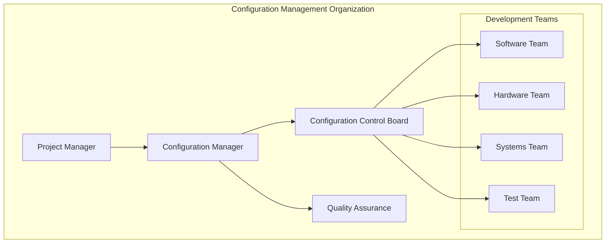
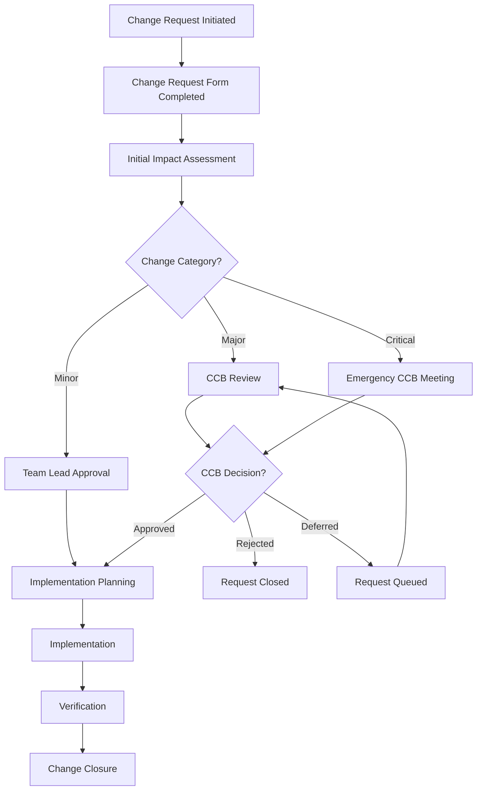
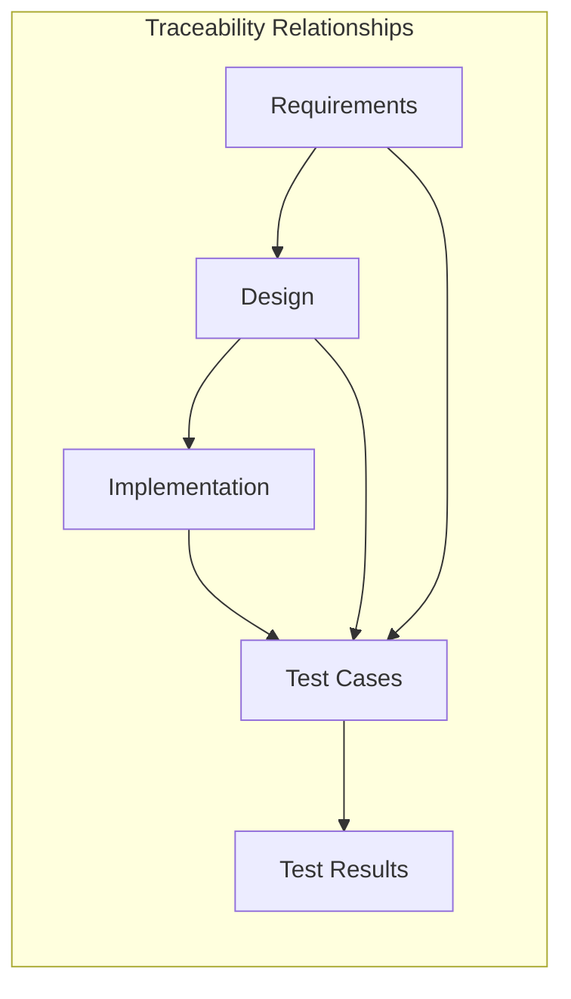

# Electronic Braking System (EBS) - Configuration Management Plan

## Document Information
- **Document Title**: EBS Configuration Management Plan
- **Version**: 1.0
- **Date**: 2025-07-29
- **Classification**: Project Management Document
- **Related Documents**: EBS_Requirements_Specification.md, EBS_System_Architecture_Specification.md

## Table of Contents
1. [Introduction](#introduction)
2. [Configuration Management Organization](#configuration-management-organization)
3. [Configuration Identification](#configuration-identification)
4. [Configuration Control](#configuration-control)
5. [Configuration Status Accounting](#configuration-status-accounting)
6. [Configuration Audits](#configuration-audits)
7. [Tools and Infrastructure](#tools-and-infrastructure)
8. [Baseline Management](#baseline-management)
9. [Change Management Process](#change-management-process)
10. [Release Management](#release-management)

---

## 1. Introduction

### 1.1 Purpose
This Configuration Management Plan (CMP) defines the configuration management processes, procedures, and responsibilities for the Electronic Braking System (EBS) development project. It ensures systematic control of all project artifacts throughout the development lifecycle.

### 1.2 Scope
The configuration management plan covers:
- All EBS project deliverables and work products
- Requirements documents and specifications
- Design documents and models
- Source code and software components
- Test cases and test results
- Hardware designs and schematics
- Documentation and user manuals
- Tools and development environment

### 1.3 Objectives
- Maintain integrity and traceability of all project artifacts
- Control changes to baselined items
- Provide accurate status of all configuration items
- Enable reproducible builds and releases
- Support parallel development and integration
- Ensure compliance with automotive standards (ISO 26262, ASPICE)

### 1.4 Standards and References
- **ISO 26262**: Road Vehicles - Functional Safety
- **Automotive SPICE**: Process assessment model for automotive software
- **IEEE 828**: Standard for Configuration Management in Systems Engineering
- **ISO 10007**: Quality Management - Guidelines for Configuration Management
- **CMMI**: Capability Maturity Model Integration

---

## 2. Configuration Management Organization

### 2.1 Roles and Responsibilities

#### 2.1.1 Configuration Manager
- **Primary Responsibility**: Overall CM process management
- **Key Activities**:
  - Develop and maintain CM procedures
  - Coordinate CM activities across teams
  - Manage configuration baselines
  - Oversee change control board activities
  - Ensure CM tool implementation and training

#### 2.1.2 Configuration Control Board (CCB)
- **Composition**: Project Manager, Lead Engineer, Quality Manager, Safety Engineer
- **Responsibilities**:
  - Review and approve/reject change requests
  - Assess impact of proposed changes
  - Prioritize changes and allocate resources
  - Ensure change implementation quality

#### 2.1.3 Development Teams
- **Software Team**: Manage software configuration items
- **Hardware Team**: Manage hardware configuration items
- **Systems Team**: Manage system-level configuration items
- **Test Team**: Manage test configuration items

#### 2.1.4 Quality Assurance
- **Responsibilities**:
  - Audit CM processes and procedures
  - Verify CM compliance
  - Review CM metrics and reports
  - Ensure CM tool validation

### 2.2 Organizational Structure



---

## 3. Configuration Identification

### 3.1 Configuration Item Categories

#### 3.1.1 Requirements Configuration Items
| CI Type | Description | Naming Convention | Storage Location |
|---------|-------------|-------------------|------------------|
| **System Requirements** | High-level system requirements | EBS_REQ_SYS_vX.Y | /requirements/system/ |
| **Software Requirements** | Software-specific requirements | EBS_REQ_SW_vX.Y | /requirements/software/ |
| **Hardware Requirements** | Hardware-specific requirements | EBS_REQ_HW_vX.Y | /requirements/hardware/ |
| **Safety Requirements** | Safety-critical requirements | EBS_REQ_SAF_vX.Y | /requirements/safety/ |
| **Interface Requirements** | Interface specifications | EBS_REQ_IF_vX.Y | /requirements/interface/ |

#### 3.1.2 Design Configuration Items
| CI Type | Description | Naming Convention | Storage Location |
|---------|-------------|-------------------|------------------|
| **System Architecture** | System design documents | EBS_ARCH_SYS_vX.Y | /design/system/ |
| **Software Architecture** | Software design documents | EBS_ARCH_SW_vX.Y | /design/software/ |
| **Hardware Design** | Hardware design documents | EBS_ARCH_HW_vX.Y | /design/hardware/ |
| **Interface Design** | Interface design documents | EBS_ARCH_IF_vX.Y | /design/interface/ |

#### 3.1.3 Implementation Configuration Items
| CI Type | Description | Naming Convention | Storage Location |
|---------|-------------|-------------------|------------------|
| **Source Code** | Software source files | EBS_SRC_*.c/h | /code/src/, /code/include/ |
| **Build Scripts** | Build and compilation scripts | EBS_BUILD_* | /build/ |
| **Hardware Schematics** | Electronic schematics | EBS_SCH_*.sch | /hardware/schematics/ |
| **PCB Layouts** | PCB design files | EBS_PCB_*.pcb | /hardware/pcb/ |

#### 3.1.4 Verification Configuration Items
| CI Type | Description | Naming Convention | Storage Location |
|---------|-------------|-------------------|------------------|
| **Test Plans** | Test planning documents | EBS_TP_vX.Y | /test/plans/ |
| **Test Cases** | Individual test cases | EBS_TC_*.tc | /test/cases/ |
| **Test Results** | Test execution results | EBS_TR_*.xml | /test/results/ |
| **Test Reports** | Test summary reports | EBS_TREP_vX.Y | /test/reports/ |

### 3.2 Configuration Item Identification Scheme

#### 3.2.1 Naming Convention
```
EBS_<TYPE>_<COMPONENT>_<VERSION>.<EXTENSION>

Where:
- EBS: Project identifier
- TYPE: CI type (REQ, ARCH, SRC, TEST, etc.)
- COMPONENT: Component identifier
- VERSION: Version number (vX.Y.Z)
- EXTENSION: File extension
```

#### 3.2.2 Version Numbering Scheme
- **Major Version (X)**: Significant changes, interface changes
- **Minor Version (Y)**: Feature additions, enhancements
- **Patch Version (Z)**: Bug fixes, minor corrections

#### 3.2.3 Configuration Item Attributes
Each configuration item shall have the following attributes:
- **CI Identifier**: Unique identifier
- **CI Name**: Descriptive name
- **CI Type**: Category of configuration item
- **Version**: Current version number
- **Status**: Development status (Draft, Review, Approved, Released)
- **Owner**: Responsible person/team
- **Creation Date**: Date of creation
- **Last Modified**: Date of last modification
- **Dependencies**: Related configuration items
- **Approval Status**: Approval information

---

## 4. Configuration Control

### 4.1 Change Control Process

#### 4.1.1 Change Request Workflow


#### 4.1.2 Change Request Categories
| Category | Description | Approval Authority | Timeline |
|----------|-------------|-------------------|----------|
| **Minor** | Bug fixes, documentation updates | Team Lead | 1-2 days |
| **Major** | Feature changes, design modifications | CCB | 1 week |
| **Critical** | Safety-related, urgent fixes | Emergency CCB | 24 hours |

#### 4.1.3 Change Request Form
```
Change Request ID: CR-EBS-YYYY-NNNN
Date: [Date]
Requestor: [Name]
Category: [Minor/Major/Critical]

Description:
[Detailed description of the change]

Justification:
[Reason for the change]

Impact Assessment:
- Requirements Impact: [Yes/No - Details]
- Design Impact: [Yes/No - Details]
- Code Impact: [Yes/No - Details]
- Test Impact: [Yes/No - Details]
- Schedule Impact: [Days/Weeks]
- Resource Impact: [Person-hours]

Risk Assessment:
[Potential risks and mitigation strategies]

Implementation Plan:
[High-level implementation approach]

Verification Plan:
[How the change will be verified]
```

### 4.2 Access Control

#### 4.2.1 Repository Access Levels
| Access Level | Permissions | Roles |
|--------------|-------------|-------|
| **Read-Only** | View files, download | All team members |
| **Developer** | Read, create branches, submit changes | Developers, Engineers |
| **Reviewer** | Read, approve/reject changes | Senior Engineers, Leads |
| **Administrator** | Full access, user management | Configuration Manager |

#### 4.2.2 Branch Protection Rules
- **Main Branch**: Protected, requires review approval
- **Development Branches**: Protected, requires automated testing
- **Feature Branches**: Standard protection, peer review
- **Release Branches**: Highly protected, CCB approval required

---

## 5. Configuration Status Accounting

### 5.1 Status Reporting

#### 5.1.1 Configuration Status Reports
| Report Type | Frequency | Content | Recipients |
|-------------|-----------|---------|------------|
| **Weekly Status** | Weekly | CI changes, pending changes | Project team |
| **Baseline Status** | Monthly | Baseline integrity, metrics | Management |
| **Change Summary** | Monthly | Change statistics, trends | CCB, Management |
| **Audit Report** | Quarterly | Compliance status, issues | Quality, Management |

#### 5.1.2 Key Performance Indicators
- **Change Request Processing Time**: Average time from submission to closure
- **Change Success Rate**: Percentage of changes implemented successfully
- **Baseline Stability**: Number of emergency changes to baselines
- **Configuration Item Coverage**: Percentage of items under CM control
- **Tool Availability**: Uptime of CM tools and systems

### 5.2 Traceability Management

#### 5.2.1 Traceability Matrix


#### 5.2.2 Traceability Tools
- **Requirements Management**: DOORS, Polarion, or equivalent
- **Design Traceability**: Enterprise Architect, MagicDraw
- **Code Traceability**: Git, integrated with requirements tools
- **Test Traceability**: TestRail, qTest, or equivalent

---

## 6. Configuration Audits

### 6.1 Audit Types

#### 6.1.1 Functional Configuration Audit (FCA)
- **Purpose**: Verify that configuration items meet specified requirements
- **Frequency**: Before each major release
- **Scope**: All configuration items in the release baseline
- **Criteria**: Requirements compliance, functionality verification

#### 6.1.2 Physical Configuration Audit (PCA)
- **Purpose**: Verify that configuration items are correctly identified and documented
- **Frequency**: Quarterly
- **Scope**: All configuration items under CM control
- **Criteria**: Naming conventions, version control, documentation completeness

#### 6.1.3 Process Audit
- **Purpose**: Verify compliance with CM procedures
- **Frequency**: Semi-annually
- **Scope**: CM processes and procedures
- **Criteria**: Process adherence, tool usage, training compliance

### 6.2 Audit Process

#### 6.2.1 Audit Planning
1. **Audit Schedule**: Define audit calendar and scope
2. **Audit Team**: Assign qualified auditors
3. **Audit Criteria**: Define evaluation criteria
4. **Audit Checklist**: Prepare detailed checklists

#### 6.2.2 Audit Execution
1. **Opening Meeting**: Kick-off with stakeholders
2. **Evidence Collection**: Gather audit evidence
3. **Findings Documentation**: Record non-conformances
4. **Closing Meeting**: Present preliminary findings

#### 6.2.3 Audit Follow-up
1. **Audit Report**: Formal audit report
2. **Corrective Actions**: Define corrective action plans
3. **Verification**: Verify corrective action implementation
4. **Closure**: Close audit findings

---

## 7. Tools and Infrastructure

### 7.1 Configuration Management Tools

#### 7.1.1 Version Control System
- **Primary Tool**: Git with GitLab/GitHub Enterprise
- **Features**:
  - Distributed version control
  - Branch and merge capabilities
  - Access control and permissions
  - Integration with CI/CD pipelines
  - Audit trail and history

#### 7.1.2 Requirements Management Tool
- **Primary Tool**: IBM DOORS or Polarion
- **Features**:
  - Requirements traceability
  - Change impact analysis
  - Baseline management
  - Reporting and metrics
  - Integration with other tools

#### 7.1.3 Build and Integration Tools
- **Build System**: Jenkins or GitLab CI/CD
- **Artifact Repository**: Nexus or Artifactory
- **Features**:
  - Automated builds
  - Dependency management
  - Release management
  - Integration testing

#### 7.1.4 Document Management System
- **Primary Tool**: SharePoint or Confluence
- **Features**:
  - Document version control
  - Collaborative editing
  - Access control
  - Search and retrieval
  - Integration with CM tools

### 7.2 Infrastructure Requirements

#### 7.2.1 Hardware Infrastructure
- **Servers**: Redundant servers for high availability
- **Storage**: Network-attached storage with backup
- **Network**: Secure network with appropriate bandwidth
- **Backup**: Regular backup and disaster recovery

#### 7.2.2 Software Infrastructure
- **Operating System**: Enterprise-grade OS with support
- **Database**: Relational database for tool data
- **Security**: Authentication, authorization, encryption
- **Monitoring**: System monitoring and alerting

---

## 8. Baseline Management

### 8.1 Baseline Types

#### 8.1.1 Functional Baseline
- **Content**: Approved system requirements and specifications
- **Timing**: After requirements review and approval
- **Control**: Changes require CCB approval
- **Purpose**: Foundation for design and development

#### 8.1.2 Design Baseline
- **Content**: Approved design documents and specifications
- **Timing**: After design review and approval
- **Control**: Changes require impact assessment and approval
- **Purpose**: Foundation for implementation

#### 8.1.3 Product Baseline
- **Content**: Released product with all associated documentation
- **Timing**: After successful testing and validation
- **Control**: Strict change control with full impact assessment
- **Purpose**: Production release baseline

### 8.2 Baseline Establishment Process

#### 8.2.1 Baseline Creation
1. **Baseline Planning**: Define baseline scope and content
2. **Content Review**: Review all items for baseline inclusion
3. **Quality Check**: Verify quality and completeness
4. **Approval**: Obtain formal approval from stakeholders
5. **Baseline Lock**: Lock baseline and establish change control

#### 8.2.2 Baseline Maintenance
- **Change Control**: All changes through formal process
- **Impact Assessment**: Evaluate impact of proposed changes
- **Approval Process**: Appropriate approval for changes
- **Update Process**: Systematic update of baseline
- **Communication**: Notify stakeholders of baseline changes

---

## 9. Change Management Process

### 9.1 Change Types

#### 9.1.1 Corrective Changes
- **Purpose**: Fix defects or non-conformances
- **Priority**: Based on severity and impact
- **Approval**: Streamlined approval for critical fixes
- **Documentation**: Root cause analysis and fix verification

#### 9.1.2 Adaptive Changes
- **Purpose**: Adapt to changing requirements or environment
- **Priority**: Based on business value and urgency
- **Approval**: Standard CCB approval process
- **Documentation**: Requirements update and impact analysis

#### 9.1.3 Perfective Changes
- **Purpose**: Improve performance or maintainability
- **Priority**: Lower priority, scheduled in releases
- **Approval**: Standard approval with resource consideration
- **Documentation**: Benefit analysis and implementation plan

#### 9.1.4 Preventive Changes
- **Purpose**: Prevent potential future problems
- **Priority**: Proactive, planned changes
- **Approval**: Standard approval with risk assessment
- **Documentation**: Risk analysis and prevention strategy

### 9.2 Change Implementation

#### 9.2.1 Implementation Planning
- **Resource Allocation**: Assign appropriate resources
- **Schedule Planning**: Define implementation timeline
- **Risk Assessment**: Identify and mitigate risks
- **Rollback Plan**: Define rollback procedures if needed

#### 9.2.2 Implementation Execution
- **Development**: Implement the approved change
- **Testing**: Verify the change meets requirements
- **Integration**: Integrate with existing system
- **Documentation**: Update all affected documentation

#### 9.2.3 Implementation Verification
- **Functional Verification**: Verify functional requirements
- **Integration Testing**: Test system integration
- **Regression Testing**: Ensure no adverse effects
- **Acceptance Testing**: Stakeholder acceptance

---

## 10. Release Management

### 10.1 Release Planning

#### 10.1.1 Release Types
| Release Type | Description | Frequency | Content |
|--------------|-------------|-----------|---------|
| **Major Release** | Significant new features | 6-12 months | New features, major changes |
| **Minor Release** | Feature enhancements | 2-3 months | Enhancements, minor features |
| **Patch Release** | Bug fixes | As needed | Critical fixes, security updates |
| **Hotfix Release** | Emergency fixes | As needed | Critical production issues |

#### 10.1.2 Release Criteria
- **Functional Completeness**: All planned features implemented
- **Quality Gates**: All quality criteria met
- **Testing Completion**: All testing phases completed successfully
- **Documentation**: All documentation updated and reviewed
- **Approval**: Formal release approval obtained

### 10.2 Release Process

#### 10.2.1 Release Preparation
1. **Release Planning**: Define release scope and timeline
2. **Content Freeze**: Freeze content for release
3. **Build Creation**: Create release build
4. **Testing**: Execute release testing
5. **Documentation**: Finalize release documentation

#### 10.2.2 Release Execution
1. **Release Build**: Create final release build
2. **Release Notes**: Prepare release notes
3. **Deployment**: Deploy to production environment
4. **Verification**: Verify successful deployment
5. **Communication**: Communicate release to stakeholders

#### 10.2.3 Post-Release Activities
1. **Monitoring**: Monitor system performance
2. **Issue Tracking**: Track and resolve post-release issues
3. **Feedback Collection**: Collect user feedback
4. **Lessons Learned**: Document lessons learned
5. **Next Release Planning**: Plan next release cycle

---

## Document Control

### Configuration Management Plan Maintenance

#### Change Control for CM Plan
- **Change Authority**: Configuration Manager
- **Review Process**: Annual review and update
- **Approval**: Project Manager and Quality Manager
- **Distribution**: All project team members

#### Training and Communication
- **Initial Training**: All team members on CM processes
- **Refresher Training**: Annual training updates
- **Process Communication**: Regular communication of process updates
- **Tool Training**: Training on CM tools and systems

### Revision History
| Version | Date | Author | Changes |
|---------|------|--------|---------|
| 1.0 | 2025-07-29 | Configuration Manager | Initial Configuration Management Plan |

### Approval
- **Configuration Manager**: [Signature Required]
- **Project Manager**: [Signature Required]
- **Quality Manager**: [Signature Required]
- **Date**: [Approval Date]

---

*This document contains proprietary and confidential information. Distribution is restricted to authorized personnel only.*