# Electronic Braking System (EBS) - Cybersecurity Specification

## Document Information
- **Document Title**: EBS Cybersecurity Specification
- **Version**: 1.0
- **Date**: 2025-07-29
- **Classification**: Security-Critical Document
- **Related Documents**: EBS_Requirements_Specification.md, EBS_System_Architecture_Specification.md

## Table of Contents
1. [Introduction](#introduction)
2. [Cybersecurity Framework](#cybersecurity-framework)
3. [Threat Analysis and Risk Assessment](#threat-analysis-and-risk-assessment)
4. [Security Architecture](#security-architecture)
5. [Cryptographic Specifications](#cryptographic-specifications)
6. [Secure Communication Protocols](#secure-communication-protocols)
7. [Authentication and Authorization](#authentication-and-authorization)
8. [Secure Software Development](#secure-software-development)
9. [Security Monitoring and Incident Response](#security-monitoring-and-incident-response)
10. [Security Testing and Validation](#security-testing-and-validation)
11. [Security Lifecycle Management](#security-lifecycle-management)
12. [Compliance and Certification](#compliance-and-certification)

---

## 1. Introduction

### 1.1 Purpose
This document defines comprehensive cybersecurity specifications for the Electronic Braking System (EBS), ensuring protection against cyber threats while maintaining functional safety and system performance.

### 1.2 Scope
The cybersecurity specifications cover:
- Threat modeling and risk assessment for EBS
- Security architecture and design principles
- Cryptographic implementations and key management
- Secure communication protocols and interfaces
- Authentication and authorization mechanisms
- Secure software development practices
- Security monitoring and incident response procedures
- Security testing and validation requirements

### 1.3 Security Objectives
- **Confidentiality**: Protect sensitive data from unauthorized access
- **Integrity**: Ensure data and system integrity against tampering
- **Availability**: Maintain system availability against denial-of-service attacks
- **Authentication**: Verify identity of communicating entities
- **Authorization**: Control access to system functions and data
- **Non-repudiation**: Provide proof of actions and transactions

### 1.4 Regulatory Framework
- **ISO/SAE 21434**: Road Vehicles - Cybersecurity Engineering
- **UN-ECE WP.29**: Cybersecurity and Software Update Regulations
- **NIST Cybersecurity Framework**: Cybersecurity best practices
- **ISO 27001**: Information Security Management Systems
- **Common Criteria**: Security evaluation criteria

---

## 2. Cybersecurity Framework

### 2.1 Security Lifecycle Process

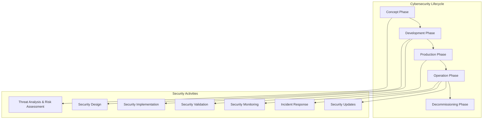

### 2.2 Security Governance

#### 2.2.1 Cybersecurity Management System (CSMS)
- **CSMS Scope**: EBS development, production, and operation
- **Risk Management**: Continuous risk assessment and mitigation
- **Security Policies**: Comprehensive security policy framework
- **Incident Management**: Structured incident response procedures
- **Monitoring**: Continuous security monitoring and assessment

#### 2.2.2 Organizational Structure
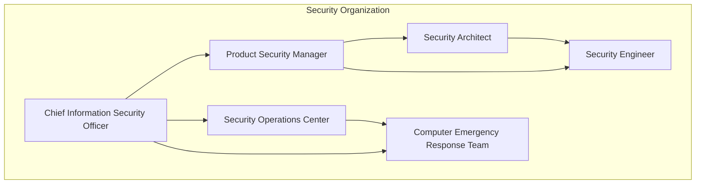

### 2.3 Security Requirements Framework

#### 2.3.1 Security Requirements Categories
| Category | Description | Priority | Standards |
|----------|-------------|----------|-----------|
| **Identification** | Asset identification and classification | High | ISO/SAE 21434 |
| **Protection** | Preventive security controls | Critical | ISO 27001 |
| **Detection** | Security monitoring and detection | High | NIST CSF |
| **Response** | Incident response and recovery | Critical | ISO 27035 |
| **Recovery** | Business continuity and recovery | Medium | ISO 22301 |

---

## 3. Threat Analysis and Risk Assessment

### 3.1 Asset Identification and Classification

#### 3.1.1 EBS Assets Inventory
| Asset Type | Asset Name | Criticality | Confidentiality | Integrity | Availability |
|------------|------------|-------------|----------------|-----------|--------------|
| **Hardware** | Primary ECU | Critical | Medium | Critical | Critical |
| **Hardware** | Secondary ECU | High | Medium | Critical | Critical |
| **Software** | Control Algorithms | Critical | High | Critical | Critical |
| **Software** | Diagnostic Software | Medium | Medium | High | Medium |
| **Data** | Calibration Data | High | High | Critical | High |
| **Data** | Diagnostic Data | Medium | Medium | High | Medium |
| **Communication** | CAN Bus | Critical | Medium | Critical | Critical |
| **Communication** | Diagnostic Interface | Medium | High | High | Medium |

#### 3.1.2 Attack Surface Analysis
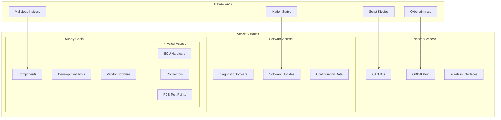

### 3.2 Threat Modeling

#### 3.2.1 STRIDE Threat Analysis
| Threat Category | Threat Description | Asset Affected | Impact Level | Likelihood |
|-----------------|-------------------|----------------|--------------|------------|
| **Spoofing** | Impersonation of legitimate ECU | CAN Communication | High | Medium |
| **Tampering** | Modification of control algorithms | Software | Critical | Low |
| **Repudiation** | Denial of diagnostic actions | Diagnostic Data | Medium | Low |
| **Information Disclosure** | Exposure of calibration data | Configuration Data | High | Medium |
| **Denial of Service** | CAN bus flooding attack | CAN Communication | Critical | Medium |
| **Elevation of Privilege** | Unauthorized diagnostic access | Diagnostic Interface | High | Medium |

#### 3.2.2 Attack Tree Analysis

**Primary Attack Goal: Compromise EBS Functionality**
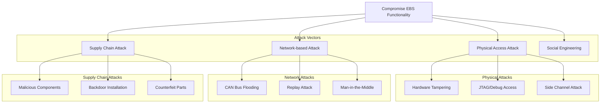

### 3.3 Risk Assessment

#### 3.3.1 Risk Evaluation Matrix
| Risk ID | Threat | Vulnerability | Impact | Likelihood | Risk Level | Mitigation Priority |
|---------|--------|---------------|--------|------------|------------|-------------------|
| R001 | CAN Bus Flooding | Lack of message filtering | High | Medium | High | 1 |
| R002 | ECU Impersonation | Weak authentication | Critical | Low | Medium | 2 |
| R003 | Firmware Tampering | No code signing | Critical | Low | Medium | 2 |
| R004 | Diagnostic Abuse | Weak access control | Medium | High | Medium | 3 |
| R005 | Side Channel Attack | Unprotected crypto | High | Low | Low | 4 |

#### 3.3.2 Risk Treatment Strategies
- **Risk Avoidance**: Eliminate vulnerabilities through design changes
- **Risk Mitigation**: Implement security controls to reduce risk
- **Risk Transfer**: Use insurance or third-party security services
- **Risk Acceptance**: Accept residual risk with management approval

---

## 4. Security Architecture

### 4.1 Defense in Depth Strategy

#### 4.1.1 Security Layers
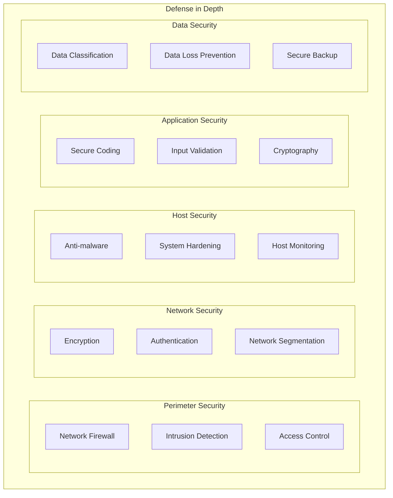

#### 4.1.2 Security Zones
| Zone | Description | Security Level | Access Control | Monitoring |
|------|-------------|----------------|----------------|------------|
| **Critical Zone** | Safety-critical functions | ASIL-D | Strict authentication | Real-time monitoring |
| **Control Zone** | Vehicle control functions | High | Certificate-based | Continuous monitoring |
| **Diagnostic Zone** | Service and maintenance | Medium | Role-based access | Event logging |
| **External Zone** | External interfaces | Low | Basic authentication | Periodic monitoring |

### 4.2 Secure Communication Architecture

#### 4.2.1 CAN Bus Security
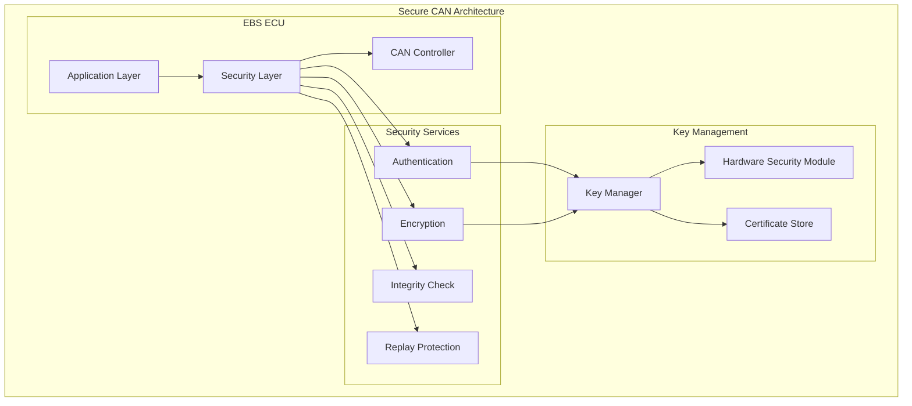

#### 4.2.2 Secure Message Format
```
+------------------+------------------+------------------+
|   Message Header |   Payload Data   | Security Trailer |
+------------------+------------------+------------------+
| ID | Seq | Flags | Application Data | MAC | Timestamp  |
+------------------+------------------+------------------+
```

**Message Security Fields:**
- **Message ID**: Unique message identifier
- **Sequence Number**: Monotonic counter for replay protection
- **Security Flags**: Encryption, authentication, priority flags
- **Message Authentication Code (MAC)**: HMAC-SHA256 for integrity
- **Timestamp**: Message generation timestamp

### 4.3 Hardware Security Architecture

#### 4.3.1 Hardware Security Module (HSM)
- **HSM Type**: Infineon SLI97 or equivalent
- **Security Level**: Common Criteria EAL5+ certified
- **Key Storage**: Secure key storage with tamper resistance
- **Cryptographic Operations**: Hardware-accelerated crypto functions
- **Random Number Generation**: True random number generator
- **Secure Boot**: Verified boot process with digital signatures

#### 4.3.2 Secure Boot Process
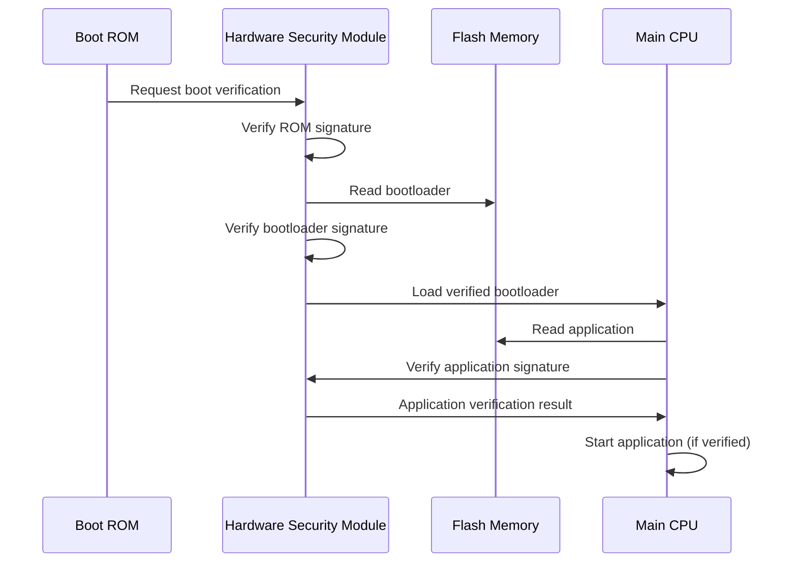

---

## 5. Cryptographic Specifications

### 5.1 Cryptographic Algorithms

#### 5.1.1 Approved Algorithms
| Purpose | Algorithm | Key Size | Standard | Implementation |
|---------|-----------|----------|----------|----------------|
| **Symmetric Encryption** | AES | 256-bit | FIPS 197 | Hardware accelerated |
| **Asymmetric Encryption** | RSA | 2048-bit | FIPS 186-4 | Software/Hardware |
| **Digital Signatures** | ECDSA | P-256 | FIPS 186-4 | Hardware accelerated |
| **Hash Functions** | SHA-256 | 256-bit | FIPS 180-4 | Hardware accelerated |
| **Message Authentication** | HMAC-SHA256 | 256-bit | FIPS 198-1 | Hardware accelerated |
| **Key Derivation** | PBKDF2 | 256-bit | RFC 2898 | Software |

#### 5.1.2 Cryptographic Modes of Operation
- **AES Encryption**: AES-GCM for authenticated encryption
- **Digital Signatures**: ECDSA with SHA-256 hash
- **Key Exchange**: ECDH with P-256 curve
- **Random Number Generation**: CTR_DRBG per NIST SP 800-90A

### 5.2 Key Management

#### 5.2.1 Key Hierarchy
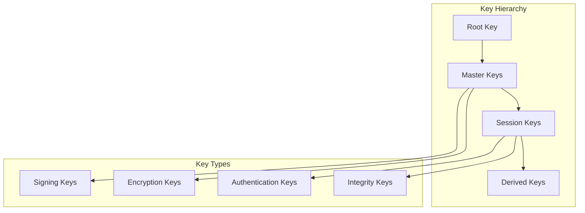

#### 5.2.2 Key Lifecycle Management
| Phase | Activities | Security Controls | Validation |
|-------|------------|-------------------|------------|
| **Generation** | Secure key generation | HSM-based generation | Entropy testing |
| **Distribution** | Secure key distribution | Encrypted channels | Authentication |
| **Storage** | Secure key storage | Hardware protection | Access control |
| **Usage** | Cryptographic operations | Usage policies | Audit logging |
| **Rotation** | Periodic key updates | Automated rotation | Continuity testing |
| **Destruction** | Secure key deletion | Cryptographic erasure | Verification |

### 5.3 Certificate Management

#### 5.3.1 Public Key Infrastructure (PKI)
- **Root CA**: Manufacturer root certificate authority
- **Intermediate CA**: Product-specific intermediate CA
- **Device Certificates**: Individual ECU certificates
- **Certificate Validation**: OCSP or CRL-based validation
- **Certificate Lifecycle**: 5-year validity with annual renewal

#### 5.3.2 Certificate Chain Structure
```
Root CA Certificate
    └── EBS Intermediate CA Certificate
        └── EBS ECU Certificate
            ├── Serial Number: Unique ECU identifier
            ├── Public Key: ECDSA P-256 public key
            ├── Validity: 5 years from manufacturing
            └── Extensions: Key usage, basic constraints
```

---

## 6. Secure Communication Protocols

### 6.1 CAN Bus Security Protocol

#### 6.1.1 Secure CAN Message Format
```
Standard CAN Frame (11-bit ID):
+-----+-----+-----+-----+-----+-----+-----+-----+
| ID  | RTR | IDE | r0  | DLC |    Data Field   |
+-----+-----+-----+-----+-----+-----+-----+-----+

Secure CAN Frame Extension:
+-----+-----+-----+-----+-----+-----+-----+-----+
| Seq | Enc | Auth| Res |        MAC          |
+-----+-----+-----+-----+-----+-----+-----+-----+
```

**Security Fields:**
- **Seq (4 bits)**: Sequence number for replay protection
- **Enc (1 bit)**: Encryption flag
- **Auth (1 bit)**: Authentication flag
- **Res (2 bits)**: Reserved for future use
- **MAC (32 bits)**: Message Authentication Code

#### 6.1.2 Message Authentication Protocol
```c
// Secure CAN Message Authentication
typedef struct {
    uint32_t message_id;
    uint8_t sequence_number;
    uint8_t data_length;
    uint8_t data[8];
    uint32_t timestamp;
    uint32_t mac;
} secure_can_message_t;

// MAC Calculation
uint32_t calculate_mac(secure_can_message_t* msg, uint8_t* key) {
    uint8_t mac_input[16];
    
    // Construct MAC input
    memcpy(mac_input, &msg->message_id, 4);
    mac_input[4] = msg->sequence_number;
    mac_input[5] = msg->data_length;
    memcpy(&mac_input[6], msg->data, 8);
    memcpy(&mac_input[14], &msg->timestamp, 2);
    
    // Calculate HMAC-SHA256 (truncated to 32 bits)
    return hmac_sha256_truncated(mac_input, 16, key, 32);
}
```

### 6.2 Diagnostic Security Protocol

#### 6.2.1 Secure Diagnostic Session
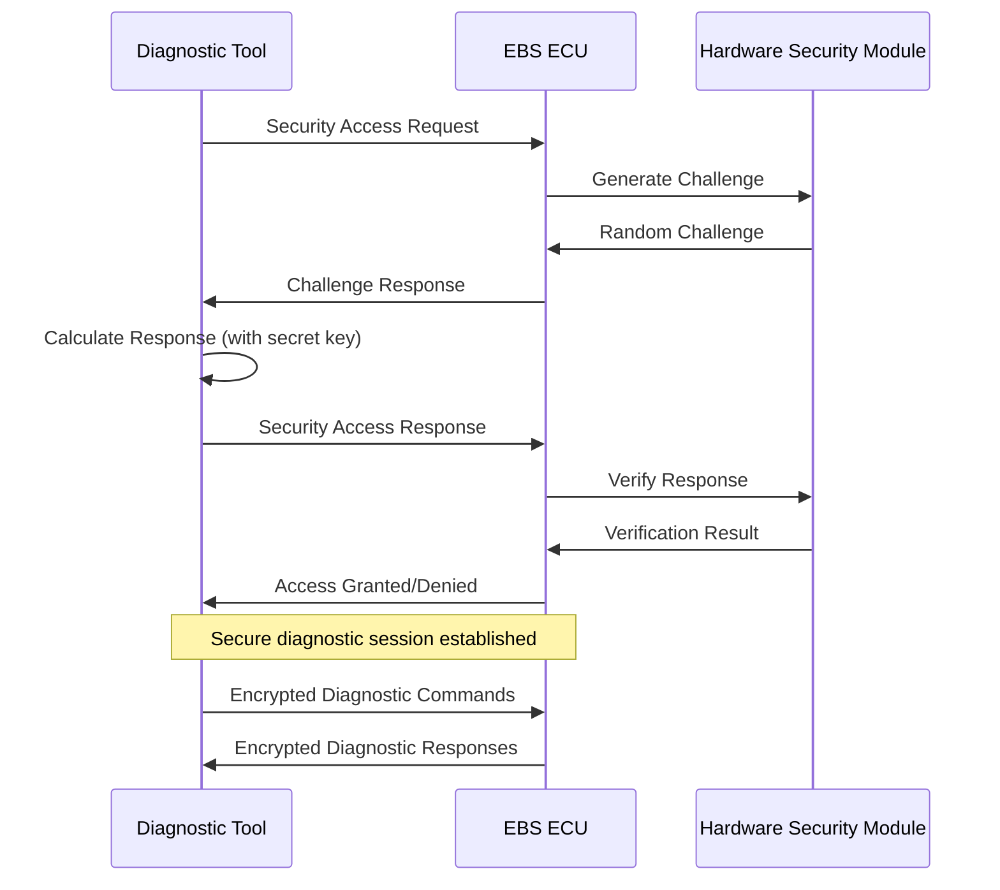

#### 6.2.2 Challenge-Response Authentication
```c
// Challenge-Response Authentication
typedef struct {
    uint8_t challenge[16];    // 128-bit random challenge
    uint8_t response[32];     // 256-bit HMAC response
    uint32_t timestamp;       // Request timestamp
    uint8_t access_level;     // Requested access level
} security_access_t;

// Response Calculation
void calculate_response(uint8_t* challenge, uint8_t* secret_key, 
                       uint8_t* response) {
    uint8_t input[20];
    
    // Combine challenge with timestamp
    memcpy(input, challenge, 16);
    uint32_t timestamp = get_timestamp();
    memcpy(&input[16], &timestamp, 4);
    
    // Calculate HMAC-SHA256
    hmac_sha256(input, 20, secret_key, 32, response);
}
```

### 6.3 Over-the-Air (OTA) Update Security

#### 6.3.1 Secure Update Process
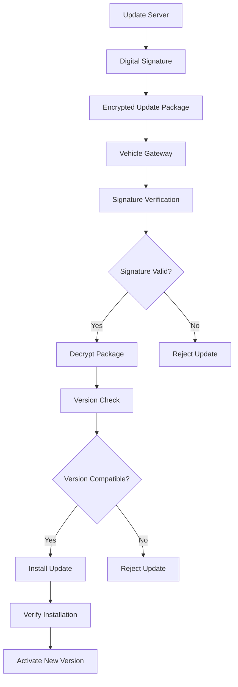

#### 6.3.2 Update Package Format
```
+------------------+------------------+------------------+
|   Package Header |  Encrypted Data  | Digital Signature|
+------------------+------------------+------------------+
| Version | Size   | AES-GCM Payload  | ECDSA Signature  |
+------------------+------------------+------------------+
```

**Package Security:**
- **Encryption**: AES-256-GCM for confidentiality and integrity
- **Digital Signature**: ECDSA P-256 for authenticity
- **Version Control**: Monotonic version numbers to prevent rollback
- **Integrity Check**: SHA-256 hash of entire package

---

## 7. Authentication and Authorization

### 7.1 Entity Authentication

#### 7.1.1 ECU Authentication
```c
// ECU Authentication Protocol
typedef struct {
    uint8_t ecu_id[16];           // Unique ECU identifier
    uint8_t certificate[512];     // X.509 certificate
    uint8_t signature[64];        // ECDSA signature
    uint32_t timestamp;           // Authentication timestamp
    uint8_t nonce[16];           // Random nonce
} ecu_auth_message_t;

// Authentication Process
bool authenticate_ecu(ecu_auth_message_t* auth_msg) {
    // Verify certificate chain
    if (!verify_certificate_chain(auth_msg->certificate)) {
        return false;
    }
    
    // Verify signature
    uint8_t message_hash[32];
    sha256_hash(auth_msg, sizeof(ecu_auth_message_t) - 64, message_hash);
    
    return ecdsa_verify(message_hash, 32, auth_msg->signature, 
                       get_public_key(auth_msg->certificate));
}
```

#### 7.1.2 Diagnostic Tool Authentication
- **Certificate-based Authentication**: X.509 certificates for tool identity
- **Multi-factor Authentication**: Certificate + PIN/password
- **Role-based Access**: Different access levels for different roles
- **Session Management**: Time-limited authenticated sessions
- **Audit Logging**: Complete audit trail of authentication events

### 7.2 Access Control

#### 7.2.1 Role-Based Access Control (RBAC)
| Role | Permissions | Access Level | Authentication Required |
|------|-------------|--------------|------------------------|
| **Technician** | Read diagnostic data | Level 1 | Certificate + PIN |
| **Engineer** | Calibration access | Level 2 | Certificate + Strong Auth |
| **Administrator** | Full system access | Level 3 | Certificate + Multi-factor |
| **Emergency** | Safety override | Level 4 | Physical key + Certificate |

#### 7.2.2 Function-Level Authorization
```c
// Function Authorization Matrix
typedef enum {
    FUNC_READ_DTC = 0x01,
    FUNC_CLEAR_DTC = 0x02,
    FUNC_READ_DATA = 0x04,
    FUNC_WRITE_DATA = 0x08,
    FUNC_CALIBRATION = 0x10,
    FUNC_PROGRAMMING = 0x20,
    FUNC_SAFETY_OVERRIDE = 0x40
} function_permissions_t;

// Role Permission Matrix
const uint8_t role_permissions[4] = {
    FUNC_READ_DTC | FUNC_READ_DATA,                    // Technician
    FUNC_READ_DTC | FUNC_CLEAR_DTC | FUNC_READ_DATA | 
    FUNC_WRITE_DATA | FUNC_CALIBRATION,               // Engineer
    0xFF,                                             // Administrator
    FUNC_SAFETY_OVERRIDE                              // Emergency
};

// Authorization Check
bool is_authorized(uint8_t role, uint8_t function) {
    return (role_permissions[role] & function) != 0;
}
```

---

## 8. Secure Software Development

### 8.1 Secure Development Lifecycle (SDL)

#### 8.1.1 SDL Process
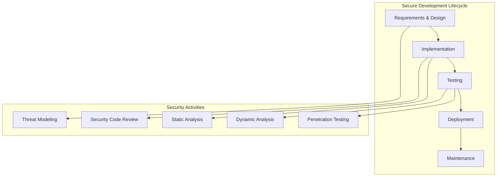

#### 8.1.2 Security Requirements
- **Input Validation**: All inputs must be validated and sanitized
- **Output Encoding**: All outputs must be properly encoded
- **Authentication**: Strong authentication for all privileged operations
- **Authorization**: Principle of least privilege for all functions
- **Cryptography**: Use only approved cryptographic algorithms
- **Error Handling**: Secure error handling without information leakage

### 8.2 Secure Coding Standards

#### 8.2.1 MISRA C Security Extensions
```c
// Secure Input Validation Example
typedef enum {
    VALIDATION_SUCCESS = 0,
    VALIDATION_NULL_POINTER,
    VALIDATION_OUT_OF_RANGE,
    VALIDATION_INVALID_FORMAT,
    VALIDATION_BUFFER_OVERFLOW
} validation_result_t;

validation_result_t validate_sensor_data(const sensor_data_t* data) {
    // Null pointer check
    if (data == NULL) {
        return VALIDATION_NULL_POINTER;
    }
    
    // Range validation
    if (data->value < SENSOR_MIN_VALUE || data->value > SENSOR_MAX_VALUE) {
        return VALIDATION_OUT_OF_RANGE;
    }
    
    // Rate of change validation
    static float previous_value = 0.0f;
    float rate_of_change = fabsf(data->value - previous_value);
    if (rate_of_change > MAX_RATE_OF_CHANGE) {
        return VALIDATION_INVALID_FORMAT;
    }
    previous_value = data->value;
    
    return VALIDATION_SUCCESS;
}
```

#### 8.2.2 Buffer Overflow Prevention
```c
// Safe String Operations
#define MAX_STRING_LENGTH 256

// Safe string copy with bounds checking
bool safe_strcpy(char* dest, size_t dest_size, const char* src) {
    if (dest == NULL || src == NULL || dest_size == 0) {
        return false;
    }
    
    size_t src_len = strnlen(src, dest_size);
    if (src_len >= dest_size) {
        return false;  // Source too long
    }
    
    memcpy(dest, src, src_len);
    dest[src_len] = '\0';
    return true;
}

// Safe memory operations
bool safe_memcpy(void* dest, size_t dest_size, const void* src, size_t count) {
    if (dest == NULL || src == NULL || count > dest_size) {
        return false;
    }
    
    memcpy(dest, src, count);
    return true;
}
```

### 8.3 Code Analysis and Testing

#### 8.3.1 Static Analysis Security Testing (SAST)
- **Tools**: PC-lint Plus, Polyspace, Coverity
- **Rules**: MISRA C:2012 + security extensions
- **Coverage**: 100% of safety-critical code
- **Metrics**: Cyclomatic complexity, code coverage, defect density
- **Reporting**: Automated security vulnerability reports

#### 8.3.2 Dynamic Analysis Security Testing (DAST)
- **Fuzzing**: Input fuzzing for robustness testing
- **Runtime Analysis**: Memory leak and buffer overflow detection
- **Penetration Testing**: Simulated attack scenarios
- **Performance Testing**: Security overhead measurement
- **Integration Testing**: End-to-end security validation

---

## 9. Security Monitoring and Incident Response

### 9.1 Security Monitoring

#### 9.1.1 Intrusion Detection System (IDS)
```c
// Intrusion Detection Framework
typedef struct {
    uint32_t message_id;
    uint32_t frequency;
    uint32_t last_seen;
    uint8_t source_node;
    bool is_suspicious;
} message_profile_t;

// Anomaly Detection
bool detect_can_anomaly(can_message_t* msg) {
    static message_profile_t profiles[MAX_MESSAGE_TYPES];
    
    // Find message profile
    message_profile_t* profile = find_profile(msg->id);
    if (profile == NULL) {
        // New message type - create profile
        profile = create_profile(msg->id);
    }
    
    // Check frequency anomaly
    uint32_t current_time = get_timestamp();
    uint32_t time_delta = current_time - profile->last_seen;
    
    if (time_delta < MIN_MESSAGE_INTERVAL) {
        // Potential flooding attack
        profile->is_suspicious = true;
        log_security_event(SECURITY_EVENT_FLOODING, msg->id);
        return true;
    }
    
    // Update profile
    profile->last_seen = current_time;
    profile->frequency++;
    
    return false;
}
```

#### 9.1.2 Security Event Logging
```c
// Security Event Types
typedef enum {
    SECURITY_EVENT_AUTH_FAILURE = 0x01,
    SECURITY_EVENT_FLOODING = 0x02,
    SECURITY_EVENT_REPLAY_ATTACK = 0x03,
    SECURITY_EVENT_TAMPERING = 0x04,
    SECURITY_EVENT_UNAUTHORIZED_ACCESS = 0x05
} security_event_type_t;

// Security Event Structure
typedef struct {
    uint32_t timestamp;
    security_event_type_t event_type;
    uint32_t source_id;
    uint8_t severity;
    uint8_t data[16];
    uint32_t checksum;
} security_event_t;

// Event Logging Function
void log_security_event(security_event_type_t type, uint32_t source_id) {
    security_event_t event;
    
    event.timestamp = get_timestamp();
    event.event_type = type;
    event.source_id = source_id;
    event.severity = get_event_severity(type);
    
    // Store additional event data
    get_event_context(type, event.data, sizeof(event.data));
    
    // Calculate checksum
    event.checksum = calculate_checksum(&event, sizeof(event) - 4);
    
    // Store in secure log
    store_security_event(&event);
    
    // Send alert if critical
    if (event.severity >= SEVERITY_HIGH) {
        send_security_alert(&event);
    }
}
```

### 9.2 Incident Response

#### 9.2.1 Incident Response Process
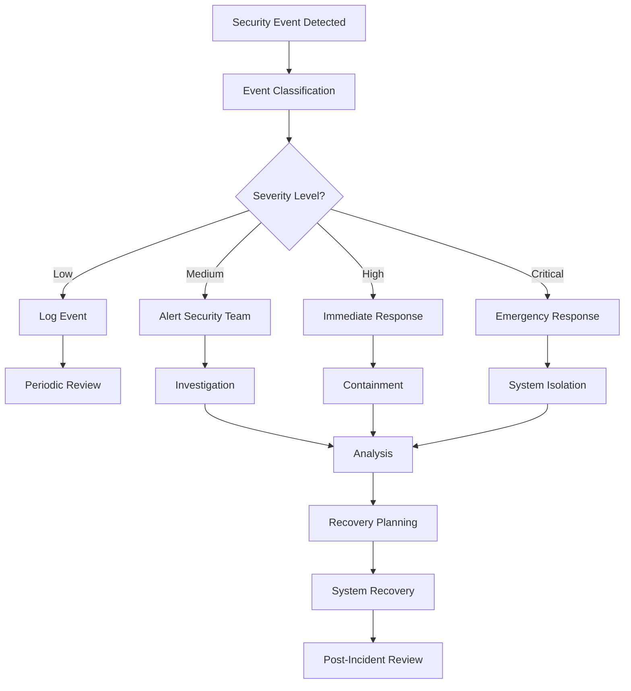

#### 9.2.2 Incident Response Team
| Role | Responsibilities | Contact Method | Response Time |
|------|------------------|----------------|---------------|
| **Incident Commander** | Overall incident management | 24/7 hotline | 15 minutes |
| **Security Analyst** | Technical analysis and investigation | Secure messaging | 30 minutes |
| **System Administrator** | System isolation and recovery | Direct phone | 15 minutes |
| **Legal Counsel** | Legal and regulatory compliance | Secure email | 2 hours |
| **Communications** | Stakeholder communication | Multiple channels | 1 hour |

#### 9.2.3 Incident Classification
| Severity | Description | Response Time | Escalation |
|----------|-------------|---------------|------------|
| **Critical** | Safety impact, system compromise | Immediate | CEO, Regulators |
| **High** | Security breach, data exposure | 1 hour | CTO, Legal |
| **Medium** | Attempted attack, policy violation | 4 hours | Security Manager |
| **Low** | Suspicious activity, minor issues | 24 hours | Security Team |

---

## 10. Security Testing and Validation

### 10.1 Security Testing Framework

#### 10.1.1 Security Test Categories
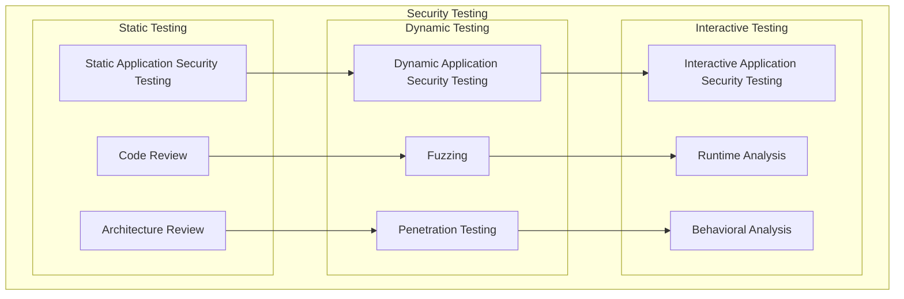

#### 10.1.2 Security Test Plan
| Test Phase | Test Type | Coverage | Tools | Success Criteria |
|------------|-----------|----------|-------|------------------|
| **Unit Testing** | SAST | 100% code | PC-lint, Coverity | Zero critical vulnerabilities |
| **Integration** | DAST | All interfaces | Custom tools | All attacks mitigated |
| **System Testing** | Penetration | Full system | Metasploit, Nmap | No successful attacks |
| **Acceptance** | Red Team | Real scenarios | Professional team | System remains secure |

### 10.2 Penetration Testing

#### 10.2.1 Attack Scenarios
**Scenario 1: CAN Bus Attack**
```
Objective: Compromise vehicle control through CAN bus
Attack Vector: OBD-II port access
Tools: CANoe, SocketCAN, custom scripts
Expected Outcome: Attack detected and mitigated
```

**Scenario 2: Diagnostic Tool Abuse**
```
Objective: Gain unauthorized access through diagnostic interface
Attack Vector: Stolen/cloned diagnostic tool
Tools: Custom diagnostic software
Expected Outcome: Authentication prevents access
```

**Scenario 3: Firmware Tampering**
```
Objective: Install malicious firmware
Attack Vector: Physical access to ECU
Tools: JTAG debugger, custom firmware
Expected Outcome: Secure boot prevents execution
```

#### 10.2.2 Red Team Exercise
- **Duration**: 2 weeks intensive testing
- **Team**: External security professionals
- **Scope**: Complete EBS system
- **Rules of Engagement**: No permanent damage, documented attacks
- **Reporting**: Detailed vulnerability report with remediation

### 10.3 Security Validation

#### 10.3.1 Cryptographic Validation
- **Algorithm Testing**: NIST CAVP (Cryptographic Algorithm Validation Program)
- **Implementation Testing**: Side-channel analysis, fault injection
- **Key Management Testing**: Key lifecycle validation
- **Random Number Testing**: NIST SP 800-22 statistical tests
- **Performance Testing**: Cryptographic operation timing

#### 10.3.2 Security Architecture Validation
```c
// Security Architecture Test Framework
typedef struct {
    char test_name[64];
    bool (*test_function)(void);
    uint8_t severity;
    bool mandatory;
} security_test_t;

// Example Security Tests
bool test_authentication_bypass(void) {
    // Attempt to bypass authentication
    diagnostic_request_t req;
    req.service_id = 0x27;  // Security Access
    req.data_length = 0;
    
// Send request without proper authentication
    diagnostic_response_t resp = send_diagnostic_request(&req);
    
    // Test should fail - access should be denied
    return (resp.response_code == NEGATIVE_RESPONSE);
}

bool test_can_message_injection(void) {
    // Attempt to inject malicious CAN messages
    can_message_t malicious_msg;
    malicious_msg.id = EBS_CONTROL_MESSAGE_ID;
    malicious_msg.dlc = 8;
    memset(malicious_msg.data, 0xFF, 8);  // Invalid data
    
    // Inject message
    bool injection_success = inject_can_message(&malicious_msg);
    
    // Check if system detected and rejected the message
    security_event_t* events = get_recent_security_events();
    bool attack_detected = false;
    
    for (int i = 0; i < MAX_EVENTS; i++) {
        if (events[i].event_type == SECURITY_EVENT_TAMPERING) {
            attack_detected = true;
            break;
        }
    }
    
    // Test passes if attack was detected
    return attack_detected;
}

// Security Test Suite
security_test_t security_tests[] = {
    {"Authentication Bypass Test", test_authentication_bypass, SEVERITY_CRITICAL, true},
    {"CAN Message Injection Test", test_can_message_injection, SEVERITY_HIGH, true},
    {"Replay Attack Test", test_replay_attack, SEVERITY_HIGH, true},
    {"Buffer Overflow Test", test_buffer_overflow, SEVERITY_CRITICAL, true},
    {"Cryptographic Validation", test_crypto_implementation, SEVERITY_HIGH, true}
};
```

---

## 11. Security Lifecycle Management

### 11.1 Security Maintenance

#### 11.1.1 Vulnerability Management
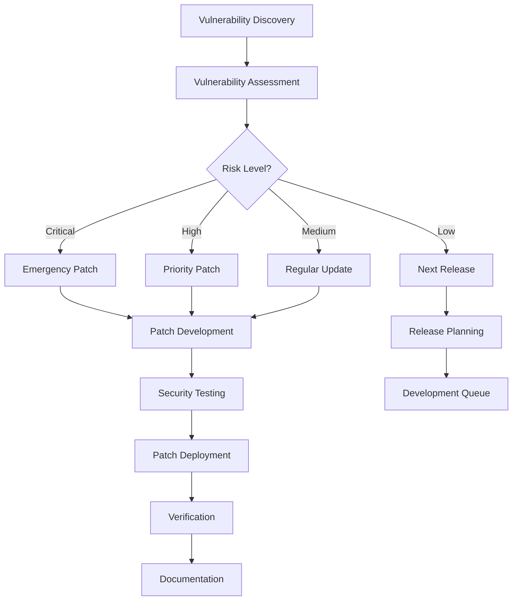

#### 11.1.2 Security Update Process
| Phase | Activities | Timeline | Stakeholders |
|-------|------------|----------|--------------|
| **Discovery** | Vulnerability identification | Immediate | Security team, researchers |
| **Assessment** | Risk analysis and prioritization | 24 hours | Security team, management |
| **Development** | Patch development and testing | 1-4 weeks | Development team |
| **Deployment** | Patch distribution and installation | 1-2 weeks | Operations team |
| **Verification** | Patch effectiveness validation | 1 week | QA team, security team |

### 11.2 Security Monitoring and Metrics

#### 11.2.1 Security KPIs
| Metric | Target | Measurement | Frequency |
|--------|--------|-------------|-----------|
| **Vulnerability Response Time** | <24 hours | Time from discovery to patch | Monthly |
| **Security Test Coverage** | 100% | Tests passed/total tests | Per release |
| **Incident Response Time** | <1 hour | Time to containment | Per incident |
| **False Positive Rate** | <5% | False alarms/total alerts | Weekly |
| **Security Training Completion** | 100% | Staff trained/total staff | Quarterly |

#### 11.2.2 Security Dashboard
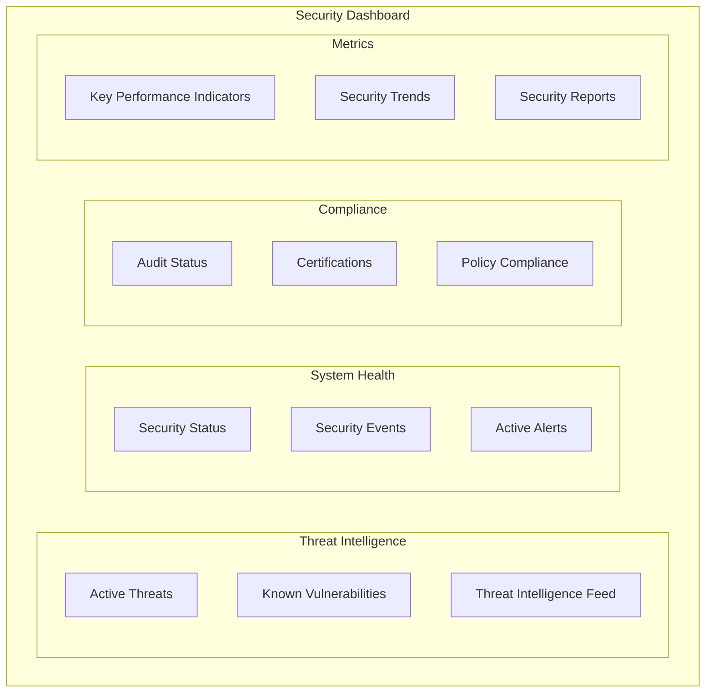

### 11.3 Security Training and Awareness

#### 11.3.1 Security Training Program
| Role | Training Content | Duration | Frequency |
|------|------------------|----------|-----------|
| **Developers** | Secure coding, threat modeling | 16 hours | Annual |
| **Testers** | Security testing, penetration testing | 12 hours | Annual |
| **Managers** | Security governance, risk management | 8 hours | Annual |
| **All Staff** | Security awareness, phishing prevention | 4 hours | Quarterly |

#### 11.3.2 Security Awareness Topics
- **Phishing and Social Engineering**: Recognition and prevention
- **Physical Security**: Device and facility security
- **Data Protection**: Handling of sensitive information
- **Incident Reporting**: How to report security incidents
- **Secure Development**: Security best practices for developers

---

## 12. Compliance and Certification

### 12.1 Regulatory Compliance

#### 12.1.1 Automotive Cybersecurity Regulations
| Regulation | Scope | Requirements | Compliance Status |
|------------|-------|--------------|-------------------|
| **UN-ECE WP.29** | Vehicle cybersecurity | CSMS, risk assessment, monitoring | In Progress |
| **ISO/SAE 21434** | Cybersecurity engineering | Lifecycle processes, risk management | Target |
| **EU Type Approval** | Vehicle certification | Cybersecurity demonstration | Required |
| **NHTSA Guidelines** | US market requirements | Cybersecurity best practices | Recommended |

#### 12.1.2 Compliance Framework
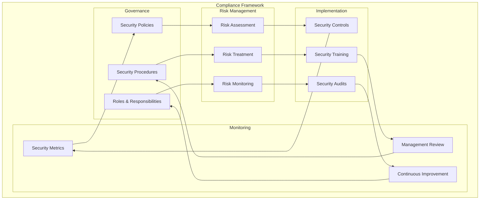

### 12.2 Security Certification

#### 12.2.1 Common Criteria Evaluation
- **Protection Profile**: Automotive ECU Protection Profile
- **Security Target**: EBS-specific security target document
- **Evaluation Assurance Level**: EAL4+ (methodically designed, tested, and reviewed)
- **Security Functions**: Authentication, access control, cryptography
- **Evaluation Timeline**: 12-18 months

#### 12.2.2 FIPS 140-2 Certification
- **Cryptographic Module**: Hardware Security Module (HSM)
- **Security Level**: Level 3 (tamper-evident physical security)
- **Approved Algorithms**: AES, SHA-256, ECDSA, HMAC
- **Key Management**: Secure key generation, storage, and destruction
- **Testing Laboratory**: NIST-approved testing laboratory

### 12.3 Security Audit and Assessment

#### 12.3.1 Internal Security Audits
- **Frequency**: Quarterly internal audits
- **Scope**: Complete cybersecurity management system
- **Auditors**: Internal audit team with security expertise
- **Standards**: ISO 27001, ISO/SAE 21434
- **Reporting**: Audit findings and corrective action plans

#### 12.3.2 External Security Assessments
- **Third-Party Assessment**: Annual independent security assessment
- **Penetration Testing**: Bi-annual penetration testing
- **Vulnerability Assessment**: Quarterly vulnerability scans
- **Code Review**: Annual third-party code security review
- **Certification Maintenance**: Ongoing certification maintenance

---

## Document Control

### Cybersecurity Document Management

#### Security Classification
- **Classification Level**: Confidential - Security Critical
- **Access Control**: Need-to-know basis, security clearance required
- **Distribution**: Controlled distribution list
- **Handling**: Secure storage, encrypted transmission
- **Retention**: 10 years minimum retention period

#### Change Control Process
1. **Security Impact Assessment**: Evaluate security impact of changes
2. **Security Review**: Security team review of all changes
3. **Approval**: Security manager approval required
4. **Implementation**: Controlled implementation with rollback plan
5. **Verification**: Security testing of all changes
6. **Documentation**: Update of security documentation

### Revision History
| Version | Date | Author | Changes | Security Review |
|---------|------|--------|---------|-----------------|
| 1.0 | 2025-07-29 | Security Architect | Initial cybersecurity specification | [Security Manager] |

### Approval
- **Chief Information Security Officer**: [Signature Required]
- **Product Security Manager**: [Signature Required]
- **Security Architect**: [Signature Required]
- **Compliance Manager**: [Signature Required]
- **Date**: [Approval Date]

### Distribution List
| Role | Name | Organization | Access Level |
|------|------|--------------|--------------|
| **CISO** | [Name] | Security Department | Full Access |
| **Product Security Manager** | [Name] | Product Development | Full Access |
| **Security Architect** | [Name] | Engineering | Full Access |
| **Development Manager** | [Name] | Software Development | Limited Access |
| **Test Manager** | [Name] | Quality Assurance | Limited Access |

---

*This document contains security-critical and proprietary information. Unauthorized disclosure is prohibited and may result in legal action. All recipients must sign a non-disclosure agreement and follow established security procedures for handling classified information.*

**Security Notice**: This document contains information that could be used to compromise system security. Access is restricted to authorized personnel only. Any suspected security breach or unauthorized access must be reported immediately to the Security Operations Center.

**Classification**: CONFIDENTIAL - SECURITY CRITICAL  
**Handling**: Authorized Personnel Only  
**Distribution**: Controlled  
**Retention**: 10 Years Minimum