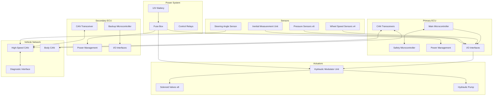
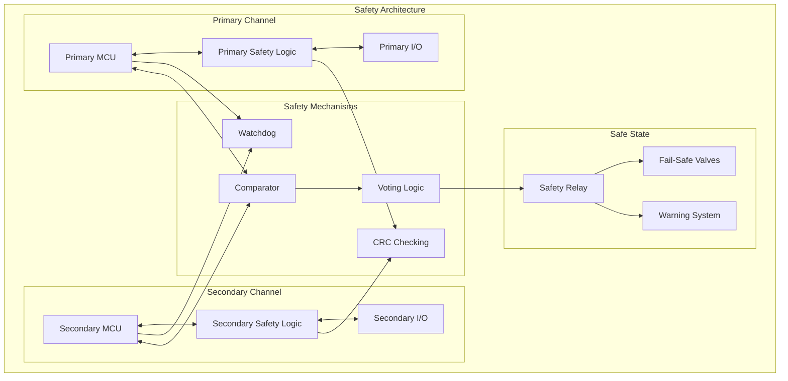
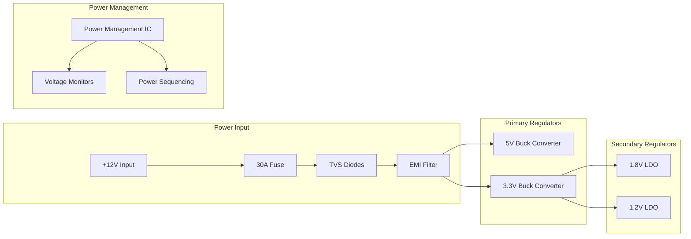
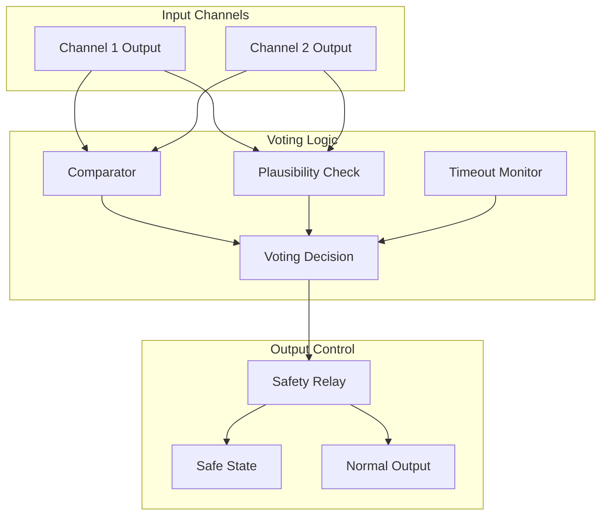

# Electronic Braking System (EBS) - Hardware Design Specifications

## Document Information
- **Document Title**: EBS Hardware Design Specifications
- **Version**: 1.0
- **Date**: 2025-07-29
- **Classification**: Technical Design Document
- **Related Documents**: EBS_Requirements_Specification.md, EBS_Component_Design_Specifications.md

## Table of Contents
1. [Introduction](#introduction)
2. [Hardware Architecture Overview](#hardware-architecture-overview)
3. [Electronic Control Unit Design](#electronic-control-unit-design)
4. [Sensor Hardware Specifications](#sensor-hardware-specifications)
5. [Actuator Hardware Specifications](#actuator-hardware-specifications)
6. [Power Management Hardware](#power-management-hardware)
7. [Communication Hardware](#communication-hardware)
8. [Safety Hardware Design](#safety-hardware-design)
9. [Thermal Management](#thermal-management)
10. [Mechanical Design](#mechanical-design)
11. [Manufacturing and Assembly](#manufacturing-and-assembly)
12. [Testing and Validation](#testing-and-validation)

---

## 1. Introduction

### 1.1 Purpose
This document provides detailed hardware design specifications for the Electronic Braking System (EBS), covering all electronic, mechanical, and electromechanical components required for system implementation.

### 1.2 Scope
The hardware design specifications cover:
- Electronic Control Unit (ECU) detailed design
- Sensor hardware implementation and interfaces
- Actuator hardware design and control circuits
- Power management and distribution systems
- Communication hardware and network interfaces
- Safety-critical hardware implementations
- Thermal management solutions
- Mechanical packaging and mounting systems

### 1.3 Design Standards and References
- **ISO 26262**: Functional Safety for Road Vehicles
- **ISO 16750**: Environmental Conditions for Automotive Equipment
- **IPC Standards**: PCB design and manufacturing standards
- **JEDEC Standards**: Semiconductor reliability standards
- **Automotive Electronics Council (AEC)**: Component qualification standards

---

## 2. Hardware Architecture Overview

### 2.1 System Block Diagram



### 2.2 Hardware Partitioning Strategy

| Subsystem | Primary ECU | Secondary ECU | Distributed |
|-----------|-------------|---------------|-------------|
| **Main Control Logic** | ✓ | Backup | - |
| **Safety Monitoring** | ✓ | ✓ | - |
| **Sensor Processing** | ✓ | Monitor | - |
| **Actuator Control** | ✓ | Emergency | - |
| **Communication** | ✓ | ✓ | - |
| **Power Management** | ✓ | ✓ | - |
| **Diagnostics** | ✓ | ✓ | - |

### 2.3 Safety Architecture Implementation



---

## 3. Electronic Control Unit Design

### 3.1 Primary ECU Hardware Design

#### 3.1.1 Main Microcontroller Specifications

**Microcontroller Selection: Infineon AURIX TC397**
- **Architecture**: 32-bit TriCore with dual ARM Cortex-R5F cores
- **Clock Speed**: 300 MHz main core, 200 MHz safety core
- **Flash Memory**: 8 MB embedded flash
- **RAM Memory**: 1 MB SRAM with ECC protection
- **Package**: LFBGA-516 (23mm x 23mm)
- **Operating Temperature**: -40°C to +150°C junction
- **Safety Certification**: ISO 26262 ASIL-D qualified

**Key Features:**
- Hardware Security Module (HSM) for cybersecurity
- Lockstep cores for safety-critical applications
- Memory Protection Unit (MPU) for memory isolation
- Multiple CAN-FD interfaces
- High-resolution PWM generators
- Integrated ADCs with 12-bit resolution

#### 3.1.2 PCB Design Specifications

**PCB Stack-up (8-layer design):**
```
Layer 1:  Component/Signal (35μm copper)
Layer 2:  Ground Plane (35μm copper)
Layer 3:  Signal Layer (17.5μm copper)
Layer 4:  Power Plane (+3.3V, +5V) (35μm copper)
Layer 5:  Power Plane (+12V) (35μm copper)
Layer 6:  Signal Layer (17.5μm copper)
Layer 7:  Ground Plane (35μm copper)
Layer 8:  Component/Signal (35μm copper)
```

**PCB Specifications:**
- **Board Size**: 150mm x 100mm
- **Board Thickness**: 1.6mm ±10%
- **Dielectric Material**: FR4 with low loss tangent
- **Copper Weight**: 1oz (35μm) for signal layers, 2oz (70μm) for power layers
- **Via Technology**: Micro-vias for high-density routing
- **Impedance Control**: ±10% tolerance for controlled impedance traces

**Design Rules:**
- **Minimum Trace Width**: 0.1mm (4 mil) for signals, 0.2mm (8 mil) for power
- **Minimum Via Size**: 0.15mm (6 mil) drill, 0.25mm (10 mil) pad
- **Minimum Spacing**: 0.1mm (4 mil) trace-to-trace, 0.15mm (6 mil) trace-to-via
- **Component Placement**: 0.5mm minimum spacing between components
- **Thermal Relief**: 4-spoke thermal relief for ground connections

#### 3.1.3 Power Supply Design

**Primary Power Rails:**
- **+12V Input**: Main power from vehicle battery
- **+5V Rail**: 10A capacity for sensors and I/O
- **+3.3V Rail**: 5A capacity for microcontroller and digital logic
- **+1.8V Rail**: 2A capacity for microcontroller core
- **+1.2V Rail**: 1A capacity for microcontroller core

**Power Supply Architecture:**


**Buck Converter Specifications (5V Rail):**
- **Input Voltage Range**: 9V to 16V
- **Output Voltage**: 5.0V ±2%
- **Output Current**: 10A maximum
- **Switching Frequency**: 500 kHz
- **Efficiency**: >90% at full load
- **Ripple**: <50mV peak-to-peak
- **Load Regulation**: <1% from no load to full load
- **Line Regulation**: <0.5% over input voltage range

#### 3.1.4 I/O Interface Design

**Analog Input Interfaces (16 channels):**
- **Input Voltage Range**: 0-5V single-ended
- **Input Impedance**: >1MΩ
- **Resolution**: 12-bit (4096 levels)
- **Accuracy**: ±0.5% FSR including linearity and offset
- **Sample Rate**: 1 MSPS maximum per channel
- **Anti-aliasing Filter**: 2nd order Butterworth, fc = 10 kHz
- **ESD Protection**: ±8kV contact discharge per IEC 61000-4-2

**Digital Input Interfaces (24 channels):**
- **Input Voltage Levels**: 
  - Logic Low: 0V to 0.8V
  - Logic High: 2.0V to 5.5V
- **Input Current**: <1mA per channel
- **Switching Threshold**: 1.4V typical with 0.4V hysteresis
- **Input Capacitance**: <10pF
- **ESD Protection**: ±8kV contact discharge
- **Debounce**: Hardware RC filter + software debounce

**PWM Output Interfaces (12 channels):**
- **Output Voltage**: 0V to 12V
- **Output Current**: 2A per channel (with external MOSFET driver)
- **Frequency Range**: 100 Hz to 20 kHz
- **Resolution**: 16-bit (65536 steps)
- **Accuracy**: ±0.1% of commanded duty cycle
- **Rise/Fall Time**: <1μs (10% to 90%)
- **Short Circuit Protection**: Electronic current limiting
- **Thermal Protection**: Automatic shutdown at 150°C

### 3.2 Secondary ECU Hardware Design

#### 3.2.1 Backup Microcontroller Specifications

**Microcontroller Selection: Infineon AURIX TC375**
- **Architecture**: 32-bit TriCore with ARM Cortex-R4F core
- **Clock Speed**: 200 MHz
- **Flash Memory**: 4 MB embedded flash
- **RAM Memory**: 512 KB SRAM with ECC protection
- **Package**: LFBGA-292 (17mm x 17mm)
- **Safety Certification**: ISO 26262 ASIL-D qualified

**Reduced I/O Configuration:**
- **Analog Inputs**: 8 channels for critical sensor monitoring
- **Digital Inputs**: 16 channels for essential status signals
- **PWM Outputs**: 6 channels for emergency actuator control
- **CAN Interfaces**: 2 channels for communication redundancy

#### 3.2.2 Watchdog and Monitoring Circuits

**External Watchdog Timer:**
- **IC**: TI TPS3813 or equivalent
- **Timeout Period**: 100ms ±10%
- **Reset Pulse Width**: 1ms minimum
- **Supply Voltage**: 3.3V ±5%
- **Operating Temperature**: -40°C to +125°C
- **Reset Threshold**: 2.93V (VDD = 3.3V)

**Voltage Monitoring:**
- **Supply Voltage Monitors**: One per power rail
- **Threshold Accuracy**: ±1.5%
- **Hysteresis**: 50mV typical
- **Propagation Delay**: <10μs
- **Reset Delay**: Programmable 1ms to 1s

**Temperature Monitoring:**
- **Sensor Type**: Integrated temperature sensor in MCU
- **Additional Sensors**: External temperature sensors for critical components
- **Accuracy**: ±2°C over operating range
- **Resolution**: 0.1°C
- **Sampling Rate**: 10 Hz

---

## 4. Sensor Hardware Specifications

### 4.1 Wheel Speed Sensor Interface

#### 4.1.1 Sensor Power Supply

**Power Supply Specifications:**
- **Output Voltage**: 5.0V ±5%
- **Output Current**: 100mA per sensor (400mA total)
- **Ripple**: <10mV peak-to-peak
- **Load Regulation**: <1% from no load to full load
- **Short Circuit Protection**: Electronic current limiting at 150mA
- **Reverse Polarity Protection**: Schottky diode with low forward drop

**Power Supply Circuit:**
```
+12V_BATT ──┬── L1 (10μH) ──┬── D1 (Schottky) ── +5V_SENS
            │               │
            C1 (100μF)      ├── C2 (10μF) ── C3 (0.1μF)
            │               │
            GND             R1 (Current Sense)
                           │
                           Current Monitor
```

#### 4.1.2 Signal Conditioning Circuit

**Input Protection:**
- **ESD Protection**: TVS diodes rated for ±15kV
- **Overvoltage Protection**: Zener diodes at 6.2V
- **Series Resistance**: 100Ω for current limiting
- **Common Mode Choke**: For EMI suppression

**Signal Processing:**
- **Input Buffer**: High-impedance CMOS buffer
- **Schmitt Trigger**: For noise immunity and clean digital output
- **Hysteresis**: 200mV typical for noise rejection
- **Output Driver**: Open-drain with pull-up resistor
- **Frequency Response**: DC to 50 kHz (-3dB)

#### 4.1.3 Diagnostic Features

**Sensor Health Monitoring:**
- **Supply Voltage Monitoring**: Continuous monitoring of 5V supply
- **Signal Presence Detection**: Detection of sensor signal activity
- **Frequency Range Check**: Valid frequency range monitoring
- **Wire Integrity Check**: Open/short circuit detection
- **Plausibility Check**: Cross-comparison between sensors

**Fault Detection Methods:**
- **Open Circuit**: Detected by pull-up resistor monitoring
- **Short to Ground**: Detected by low voltage on signal line
- **Short to Battery**: Detected by high voltage on signal line
- **Sensor Failure**: Detected by absence of signal during vehicle motion

### 4.2 Pressure Sensor Interface

#### 4.2.1 Analog Signal Conditioning

**Instrumentation Amplifier:**
- **IC**: Texas Instruments INA826 or equivalent
- **Gain**: 1 V/V (unity gain for ratiometric sensors)
- **Input Offset Voltage**: <25μV maximum
- **Input Bias Current**: <1nA maximum
- **Common Mode Rejection**: >100dB at DC
- **Bandwidth**: 1 MHz (-3dB)
- **Supply Voltage**: ±15V or single 5V supply

**Anti-Aliasing Filter:**
- **Filter Type**: 2nd order Sallen-Key low-pass
- **Cutoff Frequency**: 1 kHz (-3dB)
- **Roll-off Rate**: -40dB/decade
- **Passband Ripple**: <0.1dB
- **Group Delay**: <100μs at 100 Hz
- **Component Tolerance**: ±1% resistors, ±5% capacitors

**ADC Interface:**
- **Reference Voltage**: 5.000V ±0.1% precision reference
- **Input Range**: 0.5V to 4.5V (10% to 90% of supply)
- **Resolution**: 12-bit (4096 levels)
- **Sampling Rate**: 1 kHz per channel
- **Conversion Time**: <10μs per sample
- **Integral Nonlinearity**: <±1 LSB
- **Differential Nonlinearity**: <±0.5 LSB

#### 4.2.2 Calibration and Compensation

**Offset Calibration:**
- **Method**: Software-based offset correction
- **Calibration Points**: Zero pressure and atmospheric pressure
- **Accuracy**: ±0.1% of full scale after calibration
- **Temperature Compensation**: Linear temperature coefficient correction
- **Drift Compensation**: Long-term drift correction algorithm

**Gain Calibration:**
- **Method**: Two-point calibration at 0% and 100% of range
- **Reference Standards**: NIST-traceable pressure standards
- **Calibration Accuracy**: ±0.05% of reading
- **Linearity Correction**: Multi-point linearization if required
- **Cross-axis Compensation**: Correction for mounting orientation effects

### 4.3 Inertial Measurement Unit Interface

#### 4.3.1 SPI Interface Implementation

**SPI Master Configuration:**
- **Clock Speed**: 10 MHz maximum
- **Data Format**: 16-bit MSB first
- **Clock Polarity**: CPOL = 0 (idle low)
- **Clock Phase**: CPHA = 0 (sample on rising edge)
- **Chip Select**: Active low, minimum 100ns setup time
- **Data Hold Time**: 10ns minimum after clock edge

**Signal Integrity:**
- **Trace Impedance**: 50Ω ±10% single-ended
- **Trace Length Matching**: ±0.1mm between clock and data
- **Via Count**: Minimize vias in high-speed traces
- **Ground Plane**: Continuous ground plane under traces
- **Termination**: Series termination resistors if required

#### 4.3.2 Power and Clock Management

**Power Supply Design:**
- **Digital Supply**: 3.3V ±3% for digital I/O
- **Analog Supply**: 3.3V ±1% for sensor core
- **Supply Decoupling**: 10μF + 0.1μF + 10nF per supply pin
- **Power Sequencing**: Digital supply before analog supply
- **Inrush Current**: <10mA during power-up

**Clock Generation:**
- **Internal Oscillator**: 32 kHz internal RC oscillator
- **External Clock**: Optional external 32.768 kHz crystal
- **Clock Accuracy**: ±100ppm over temperature and voltage
- **Clock Stability**: ±10ppm short-term stability
- **Phase Noise**: <-140dBc/Hz at 1kHz offset

---

## 5. Actuator Hardware Specifications

### 5.1 Hydraulic Modulator Unit Electronics

#### 5.1.1 Solenoid Valve Driver Design

**High-Side MOSFET Driver:**
- **MOSFET**: Infineon IPD90N04S4L-02 or equivalent
- **On-Resistance**: <4mΩ at 25°C
- **Continuous Current**: 90A at 25°C case temperature
- **Switching Speed**: <100ns rise/fall time
- **Gate Drive Voltage**: 12V for full enhancement
- **Thermal Resistance**: 0.4°C/W junction-to-case

**Gate Driver Circuit:**
- **IC**: Texas Instruments UCC27211 or equivalent
- **Output Current**: ±4A peak gate drive current
- **Propagation Delay**: <25ns typical
- **Supply Voltage**: 12V ±10%
- **Undervoltage Lockout**: 8.5V typical
- **Deadtime**: Programmable 10ns to 1μs

**Current Sensing:**
- **Method**: Shunt resistor in source path
- **Shunt Resistance**: 1mΩ ±1% precision
- **Current Amplifier**: Differential amplifier with gain = 50
- **Bandwidth**: 100 kHz (-3dB)
- **Accuracy**: ±2% of reading including all errors
- **Overcurrent Threshold**: 3A ±5%

#### 5.1.2 PWM Control Implementation

**PWM Generation:**
- **Resolution**: 16-bit (65536 steps)
- **Frequency**: 1 kHz to 5 kHz selectable
- **Duty Cycle Range**: 0% to 100%
- **Accuracy**: ±0.1% of commanded duty cycle
- **Jitter**: <0.01% of PWM period
- **Deadtime**: Programmable for complementary outputs

**Control Loop Implementation:**
- **Control Type**: PID control with feedforward
- **Sample Rate**: 10 kHz (10x PWM frequency)
- **Controller Bandwidth**: 500 Hz (-3dB)
- **Steady-State Error**: <1% of commanded current
- **Settling Time**: <10ms to within 2% of final value
- **Overshoot**: <5% for step response

#### 5.1.3 Protection Circuits

**Overcurrent Protection:**
- **Detection Method**: Current sense amplifier with comparator
- **Threshold**: 3A ±5% (150% of nominal current)
- **Response Time**: <10μs from detection to shutdown
- **Recovery**: Automatic retry after 100ms delay
- **Fault Indication**: Status bit in diagnostic register

**Overtemperature Protection:**
- **Sensor**: Integrated temperature sensor in MOSFET
- **Threshold**: 150°C ±5°C
- **Response Time**: <1ms from detection to shutdown
- **Hysteresis**: 10°C for recovery
- **Fault Indication**: Status bit and external LED

**Short Circuit Protection:**
- **Detection**: Fast current rise detection (di/dt)
- **Threshold**: 10A/μs rate of current rise
- **Response Time**: <1μs from detection to shutdown
- **Protection Method**: Gate drive disable + crowbar
- **Recovery**: Manual reset required after fault analysis

### 5.2 Pump Motor Control

#### 5.2.1 Three-Phase Motor Driver

**Power Stage Design:**
- **Topology**: Three-phase bridge with six MOSFETs
- **MOSFETs**: Infineon IPB180N10S3-02 or equivalent
- **On-Resistance**: <18mΩ at 25°C
- **Continuous Current**: 30A at 100°C case temperature
- **Switching Frequency**: 20 kHz
- **Deadtime**: 500ns to prevent shoot-through

**Gate Driver:**
- **IC**: Infineon 6EDL04I06PF or equivalent
- **Bootstrap Supply**: Self-powered high-side drivers
- **Fault Protection**: Overcurrent, overtemperature, undervoltage
- **Isolation**: 1200V isolation between channels
- **Propagation Delay**: <200ns channel-to-channel matching

#### 5.2.2 Motor Control Algorithm

**Control Method:**
- **Type**: Sinusoidal PWM with space vector modulation
- **Commutation**: Hall sensor-based 120° commutation
- **Speed Control**: Closed-loop PI controller
- **Current Control**: Inner current loop with 20 kHz bandwidth
- **Protection**: Overcurrent, overspeed, stall detection

**Hall Sensor Interface:**
- **Supply Voltage**: 5V ±5%
- **Signal Levels**: 0V/5V digital outputs
- **Filtering**: RC filter with 1μs time constant
- **Debounce**: Software debounce for 100μs
- **Fault Detection**: Missing commutation signal detection

---

## 6. Power Management Hardware

### 6.1 Primary Power Distribution

#### 6.1.1 Input Protection and Filtering

**Reverse Polarity Protection:**
- **Method**: P-channel MOSFET in high-side
- **MOSFET**: Vishay SiR406DP or equivalent
- **On-Resistance**: <6mΩ at 25°C
- **Continuous Current**: 40A at 100°C case temperature
- **Voltage Drop**: <240mV at 40A
- **Gate Drive**: Charge pump for gate drive

**Overvoltage Protection:**
- **Method**: Crowbar circuit with SCR
- **Trigger Voltage**: 32V ±5%
- **Clamping Voltage**: <35V
- **Energy Absorption**: 100J for 1ms pulse
- **Recovery**: Automatic after overvoltage removal
- **Fuse Coordination**: Designed to blow 40A fuse

**EMI Filtering:**
- **Common Mode Choke**: 100μH at 1A
- **Differential Mode Inductor**: 10μH at 40A
- **X-Capacitors**: 1μF film capacitors (X2 rated)
- **Y-Capacitors**: 2.2nF ceramic capacitors (Y1 rated)
- **Attenuation**: >40dB at 150 kHz to 108 MHz

#### 6.1.2 DC-DC Converter Design

**5V Buck Converter:**
- **Controller IC**: Texas Instruments TPS54560 or equivalent
- **Input Voltage**: 9V to 16V
- **Output Voltage**: 5.0V ±2%
- **Output Current**: 10A maximum
- **Switching Frequency**: 500 kHz
- **Efficiency**: >92% at full load
- **Load Regulation**: <1% from 10% to 100% load
- **Line Regulation**: <0.5% over input voltage range

**Inductor Selection:**
- **Inductance**: 4.7μH ±20%
- **Saturation Current**: 15A minimum
- **RMS Current Rating**: 12A minimum
- **DC Resistance**: <5mΩ maximum
- **Core Material**: Ferrite for low core losses
- **Shielding**: Magnetic shielding to reduce EMI

**Output Capacitor Selection:**
- **Capacitance**: 220μF total (multiple capacitors in parallel)
- **ESR**: <10mΩ at 500 kHz
- **Ripple Current**: 3A RMS minimum
- **Voltage Rating**: 10V minimum (2x output voltage)
- **Temperature Range**: -55°C to +125°C
- **Technology**: Low-ESR aluminum electrolytic + ceramic

### 6.2 Power Monitoring and Control

#### 6.2.1 Voltage Monitoring

**Precision Voltage References:**
- **IC**: Texas Instruments REF5050 or equivalent
- **Output Voltage**: 5.000V ±0.05%
- **Temperature Coefficient**: 3ppm/°C maximum
- **Load Regulation**: 10ppm/mA
- **Line Regulation**: 2ppm/V
- **Noise**: 2.5μVrms (0.1Hz to 10Hz)
- **Long-term Stability**: 25ppm/√khr

**Voltage Monitor Circuits:**
- **Comparator**: Texas Instruments TLV7011 or equivalent
- **Threshold Accuracy**: ±0.5% over temperature
- **Hysteresis**: 10mV built-in hysteresis
- **Propagation Delay**: 1μs maximum
- **Supply Current**: 1μA maximum
- **Output**: Open-drain with pull-up

#### 6.2.2 Current Monitoring

**Current Sense Amplifiers:**
- **IC**: Texas Instruments INA226 or equivalent
- **Input Offset**: ±10μV maximum
- **Gain**: 50 V/V (for 1mΩ shunt)
- **Bandwidth**: 500 kHz
- **Common Mode Range**: 0V to 36V
- **Supply Voltage**: 2.7V to 5.5V
- **Interface**: I2C for digital readout

**Current Measurement Accuracy:**
- **Shunt Resistor**: 1mΩ ±0.1% precision
- **Temperature Coefficient**: ±15ppm/°C
- **Power Rating**: 2W at 70°C
- **Overall Accuracy**: ±1% of reading including all errors
- **Resolution**: 1mA (with 16-bit ADC)

---

## 7. Communication Hardware

### 7.1 CAN Interface Implementation

#### 7.1.1 CAN Transceiver Design

**CAN Transceiver IC:**
- **IC**: NXP TJA1051T or equivalent
- **Standard**: ISO 11898-2 compliant
- **Data Rate**: Up to 1 Mbps
- **Supply Voltage**: 4.75V to 5.25V
- **Standby Current**: <10μA
- **Dominant Timeout**: 1ms to 4ms
- **Temperature Range**: -40°C to +150°C

**Bus Interface:**
- **Differential Voltage**: 2V ±0.5V (dominant state)
- **Common Mode Voltage**: 2.5V ±0.5V
- **Input Impedance**: 20kΩ minimum
- **Bus Load**: 60Ω differential with termination
- **ESD Protection**: ±8kV contact discharge per ISO 10605

#### 7.1.2 CAN Network Topology

**Physical Layer:**
- **Cable Type**: Twisted pair, 120Ω characteristic impedance
- **Wire Gauge**: 0.35mm² (22 AWG) minimum
- **Maximum Length**: 40m at 500 kbps
- **Termination**: 120Ω resistors at both ends
- **Stub Length**: <0.3m maximum

**Signal Integrity:**
- **Rise/Fall Time**: 10ns to 50ns (depending on bus length)
- **Propagation Delay**: <5ns/m
- **Skew**: <2ns between CAN_H and CAN_L
- **Jitter**: <2% of bit time
- **EMI Suppression**: Common mode choke at each node

### 7.2 Diagnostic Interface

#### 7.2.1 OBD-II Connector Interface

**Connector Specifications:**
- **Standard**: SAE J1962 16-pin connector
- **Pin Assignment**:
  - Pin 6: CAN_H (ISO 15765-4)
  - Pin 14: CAN_L (ISO 15765-4)
  - Pin 4: Chassis Ground
  - Pin 16: +12V Battery Power
- **Signal Levels**: CAN high-speed (ISO 11898-2)
- **Data Rate**: 500 kbps for diagnostic communication
- **Protocol**: ISO-TP (ISO 14229-2) transport layer
- **Services**: UDS (ISO 14229-1) diagnostic services

**Circuit Protection:**
- **ESD Protection**: TVS diodes on CAN lines
- **Overcurrent Protection**: PTC resettable fuses
- **Overvoltage Protection**: Zener diodes at 15V
- **Isolation**: Optional galvanic isolation for service tools

---

## 8. Safety Hardware Design

### 8.1 Redundant Architecture Implementation

#### 8.1.1 Dual-Channel Safety Concept

**Channel Separation:**
- **Physical Separation**: Separate PCB areas for each channel
- **Power Supply Separation**: Independent power supplies
- **Ground Separation**: Separate ground planes with single connection point
- **Signal Separation**: No shared signal paths between channels
- **Software Separation**: Independent software execution

**Cross-Channel Communication:**
- **Interface**: SPI or dedicated serial interface
- **Data Format**: CRC-protected message frames
- **Timing**: Synchronized communication windows
- **Fault Detection**: Timeout and sequence monitoring
- **Bandwidth**: 1 Mbps for real-time data exchange

#### 8.1.2 Voting and Arbitration Logic

**Hardware Voting Circuit:**
- **Implementation**: FPGA-based voting logic
- **FPGA**: Microsemi ProASIC3 or equivalent
- **Voting Algorithm**: 2-out-of-2 with plausibility checking
- **Response Time**: <10μs for voting decision
- **Fault Tolerance**: Single channel failure tolerance
- **Output**: Safe state activation on disagreement

**Arbitration Logic:**


### 8.2 Fail-Safe Mechanisms

#### 8.2.1 Safety Relay Design

**Safety Relay Specifications:**
- **Type**: Dual-coil safety relay with force-guided contacts
- **Contact Rating**: 10A at 12V DC
- **Coil Voltage**: 12V DC ±10%
- **Coil Resistance**: 180Ω ±5%
- **Operating Time**: <10ms
- **Release Time**: <5ms
- **Mechanical Life**: 10 million operations minimum
- **Safety Category**: Category 4 per ISO 13849-1

**Relay Driver Circuit:**
- **Driver IC**: High-side MOSFET driver with diagnostics
- **Flyback Protection**: Fast recovery diode across coil
- **Coil Current Monitoring**: Current sense for diagnostic feedback
- **Contact Monitoring**: Auxiliary contacts for position feedback
- **Fault Detection**: Open coil, welded contact detection

#### 8.2.2 Fail-Safe Valve Design

**Normally Closed Safety Valves:**
- **Type**: Spring-return normally closed solenoid valves
- **Operating Pressure**: 250 bar maximum
- **Flow Coefficient**: Cv = 0.8
- **Response Time**: <5ms opening, <3ms closing
- **Power Consumption**: 15W holding, 45W peak
- **Fail-Safe Action**: Close on power loss or fault
- **Manual Override**: Emergency manual operation capability

**Valve Control Circuit:**
- **Driver**: High-side MOSFET with current control
- **Current Sensing**: Precision current measurement
- **Position Feedback**: Hall sensor for valve position
- **Diagnostic Features**: Coil resistance, position monitoring
- **Protection**: Overcurrent, overtemperature protection

---

## 9. Thermal Management

### 9.1 Thermal Analysis and Design

#### 9.1.1 Heat Generation Sources

**Power Dissipation Analysis:**
| Component | Power Dissipation | Operating Temperature |
|-----------|-------------------|----------------------|
| **Main MCU** | 3W typical, 5W maximum | 85°C junction max |
| **Power MOSFETs** | 2W per device | 150°C junction max |
| **Buck Converters** | 1.5W per converter | 125°C junction max |
| **CAN Transceivers** | 0.5W per device | 150°C junction max |
| **Linear Regulators** | 1W per regulator | 125°C junction max |
| **Total System** | 15W typical, 25W maximum | 85°C ambient max |

#### 9.1.2 Thermal Design Strategy

**Heat Sink Design:**
- **Material**: Aluminum alloy 6061-T6
- **Thermal Conductivity**: 167 W/m·K
- **Surface Treatment**: Black anodized for improved emissivity
- **Fin Design**: Optimized for natural convection
- **Thermal Resistance**: <2°C/W junction to ambient
- **Mounting**: Thermal interface material (TIM) for good contact

**Thermal Interface Materials:**
- **Type**: Silicone-based thermal pad
- **Thermal Conductivity**: 3 W/m·K minimum
- **Thickness**: 0.5mm ±0.1mm
- **Compression**: 20% compression at assembly
- **Temperature Range**: -40°C to +150°C
- **Electrical Isolation**: >1kV breakdown voltage

#### 9.1.3 Thermal Simulation and Validation

**CFD Analysis:**
- **Software**: ANSYS Fluent or equivalent
- **Boundary Conditions**: Natural convection, radiation
- **Ambient Temperature**: 85°C maximum
- **Heat Sources**: Component power dissipation map
- **Results**: Temperature distribution, hot spots identification
- **Validation**: Thermal imaging verification

**Thermal Testing:**
- **Test Conditions**: Maximum power dissipation at 85°C ambient
- **Measurement**: Thermocouple monitoring of critical components
- **Duration**: 4 hours continuous operation
- **Acceptance Criteria**: All components within temperature limits
- **Safety Margin**: 10°C margin below maximum ratings

### 9.2 Component Placement and Layout

#### 9.2.1 Thermal-Aware PCB Layout

**Component Placement Strategy:**
- **Heat Sources**: Distribute evenly across PCB area
- **Thermal Coupling**: Minimize thermal coupling between hot components
- **Airflow**: Align components with natural convection flow
- **Ground Plane**: Use ground plane as heat spreader
- **Via Stitching**: Thermal vias for heat transfer to ground plane

**Copper Pour Optimization:**
- **Thermal Vias**: 0.2mm diameter, 0.5mm pitch array
- **Copper Thickness**: 2oz (70μm) copper for thermal layers
- **Thermal Relief**: Minimize thermal relief connections
- **Plane Connectivity**: Solid connection to thermal pads
- **Via Fill**: Conductive via fill for improved thermal transfer

---

## 10. Mechanical Design

### 10.1 Housing and Enclosure Design

#### 10.1.1 ECU Housing Specifications

**Housing Material:**
- **Material**: Die-cast aluminum alloy A380
- **Wall Thickness**: 3mm minimum for structural integrity
- **Surface Treatment**: Powder coating for corrosion protection
- **Color**: RAL 7016 (anthracite grey) for automotive appearance
- **Finish**: Matte finish to reduce glare and fingerprints

**Dimensional Specifications:**
- **External Dimensions**: 150mm × 100mm × 35mm (L × W × H)
- **Internal Volume**: 450 cm³ available for electronics
- **Weight**: 800g maximum including electronics
- **Mounting**: 4-point mounting with M8 bolts
- **Connector Area**: Dedicated area for connector mounting

**Sealing and Protection:**
- **IP Rating**: IP67 (dust tight, waterproof to 1m depth)
- **Gasket Material**: EPDM rubber gasket
- **Gasket Compression**: 25% compression for proper sealing
- **Vent**: Gore-Tex membrane for pressure equalization
- **Cable Entries**: IP67 rated cable glands

#### 10.1.2 Connector Design and Mounting

**Connector Specifications:**
- **Type**: TE Connectivity AMP Superseal 1.5 series
- **Housing Material**: PA66 with 25% glass fiber reinforcement
- **Contact Material**: Copper alloy with gold plating
- **Current Rating**: 7.5A per contact (power contacts)
- **Voltage Rating**: 600V AC/DC
- **Temperature Range**: -40°C to +125°C
- **Mating Cycles**: 1000 minimum

**Connector Mounting:**
- **Mounting Method**: Threaded insert with O-ring seal
- **Torque Specification**: 5 Nm ±0.5 Nm
- **Retention Force**: 100N minimum pull-out force
- **Alignment**: Self-aligning design for easy mating
- **Keying**: Mechanical keying to prevent incorrect mating

### 10.2 Vibration and Shock Resistance

#### 10.2.1 Mechanical Design for Durability

**Structural Analysis:**
- **Method**: Finite Element Analysis (FEA)
- **Software**: ANSYS Mechanical or equivalent
- **Load Cases**: Static loads, dynamic loads, thermal expansion
- **Material Properties**: Temperature-dependent material data
- **Safety Factor**: 2.0 minimum for all stress calculations

**Vibration Isolation:**
- **Isolators**: Rubber isolators with 40 Shore A hardness
- **Natural Frequency**: <10 Hz to avoid resonance
- **Damping Ratio**: 0.1 to 0.2 for optimal isolation
- **Load Capacity**: 2kg per isolator (4 isolators total)
- **Temperature Range**: -40°C to +100°C

#### 10.2.2 PCB Mechanical Design

**PCB Support Structure:**
- **Support Posts**: Plastic support posts at 25mm intervals
- **Material**: Nylon 6/6 with 30% glass fiber
- **Height Tolerance**: ±0.1mm for proper support
- **Thermal Expansion**: Matched to PCB expansion coefficient
- **Electrical Isolation**: Non-conductive material

**Component Mounting:**
- **Large Components**: Additional mechanical support
- **Heavy Components**: Underfill or potting compound
- **Connectors**: Through-hole mounting with mechanical retention
- **Crystals**: Shock-resistant crystal packages
- **Capacitors**: Low-profile capacitors to reduce stress

---

## 11. Manufacturing and Assembly

### 11.1 PCB Manufacturing Specifications

#### 11.1.1 Fabrication Requirements

**PCB Specifications:**
- **Base Material**: FR4 with Tg ≥ 170°C
- **Copper Weight**: 1oz (35μm) signal layers, 2oz (70μm) power layers
- **Surface Finish**: HASL (Hot Air Solder Leveling) or ENIG
- **Solder Mask**: Green solder mask, matte finish
- **Silkscreen**: White silkscreen for component identification
- **Via Technology**: Through-hole and blind vias

**Quality Standards:**
- **IPC Class**: IPC Class 2 (dedicated service electronics)
- **Acceptance Criteria**: IPC-A-600 for PCB acceptability
- **Testing**: Electrical test, impedance control verification
- **Inspection**: AOI (Automated Optical Inspection)
- **Documentation**: Fabrication drawings per IPC-2221

#### 11.1.2 Assembly Process

**SMT Assembly Process:**
1. **Solder Paste Application**: Stencil printing with Type 3 paste
2. **Component Placement**: High-speed pick-and-place machines
3. **Reflow Soldering**: Lead-free SAC305 solder alloy
4. **Inspection**: AOI and in-circuit testing (ICT)
5. **Through-Hole Assembly**: Wave soldering or selective soldering
6. **Final Inspection**: Functional testing and visual inspection

**Reflow Profile:**
- **Preheat**: 150°C to 180°C at 1-3°C/s ramp rate
- **Soak**: 60-120 seconds at 180°C to 200°C
- **Reflow**: Peak temperature 245°C ±5°C for 10-30 seconds
- **Cooling**: Natural cooling at <6°C/s to room temperature

### 11.2 Quality Control and Testing

#### 11.2.1 Incoming Inspection

**Component Inspection:**
- **Visual Inspection**: Package integrity, marking verification
- **Electrical Testing**: Sample testing per AQL standards
- **Moisture Sensitivity**: MSL (Moisture Sensitivity Level) handling
- **Traceability**: Lot tracking and certificate of compliance
- **Storage**: ESD-safe storage in controlled environment

**PCB Inspection:**
- **Dimensional Verification**: Critical dimensions per drawing
- **Electrical Testing**: Continuity and isolation testing
- **Impedance Testing**: Controlled impedance verification
- **Visual Inspection**: Workmanship per IPC standards
- **Documentation**: Test reports and certificates

#### 11.2.2 Final Assembly Testing

**Functional Testing:**
- **Power-On Test**: Supply voltage and current verification
- **Communication Test**: CAN bus communication verification
- **I/O Testing**: All inputs and outputs functional verification
- **Calibration**: Sensor calibration and adjustment
- **Burn-In**: 24-hour burn-in at elevated temperature

**Environmental Stress Screening:**
- **Temperature Cycling**: 10 cycles from -40°C to +85°C
- **Vibration Screening**: Random vibration per MIL-STD-810
- **Functional Testing**: Testing at temperature extremes
- **Final Inspection**: Visual inspection for defects
- **Documentation**: Test records and traceability

---

## 12. Testing and Validation

### 12.1 Hardware Validation Testing

#### 12.1.1 Electrical Testing

**Power Supply Testing:**
- **Load Regulation**: Testing from 10% to 100% load
- **Line Regulation**: Testing over input voltage range
- **Transient Response**: Step load testing
- **Ripple and Noise**: Measurement with oscilloscope
- **Efficiency**: Power efficiency measurement
- **Thermal Testing**: Temperature rise under load

**Signal Integrity Testing:**
- **Rise/Fall Times**: High-speed signal measurement
- **Overshoot/Undershoot**: Signal quality verification
- **Crosstalk**: Adjacent signal interference measurement
- **EMI Testing**: Radiated and conducted emissions
- **ESD Testing**: Electrostatic discharge immunity
- **Surge Testing**: Automotive transient immunity

#### 12.1.2 Functional Testing

**Sensor Interface Testing:**
- **Accuracy Testing**: Comparison with calibrated references
- **Linearity Testing**: Multi-point linearity verification
- **Temperature Testing**: Performance over temperature range
- **Noise Testing**: Signal-to-noise ratio measurement
- **Bandwidth Testing**: Frequency response verification
- **Fault Testing**: Open/short circuit response

**Actuator Control Testing:**
- **Current Control**: PWM current control accuracy
- **Response Time**: Step response measurement
- **Protection Testing**: Overcurrent and overtemperature
- **Diagnostic Testing**: Fault detection verification
- **Thermal Testing**: Continuous operation testing
- **Life Testing**: Accelerated life testing

### 12.2 Environmental Testing

#### 12.2.1 Temperature Testing

**Operating Temperature Testing:**
- **Cold Temperature**: -40°C operation verification
- **Hot Temperature**: +85°C operation verification
- **Temperature Cycling**: 1000 cycles testing
- **Thermal Shock**: Rapid temperature change testing
- **Functional Testing**: Performance at temperature extremes

**Storage Temperature Testing:**
- **Cold Storage**: -55°C storage testing
- **Hot Storage**: +125°C storage testing
- **Recovery Testing**: Function after storage
- **Parameter Drift**: Electrical parameter changes
- **Physical Inspection**: Visual inspection for damage

#### 12.2.2 Mechanical Testing

**Vibration Testing:**
- **Random Vibration**: ISO 16750-3 compliance testing
- **Sine Vibration**: Resonance frequency identification
- **Functional Testing**: Operation during vibration
- **Fatigue Testing**: Long-term vibration exposure
- **Failure Analysis**: Post-test inspection

**Shock Testing:**
- **Mechanical Shock**: 100g shock pulse testing
- **Drop Testing**: Package drop testing
- **Functional Verification**: Post-shock operation
- **Physical Inspection**: Damage assessment
- **Reliability Impact**: Effect on long-term reliability

---

## Document Control

### Hardware Design Change Control

#### Change Management Process
1. **Engineering Change Request (ECR)**: Formal change request
2. **Impact Analysis**: Technical and cost impact assessment
3. **Design Review**: Peer review of proposed changes
4. **Approval**: Change approval by design authority
5. **Implementation**: Design update and documentation
6. **Verification**: Testing and validation of changes
7. **Release**: Updated design release to manufacturing

#### Design Documentation Management
- **Version Control**: All design files under version control
- **Design Reviews**: Formal design review process
- **Design Verification**: Testing and validation records
- **Manufacturing Release**: Controlled release process
- **Change History**: Complete change tracking

### Revision History
| Version | Date | Author | Changes |
|---------|------|--------|---------|
| 1.0 | 2025-07-29 | Hardware Engineer | Initial hardware design specification |

### Approval
- **Hardware Manager**: [Signature Required]
- **Design Engineer**: [Signature Required]
- **Safety Engineer**: [Signature Required]
- **Quality Engineer**: [Signature Required]
- **Date**: [Approval Date]

---

*This document contains proprietary and confidential information. Distribution is restricted to authorized personnel only.*