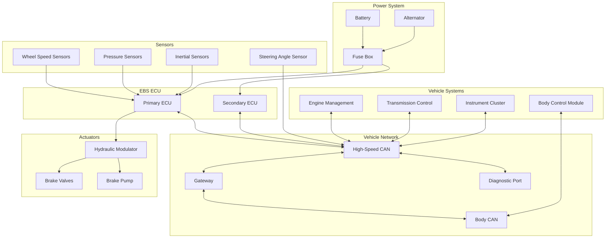

# Electronic Braking System (EBS) - Interface Control Document (ICD)

## Document Information
- **Document Title**: EBS Interface Control Document
- **Version**: 1.0
- **Date**: 2025-07-29
- **Classification**: Technical Design Document
- **Related Documents**: EBS_Requirements_Specification.md, EBS_System_Architecture_Specification.md

## Table of Contents
1. [Introduction](#introduction)
2. [System Interface Overview](#system-interface-overview)
3. [CAN Bus Interface Specifications](#can-bus-interface-specifications)
4. [Sensor Interface Specifications](#sensor-interface-specifications)
5. [Actuator Interface Specifications](#actuator-interface-specifications)
6. [Diagnostic Interface Specifications](#diagnostic-interface-specifications)
7. [Power and Ground Interface Specifications](#power-and-ground-interface-specifications)
8. [Physical Connector Specifications](#physical-connector-specifications)
9. [Interface Testing and Validation](#interface-testing-and-validation)

---

## 1. Introduction

### 1.1 Purpose
This Interface Control Document (ICD) defines all external and internal interfaces for the Electronic Braking System (EBS), including electrical, mechanical, and communication interface specifications.

### 1.2 Scope
The ICD covers:
- CAN bus communication protocols and message definitions
- Sensor interface electrical and protocol specifications
- Actuator control interface specifications
- Diagnostic communication interfaces
- Power distribution and grounding specifications
- Physical connector and pinout definitions
- Interface testing and validation requirements

### 1.3 Interface Classification
- **Safety-Critical Interfaces**: ASIL-D rated interfaces for critical functions
- **Performance Interfaces**: High-speed interfaces for real-time control
- **Diagnostic Interfaces**: Service and maintenance communication
- **Power Interfaces**: System power distribution and management

---

## 2. System Interface Overview

### 2.1 Interface Architecture

### 2.2 Interface Summary

| Interface Type | Count | Protocol | Data Rate | Safety Level |
|----------------|-------|----------|-----------|--------------|
| **CAN Bus** | 3 | CAN 2.0B/CAN-FD | 500 kbps / 2 Mbps | ASIL-C |
| **Wheel Speed Sensors** | 4 | Digital Pulse | 10 kHz max | ASIL-D |
| **Pressure Sensors** | 6 | Analog Voltage | 1 kHz | ASIL-D |
| **Inertial Sensors** | 1 | SPI | 10 MHz | ASIL-D |
| **PWM Outputs** | 12 | PWM | 1-20 kHz | ASIL-D |
| **Power Supply** | 2 | DC Power | - | ASIL-D |
| **Diagnostic** | 1 | UDS over CAN | 500 kbps | ASIL-C |

---

## 3. CAN Bus Interface Specifications

### 3.1 Physical Layer Specifications

#### 3.1.1 Electrical Characteristics
- **Standard**: ISO 11898-2 (CAN 2.0B)
- **Voltage Levels**: 
  - Dominant (0): CAN_H = 3.5V, CAN_L = 1.5V (differential = 2V)
  - Recessive (1): CAN_H = 2.5V, CAN_L = 2.5V (differential = 0V)
- **Common Mode Voltage**: 2.5V ±0.5V
- **Differential Voltage**: 2V ±0.5V (dominant), 0V ±0.05V (recessive)
- **Input Impedance**: 20kΩ minimum
- **Load Impedance**: 60Ω differential (with termination)

#### 3.1.2 Timing Characteristics
- **Bit Rate**: 500 kbps (high-speed CAN)
- **Bit Time**: 2.0 μs
- **Sample Point**: 87.5% of bit time
- **Synchronization Jump Width**: 1 time quantum
- **Propagation Delay**: <250 ns maximum

#### 3.1.3 Cable Specifications
- **Cable Type**: Twisted pair, 120Ω characteristic impedance
- **Wire Gauge**: 0.35 mm² (22 AWG) minimum
- **Maximum Length**: 40m at 500 kbps
- **Termination**: 120Ω resistors at both ends
- **Shield**: Optional, connected to chassis ground

### 3.2 Data Link Layer Specifications

#### 3.2.1 Frame Format
- **Frame Type**: CAN 2.0B Extended Frame (29-bit identifier)
- **Data Length**: 0-8 bytes (CAN 2.0B), 0-64 bytes (CAN-FD)
- **Bit Stuffing**: After 5 consecutive identical bits
- **CRC**: 15-bit CRC for error detection
- **Error Detection**: Frame check, acknowledgment, bit monitoring

#### 3.2.2 Message Arbitration
- **Arbitration**: Bitwise arbitration based on message ID
- **Priority**: Lower ID = higher priority
- **Bus Access**: CSMA/CD (Carrier Sense Multiple Access with Collision Detection)
- **Error Handling**: Automatic retransmission on error

### 3.3 Application Layer Message Definitions

#### 3.3.1 EBS Status Messages

**EBS System Status (ID: 0x100)**
| Byte | Bit 7 | Bit 6 | Bit 5 | Bit 4 | Bit 3 | Bit 2 | Bit 1 | Bit 0 |
|------|-------|-------|-------|-------|-------|-------|-------|-------|
| 0 | Reserved | System Fault | Brake Assist | TCS Active | ESC Active | ABS Active | Reserved | Reserved |
| 1 | Brake Pressure FL (0-255, scale: 0.5 bar/bit) |
| 2 | Brake Pressure FR (0-255, scale: 0.5 bar/bit) |
| 3 | Brake Pressure RL (0-255, scale: 0.5 bar/bit) |
| 4 | Brake Pressure RR (0-255, scale: 0.5 bar/bit) |
| 5 | Vehicle Speed High Byte (0-65535, scale: 0.01 km/h/bit) |
| 6 | Vehicle Speed Low Byte |
| 7 | Message Counter (0-255) + Checksum |

- **Transmission Rate**: 20 ms
- **Priority**: High (ID: 0x100)
- **Safety**: ASIL-D with checksum and counter

**EBS Wheel Speed Data (ID: 0x101)**
| Byte | Description |
|------|-------------|
| 0-1 | Front Left Wheel Speed (0-65535, scale: 0.01 km/h/bit) |
| 2-3 | Front Right Wheel Speed (0-65535, scale: 0.01 km/h/bit) |
| 4-5 | Rear Left Wheel Speed (0-65535, scale: 0.01 km/h/bit) |
| 6-7 | Rear Right Wheel Speed (0-65535, scale: 0.01 km/h/bit) |

- **Transmission Rate**: 10 ms
- **Priority**: High (ID: 0x101)
- **Safety**: ASIL-D

#### 3.3.2 Engine Interface Messages

**Engine Torque Request (ID: 0x102)**
| Byte | Description |
|------|-------------|
| 0-1 | Torque Reduction Request (0-100%, scale: 0.1%/bit) |
| 2 | Torque Reduction Active (bit 0), Reserved (bits 1-7) |
| 3 | Request Priority (0-7) |
| 4-7 | Reserved |

- **Transmission Rate**: 10 ms (when active)
- **Priority**: High (ID: 0x102)
- **Safety**: ASIL-C

**Engine Status Response (ID: 0x280)**
| Byte | Description |
|------|-------------|
| 0-1 | Current Engine Torque (0-65535 Nm, scale: 0.1 Nm/bit) |
| 2-3 | Engine Speed (0-8000 RPM, scale: 0.125 RPM/bit) |
| 4 | Engine State (0=Off, 1=Idle, 2=Running, 3=Fault) |
| 5-7 | Reserved |

- **Transmission Rate**: 20 ms
- **Priority**: Medium (ID: 0x280)
- **Safety**: ASIL-C

#### 3.3.3 Diagnostic Messages

**Diagnostic Request (ID: 0x7E0)**
- **Format**: ISO-TP (ISO 14229-2)
- **Service**: UDS (Unified Diagnostic Services)
- **Data Length**: Variable (up to 4095 bytes with segmentation)
- **Response ID**: 0x7E8

**Diagnostic Response (ID: 0x7E8)**
- **Format**: ISO-TP response
- **Service**: UDS response codes
- **Timeout**: 5000 ms maximum response time

### 3.4 Network Management

#### 3.4.1 Node Addressing
| Node | CAN ID Range | Function |
|------|--------------|----------|
| **EBS Primary ECU** | 0x100-0x17F | Main EBS functions |
| **EBS Secondary ECU** | 0x180-0x1FF | Backup and monitoring |
| **Engine Management** | 0x280-0x2FF | Engine control |
| **Transmission** | 0x300-0x37F | Transmission control |
| **Instrument Cluster** | 0x400-0x47F | Display and warnings |
| **Body Control** | 0x500-0x57F | Body functions |
| **Diagnostic** | 0x7E0-0x7EF | Service and maintenance |

#### 3.4.2 Bus Load Management
- **Maximum Bus Load**: 70% at 500 kbps
- **Message Scheduling**: Time-triggered for critical messages
- **Priority Management**: Safety-critical messages have highest priority
- **Error Recovery**: Automatic bus-off recovery after 128 error frames

---

## 4. Sensor Interface Specifications

### 4.1 Wheel Speed Sensor Interface

#### 4.1.1 Electrical Interface
- **Sensor Type**: Active Hall effect sensor
- **Supply Voltage**: 5V ±5% (4.75V to 5.25V)
- **Supply Current**: 15 mA typical, 25 mA maximum
- **Output Type**: Digital square wave (push-pull)
- **Output Voltage**: 0.4V low, 4.6V high (into 1kΩ load)
- **Output Current**: ±20 mA maximum

#### 4.1.2 Signal Characteristics
- **Frequency Range**: 0 Hz to 10 kHz
- **Duty Cycle**: 50% ±10%
- **Rise/Fall Time**: <10 μs (10% to 90%)
- **Jitter**: <1% of pulse width
- **Resolution**: 48 pulses per wheel revolution

#### 4.1.3 Connector Pinout (3-pin Deutsch DT series)
| Pin | Signal | Wire Color | Function |
|-----|--------|------------|----------|
| 1 | +5V Supply | Red | Sensor power supply |
| 2 | Ground | Black | Signal and power ground |
| 3 | Signal Output | White | Digital pulse output |

#### 4.1.4 Cable Specifications
- **Cable Type**: Twisted pair with shield
- **Length**: 1.5m ±0.1m
- **Wire Gauge**: 0.35 mm² (22 AWG)
- **Shield**: Connected to ECU ground
- **Protection**: IP67 rated connector

### 4.2 Pressure Sensor Interface

#### 4.2.1 Electrical Interface
- **Sensor Type**: Piezoresistive pressure sensor
- **Supply Voltage**: 5V ±0.25V (4.75V to 5.25V)
- **Supply Current**: 10 mA typical, 15 mA maximum
- **Output Type**: Ratiometric analog voltage
- **Output Range**: 0.5V to 4.5V (10% to 90% of supply)
- **Output Impedance**: 5kΩ typical

#### 4.2.2 Signal Characteristics
- **Pressure Range**: 0 to 250 bar
- **Accuracy**: ±0.25% full scale
- **Resolution**: 0.1 bar (12-bit ADC)
- **Response Time**: <1 ms (10% to 90%)
- **Temperature Coefficient**: ±0.02% FSO/°C

#### 4.2.3 Connector Pinout (3-pin Deutsch DT series)
| Pin | Signal | Wire Color | Function |
|-----|--------|------------|----------|
| 1 | +5V Supply | Red | Sensor power supply |
| 2 | Ground | Black | Signal and power ground |
| 3 | Analog Output | Blue | Pressure signal (0.5-4.5V) |

### 4.3 Inertial Measurement Unit (IMU) Interface

#### 4.3.1 SPI Interface Specifications
- **Protocol**: SPI Mode 0 (CPOL=0, CPHA=0)
- **Clock Speed**: 10 MHz maximum
- **Data Format**: 16-bit MSB first
- **Chip Select**: Active low
- **Voltage Levels**: 3.3V CMOS

#### 4.3.2 SPI Timing Requirements
- **Setup Time**: 10 ns minimum (data to clock)
- **Hold Time**: 10 ns minimum (data after clock)
- **Clock High/Low Time**: 25 ns minimum each
- **Chip Select Setup**: 100 ns minimum before first clock
- **Chip Select Hold**: 100 ns minimum after last clock

#### 4.3.3 Connector Pinout (6-pin connector)
| Pin | Signal | Wire Color | Function |
|-----|--------|------------|----------|
| 1 | +3.3V Supply | Red | Sensor power supply |
| 2 | Ground | Black | Digital ground |
| 3 | SCLK | Yellow | SPI clock |
| 4 | MOSI | Green | Master out, slave in |
| 5 | MISO | Blue | Master in, slave out |
| 6 | CS# | White | Chip select (active low) |

#### 4.3.4 Data Format
- **Gyroscope Data**: 16-bit signed integer per axis (X, Y, Z)
- **Accelerometer Data**: 16-bit signed integer per axis (X, Y, Z)
- **Temperature Data**: 16-bit signed integer
- **Status Register**: 8-bit status and configuration
- **Sample Rate**: 1000 Hz configurable

---

## 5. Actuator Interface Specifications

### 5.1 Hydraulic Modulator Unit Interface

#### 5.1.1 Solenoid Valve Control
- **Control Method**: PWM (Pulse Width Modulation)
- **PWM Frequency**: 1 kHz to 5 kHz
- **Duty Cycle Range**: 0% to 100%
- **Resolution**: 16-bit (0.0015% resolution)
- **Output Voltage**: 12V nominal (9V to 16V)
- **Output Current**: 2A per channel maximum

#### 5.1.2 Valve Driver Specifications
- **Driver Type**: High-side MOSFET driver
- **On Resistance**: <50 mΩ
- **Switching Time**: <1 μs rise/fall
- **Current Sensing**: 0.1Ω shunt resistor
- **Protection**: Overcurrent, overtemperature, short circuit
- **Diagnostic**: Load current monitoring, open/short detection

#### 5.1.3 Pump Motor Control
- **Control Method**: 3-phase PWM control
- **PWM Frequency**: 20 kHz
- **Motor Voltage**: 12V DC
- **Motor Current**: 25A maximum
- **Speed Control**: Closed-loop with Hall sensors
- **Protection**: Overcurrent, overvoltage, overtemperature

#### 5.1.4 HMU Connector Pinout (64-pin connector)
| Pin Range | Signal Group | Function |
|-----------|--------------|----------|
| 1-8 | Inlet Valve Control | PWM control for 4 inlet valves |
| 9-16 | Outlet Valve Control | PWM control for 4 outlet valves |
| 17-22 | Pump Motor Control | 3-phase motor control |
| 23-30 | Valve Current Sense | Current feedback for diagnostics |
| 31-38 | Pressure Sensors | Analog inputs from pressure sensors |
| 39-46 | Temperature Sensors | Temperature monitoring |
| 47-54 | Power Supply | +12V, +5V, Ground connections |
| 55-64 | CAN Communication | CAN-H, CAN-L, Shield, Reserved |

### 5.2 Electric Brake Actuator Interface (Future)

#### 5.2.1 CAN-based Control
- **Protocol**: CAN 2.0B Extended Frame
- **Baud Rate**: 1 Mbps
- **Message Rate**: 1 ms for position control
- **Data Format**: Position command, force command, status

#### 5.2.2 Position Control Message (ID: 0x200 + Actuator ID)
| Byte | Description |
|------|-------------|
| 0-1 | Position Command (0-65535, scale: 0.001 mm/bit) |
| 2-3 | Force Command (0-65535, scale: 0.1 N/bit) |
| 4 | Control Mode (0=Position, 1=Force, 2=Hybrid) |
| 5 | Command Priority (0-7) |
| 6-7 | Reserved |

#### 5.2.3 Actuator Status Message (ID: 0x300 + Actuator ID)
| Byte | Description |
|------|-------------|
| 0-1 | Actual Position (0-65535, scale: 0.001 mm/bit) |
| 2-3 | Actual Force (0-65535, scale: 0.1 N/bit) |
| 4 | Actuator Status (bit field) |
| 5 | Temperature (0-255, scale: 1°C/bit, offset: -40°C) |
| 6-7 | Fault Codes |

---

## 6. Diagnostic Interface Specifications

### 6.1 UDS (Unified Diagnostic Services) Interface

#### 6.1.1 Transport Protocol
- **Protocol**: ISO-TP (ISO 14229-2) over CAN
- **Request ID**: 0x7E0 (EBS ECU)
- **Response ID**: 0x7E8 (EBS ECU)
- **Flow Control**: ISO-TP flow control frames
- **Segmentation**: Support for multi-frame messages

#### 6.1.2 Supported UDS Services
| Service ID | Service Name | Description |
|------------|--------------|-------------|
| 0x10 | Diagnostic Session Control | Switch diagnostic sessions |
| 0x11 | ECU Reset | Reset ECU (soft/hard reset) |
| 0x14 | Clear Diagnostic Information | Clear DTCs |
| 0x19 | Read DTC Information | Read diagnostic trouble codes |
| 0x22 | Read Data By Identifier | Read system parameters |
| 0x23 | Read Memory By Address | Read memory contents |
| 0x27 | Security Access | Unlock protected functions |
| 0x2E | Write Data By Identifier | Write system parameters |
| 0x31 | Routine Control | Execute diagnostic routines |
| 0x34 | Request Download | Start software download |
| 0x36 | Transfer Data | Transfer software data |
| 0x37 | Request Transfer Exit | Complete software download |

#### 6.1.3 Data Identifiers (DIDs)
| DID | Description | Data Length | Access |
|-----|-------------|-------------|--------|
| 0xF186 | Active Diagnostic Session | 1 byte | Read |
| 0xF190 | VIN (Vehicle Identification Number) | 17 bytes | Read |
| 0xF194 | System Supplier Identifier | 16 bytes | Read |
| 0xF195 | ECU Manufacturing Date | 4 bytes | Read |
| 0xF19D | ECU Installation Date | 4 bytes | Read/Write |
| 0xF1A0 | Software Version Number | 4 bytes | Read |
| 0xF1A1 | Application Software Fingerprint | 16 bytes | Read |
| 0xF1A2 | Active Diagnostic Session | 1 byte | Read |
| 0xF1A3 | Spare Part Number | 16 bytes | Read |
| 0xF1A4 | Software Calibration Identifier | 16 bytes | Read |

#### 6.1.4 Diagnostic Trouble Codes (DTCs)
| DTC Code | Description | Fault Class | Action |
|----------|-------------|-------------|--------|
| P0C00 | ABS System Fault | A | Warning light |
| P0C01 | ESC System Fault | A | Warning light |
| P0C02 | TCS System Fault | B | Reduced function |
| P0C10 | Wheel Speed Sensor FL Fault | A | ABS disabled |
| P0C11 | Wheel Speed Sensor FR Fault | A | ABS disabled |
| P0C12 | Wheel Speed Sensor RL Fault | A | ABS disabled |
| P0C13 | Wheel Speed Sensor RR Fault | A | ABS disabled |
| P0C20 | Brake Pressure Sensor Fault | A | System degraded |
| P0C30 | Hydraulic Pump Fault | A | Manual braking only |
| P0C40 | Solenoid Valve Fault | A | Affected wheel disabled |

### 6.2 Calibration Interface

#### 6.2.1 Calibration Data Access
- **Method**: UDS Read/Write Data By Identifier
- **Protection**: Security access required (Level 1)
- **Backup**: Automatic backup before modification
- **Validation**: CRC check after modification

#### 6.2.2 Calibration Parameters
| Parameter | DID | Range | Unit | Default |
|-----------|-----|-------|------|---------|
| ABS Slip Threshold | 0x1000 | 0.05-0.25 | - | 0.15 |
| ESC Yaw Rate Threshold | 0x1001 | 1.0-10.0 | deg/s | 5.0 |
| TCS Slip Threshold | 0x1002 | 0.02-0.20 | - | 0.10 |
| Brake Pressure Offset FL | 0x1010 | -10.0-10.0 | bar | 0.0 |
| Brake Pressure Offset FR | 0x1011 | -10.0-10.0 | bar | 0.0 |
| Brake Pressure Offset RL | 0x1012 | -10.0-10.0 | bar | 0.0 |
| Brake Pressure Offset RR | 0x1013 | -10.0-10.0 | bar | 0.0 |

---

## 7. Power and Ground Interface Specifications

### 7.1 Power Supply Requirements

#### 7.1.1 Primary Power Supply
- **Voltage**: 12V nominal (9V to 16V operating range)
- **Current**: 25A maximum (including all actuators)
- **Inrush Current**: <50A for 1ms at startup
- **Ripple**: <200mV peak-to-peak
- **Transients**: ISO 7637-2 compliant (pulses 1, 2a, 3a, 3b, 4)

#### 7.1.2 Power Distribution
| Load | Current | Voltage | Protection |
|------|---------|---------|------------|
| **Primary ECU** | 2.5A | 12V | 5A fuse |
| **Secondary ECU** | 1.5A | 12V | 3A fuse |
| **Hydraulic Pump** | 25A | 12V | 30A fuse |
| **Solenoid Valves** | 8A | 12V | 10A fuse |
| **Sensors** | 1A | 5V/3.3V | Internal protection |

#### 7.1.3 Voltage Regulation
- **5V Rail**: Buck converter, 10A capacity, >90% efficiency
- **3.3V Rail**: LDO regulator, 5A capacity, <300mV dropout
- **Monitoring**: All rails monitored for overvoltage/undervoltage
- **Protection**: Crowbar protection at 32V input

### 7.2 Grounding Specifications

#### 7.2.1 Ground Architecture
- **Power Ground**: High-current return path for actuators
- **Signal Ground**: Low-noise ground for sensors and logic
- **Chassis Ground**: Connection to vehicle chassis
- **Shield Ground**: Cable shield termination

#### 7.2.2 Ground Resistance Requirements
- **Power Ground**: <10 mΩ to battery negative
- **Signal Ground**: <5 mΩ between ECU and sensors
- **Chassis Ground**: <100 mΩ to vehicle chassis
- **Ground Loop**: <1 mΩ difference between grounds

### 7.3 EMC and Protection

#### 7.3.1 EMC Requirements
- **Emissions**: CISPR 25 Class 5 limits
- **Immunity**: ISO 11452 series requirements
- **ESD Protection**: ±8kV contact, ±15kV air discharge
- **Transient Protection**: ISO 7637-2 pulse immunity

#### 7.3.2 Protection Circuits
- **Reverse Polarity**: MOSFET-based protection
- **Overvoltage**: TVS diodes and crowbar circuits
- **Overcurrent**: Electronic fuses with current limiting
- **Load Dump**: Clamping circuits for 100V transients

---

## 8. Physical Connector Specifications

### 8.1 Main ECU Connectors

#### 8.1.1 Primary ECU Connector A (64-pin)
- **Connector Type**: TE Connectivity AMP Superseal 1.5
- **Housing Material**: PA66 with glass fiber
- **Contact Material**: Copper alloy with gold plating
- **Current Rating**: 7.5A per contact
- **Voltage Rating**: 600V
- **IP Rating**: IP67 when mated

**Pinout Assignment:**
| Pin | Signal | Wire Gauge | Function |
|-----|--------|------------|----------|
| 1-4 | +12V Power | 1.5 mm² | Main power supply |
| 5-8 | Power Ground | 1.5 mm² | Power return |
| 9-12 | Wheel Speed Sensors | 0.35 mm² | WSS signal inputs |
| 13-18 | Pressure Sensors | 0.35 mm² | Analog pressure inputs |
| 19-24 | CAN Interfaces | 0.35 mm² | CAN-H, CAN-L, Shield |
| 25-36 | PWM Outputs | 0.75 mm² | Valve control outputs |
| 37-42 | SPI Interface | 0.35 mm² | IMU communication |
| 43-48 | Digital Inputs | 0.35 mm² | Switch and status inputs |
| 49-54 | Analog Inputs | 0.35 mm² | Additional sensor inputs |
| 55-60 | Signal Ground | 0.35 mm² | Signal return |
| 61-64 | Reserved | 0.35 mm² | Future expansion |

#### 8.1.2 Secondary ECU Connector B (48-pin)
- **Connector Type**: TE Connectivity AMP Superseal 1.5
- **Similar specifications to Connector A**
- **Reduced pin count for backup functions**

### 8.2 Sensor Connectors

#### 8.2.1 Wheel Speed Sensor Connectors (4x)
- **Connector Type**: Deutsch DT04-3P
- **Contact Rating**: 7.5A per contact
- **Wire Seal**: Individual wire seals
- **IP Rating**: IP67/IP69K
- **Temperature Range**: -40°C to +125°C

#### 8.2.2 Pressure Sensor Connectors (6x)
- **Connector Type**: Deutsch DT04-3P
- **Similar specifications to WSS connectors**
- **Additional EMI filtering for analog signals**

### 8.3 Actuator Connectors

#### 8.3.1 Hydraulic Modulator Connector
- **Connector Type**: TE Connectivity AMPSEAL 16
- **Pin Count**: 64 pins
- **Current Rating**: 13A per contact (power pins)
- **Voltage Rating**: 600V
- **IP Rating**: IP67

#### 8.3.2 Individual Valve Connectors (8x)
- **Connector Type**: Deutsch DT04-2P
- **Current Rating**: 7.5A per contact
- **Wire Gauge**: 0.75 mm² (18 AWG)
- **Protection**: Integrated flyback diodes

### 8.4 Diagnostic Connector

#### 8.4.1 OBD-II Connector
- **Standard**: SAE J1962
- **Pin Count**: 16 pins
- **Relevant Pins**: 
  - Pin 6: CAN-H
  - Pin 14: CAN-L
  - Pin 4: Chassis Ground
  - Pin 16: +12V Battery

---

## 9. Interface Testing and Validation

### 9.1 Electrical Testing

#### 9.1.1 Power Supply Testing
- **Input Voltage Range**: 6V
to 32V survival
- **Load Regulation**: ±2% from no load to full load
- **Line Regulation**: ±1% over input voltage range
- **Transient Response**: <100ms recovery time
- **Protection Testing**: Reverse polarity, overvoltage, overcurrent

#### 9.1.2 Signal Integrity Testing
- **Rise/Fall Time**: Measured at 10% and 90% levels
- **Overshoot/Undershoot**: <10% of signal amplitude
- **Jitter**: <1% of bit time for digital signals
- **Crosstalk**: <5% between adjacent signals
- **EMI Testing**: Conducted and radiated emissions per CISPR 25

#### 9.1.3 CAN Bus Testing
- **Bit Timing**: Verified with oscilloscope and protocol analyzer
- **Bus Load**: Measured under maximum traffic conditions
- **Error Injection**: Deliberate error injection for robustness testing
- **Network Topology**: Testing with various node configurations
- **Cable Length**: Testing at maximum specified cable lengths

### 9.2 Protocol Testing

#### 9.2.1 CAN Message Testing
- **Message Format**: Verification of all message structures
- **Timing**: Verification of transmission intervals
- **Priority**: Arbitration testing under high bus load
- **Error Handling**: Response to corrupted messages
- **Sequence Testing**: Message counter and checksum validation

#### 9.2.2 Diagnostic Protocol Testing
- **UDS Services**: Testing of all supported diagnostic services
- **ISO-TP**: Multi-frame message segmentation and reassembly
- **Timing**: Response time verification for all services
- **Security**: Security access and authentication testing
- **Error Conditions**: Testing with invalid requests and timeouts

### 9.3 Environmental Testing

#### 9.3.1 Temperature Testing
- **Operating Range**: -40°C to +85°C functional testing
- **Storage Range**: -55°C to +125°C non-functional testing
- **Thermal Cycling**: 1000 cycles per IEC 60068-2-14
- **Temperature Shock**: Rapid temperature changes per IEC 60068-2-11
- **Humidity**: 85% RH at 85°C per IEC 60068-2-78

#### 9.3.2 Mechanical Testing
- **Vibration**: Random vibration per ISO 16750-3
- **Shock**: Mechanical shock per ISO 16750-3
- **Connector Durability**: 1000 mate/unmate cycles
- **Cable Flexing**: 100,000 flex cycles for mobile cables
- **IP Rating**: Water ingress testing per IEC 60529

### 9.4 Compatibility Testing

#### 9.4.1 Vehicle Integration Testing
- **CAN Network**: Integration with existing vehicle networks
- **Load Testing**: Impact on vehicle electrical system
- **EMC**: In-vehicle EMC testing with other systems
- **Functional**: End-to-end system functionality testing
- **Interoperability**: Testing with different vehicle configurations

#### 9.4.2 Supplier Component Testing
- **Sensor Compatibility**: Testing with approved sensor suppliers
- **Actuator Compatibility**: Testing with different actuator types
- **ECU Variants**: Testing with different ECU configurations
- **Software Versions**: Compatibility across software versions
- **Calibration**: Testing with different calibration sets

### 9.5 Safety Testing

#### 9.5.1 Fault Injection Testing
- **Power Supply Faults**: Overvoltage, undervoltage, interruption
- **Signal Faults**: Open circuit, short circuit, wrong voltage
- **Communication Faults**: Bus-off, message corruption, timing errors
- **Sensor Faults**: Out-of-range, stuck, noisy signals
- **Actuator Faults**: Open load, short circuit, overcurrent

#### 9.5.2 Redundancy Testing
- **Dual-Channel**: Testing of redundant signal paths
- **Backup Systems**: Secondary ECU takeover testing
- **Graceful Degradation**: System behavior with partial failures
- **Safe State**: Verification of safe state entry conditions
- **Recovery**: Testing of fault recovery mechanisms

---

## Document Control

### Interface Change Control

#### Change Request Process
1. **Identification**: Interface change requirement identified
2. **Impact Analysis**: Assessment of change impact on all stakeholders
3. **Approval**: Change approval by interface control board
4. **Implementation**: Coordinated implementation across all parties
5. **Verification**: Testing and validation of interface changes
6. **Documentation**: Update of all relevant documentation

#### Interface Baseline Management
- **Version Control**: All interface specifications under version control
- **Configuration Management**: Tracking of interface configurations
- **Change History**: Complete history of all interface changes
- **Stakeholder Notification**: Automatic notification of interface changes
- **Compliance Verification**: Verification of compliance to interface specifications

### Revision History
| Version | Date | Author | Changes |
|---------|------|--------|---------|
| 1.0 | 2025-07-29 | Interface Engineer | Initial interface control document |

### Approval
- **Interface Engineer**: [Signature Required]
- **Systems Engineer**: [Signature Required]
- **Hardware Manager**: [Signature Required]
- **Software Manager**: [Signature Required]
- **Date**: [Approval Date]

---

*This document contains proprietary and confidential information. Distribution is restricted to authorized personnel only.*