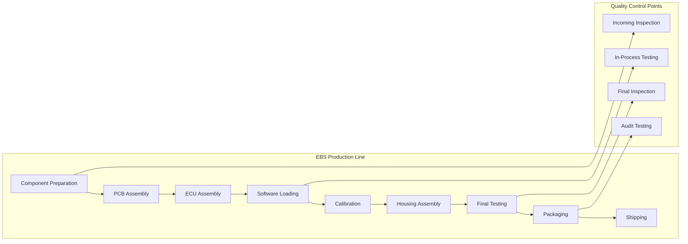

# Electronic Braking System (EBS) - Manufacturing and Production Requirements

## Document Information
- **Document Title**: EBS Manufacturing and Production Requirements
- **Version**: 1.0
- **Date**: 2025-07-29
- **Classification**: Production Document
- **Related Documents**: EBS_Requirements_Specification.md, EBS_Hardware_Design_Specifications.md

## Table of Contents
1. [Introduction](#introduction)
2. [Manufacturing Strategy](#manufacturing-strategy)
3. [Production Requirements](#production-requirements)
4. [Manufacturing Process Requirements](#manufacturing-process-requirements)
5. [Quality Control Requirements](#quality-control-requirements)
6. [Equipment and Tooling Requirements](#equipment-and-tooling-requirements)
7. [Facility Requirements](#facility-requirements)
8. [Material Management Requirements](#material-management-requirements)
9. [Packaging and Shipping Requirements](#packaging-and-shipping-requirements)
10. [Production Testing Requirements](#production-testing-requirements)
11. [Traceability Requirements](#traceability-requirements)
12. [Environmental and Safety Requirements](#environmental-and-safety-requirements)

---

## 1. Introduction

### 1.1 Purpose
This document defines the comprehensive manufacturing and production requirements for the Electronic Braking System (EBS). It establishes the standards, processes, and controls necessary to ensure consistent, high-quality production of EBS units that meet all technical, safety, and regulatory requirements.

### 1.2 Scope
The manufacturing requirements cover:
- Complete EBS system production from component assembly to final testing
- Manufacturing processes and procedures
- Quality control and assurance systems
- Production equipment and tooling specifications
- Facility requirements and environmental controls
- Material handling and logistics
- Production testing and validation
- Packaging and shipping requirements

### 1.3 Manufacturing Objectives
- **Quality**: Achieve zero-defect production with <10 PPM defect rate
- **Efficiency**: Maintain >95% overall equipment effectiveness (OEE)
- **Capacity**: Meet production volume requirements with scalability
- **Cost**: Achieve target manufacturing cost objectives
- **Safety**: Maintain zero workplace accidents and incidents
- **Compliance**: Full compliance with automotive manufacturing standards

### 1.4 Production Volume Requirements
| Production Phase | Annual Volume | Daily Volume | Peak Capacity |
|------------------|---------------|--------------|---------------|
| **Pilot Production** | 1,000 units | 5 units | 10 units |
| **Low Volume Production** | 10,000 units | 40 units | 80 units |
| **Full Production** | 100,000 units | 400 units | 800 units |
| **Peak Production** | 200,000 units | 800 units | 1,200 units |

---

## 2. Manufacturing Strategy

### 2.1 Manufacturing Approach

#### 2.1.1 Production Philosophy
- **Lean Manufacturing**: Implementation of lean manufacturing principles
- **Just-in-Time**: JIT production to minimize inventory and waste
- **Continuous Improvement**: Kaizen and continuous improvement culture
- **Quality at Source**: Quality built into every process step
- **Flexible Manufacturing**: Adaptable to volume and product variations

#### 2.1.2 Make vs. Buy Strategy
| Component Category | Strategy | Rationale |
|-------------------|----------|-----------|
| **ECU Assembly** | Make | Core competency, quality control |
| **PCB Assembly** | Make | Critical quality, IP protection |
| **Software** | Make | Core IP, safety critical |
| **Sensors** | Buy | Specialized suppliers, cost |
| **Connectors** | Buy | Standard components, cost |
| **Housing** | Make/Buy | Volume dependent |
| **Packaging** | Buy | Non-core activity |

#### 2.1.3 Manufacturing Location Strategy
- **Primary Facility**: Main production facility for high-volume production
- **Secondary Facility**: Backup facility for risk mitigation and regional supply
- **Supplier Facilities**: Key supplier facilities for critical components
- **Regional Assembly**: Regional assembly facilities for local markets

### 2.2 Production Planning

#### 2.2.1 Capacity Planning
- **Design Capacity**: Maximum theoretical production capacity
- **Effective Capacity**: Realistic production capacity considering constraints
- **Utilization Rate**: Target 85% capacity utilization for efficiency
- **Scalability**: Ability to scale capacity up/down by 50% within 6 months
- **Flexibility**: Multi-product capability on same production line

#### 2.2.2 Production Scheduling
- **Master Production Schedule**: Long-term production planning (12 months)
- **Weekly Schedules**: Detailed weekly production schedules
- **Daily Schedules**: Daily production schedules and work orders
- **Real-time Adjustments**: Real-time schedule adjustments based on demand
- **Maintenance Scheduling**: Integrated maintenance scheduling

#### 2.2.3 Inventory Management
- **Raw Materials**: 2-week inventory for critical materials
- **Work-in-Process**: Minimize WIP inventory through flow optimization
- **Finished Goods**: 1-week finished goods inventory
- **Safety Stock**: Safety stock for critical and long-lead-time items
- **Inventory Turnover**: Target >20 inventory turns per year

---

## 3. Production Requirements

### 3.1 Production Line Configuration

#### 3.1.1 Assembly Line Layout

#### 3.1.2 Production Stations
| Station | Function | Cycle Time | Operators | Equipment |
|---------|----------|------------|-----------|-----------|
| **Component Prep** | Component preparation and kitting | 30 sec | 1 | Automated kitting system |
| **PCB Assembly** | SMT and through-hole assembly | 45 sec | 2 | SMT line, wave solder |
| **ECU Assembly** | ECU mechanical assembly | 60 sec | 2 | Assembly fixtures |
| **Software Loading** | Software download and configuration | 90 sec | 1 | Programming station |
| **Calibration** | System calibration and adjustment | 120 sec | 1 | Calibration equipment |
| **Housing Assembly** | Final mechanical assembly | 90 sec | 2 | Assembly tools |
| **Final Testing** | Comprehensive system testing | 180 sec | 1 | Automated test equipment |
| **Packaging** | Product packaging and labeling | 30 sec | 1 | Packaging equipment |

#### 3.1.3 Production Flow Requirements
- **Takt Time**: 90 seconds (based on peak production requirements)
- **Line Balance**: <5% variation in station cycle times
- **Flow Efficiency**: >95% first-pass yield at each station
- **Bottleneck Management**: Continuous monitoring and elimination of bottlenecks
- **Buffer Management**: Minimal buffer inventory between stations

### 3.2 Production Control Systems

#### 3.2.1 Manufacturing Execution System (MES)
- **Production Scheduling**: Real-time production scheduling and control
- **Work Order Management**: Electronic work order generation and tracking
- **Resource Management**: Real-time resource allocation and monitoring
- **Quality Management**: Integrated quality data collection and analysis
- **Traceability**: Complete product and process traceability

#### 3.2.2 Enterprise Resource Planning (ERP) Integration
- **Material Requirements Planning**: Automated MRP based on production schedules
- **Inventory Management**: Real-time inventory tracking and management
- **Cost Accounting**: Real-time cost tracking and analysis
- **Supply Chain Integration**: Integration with supplier systems
- **Customer Integration**: Integration with customer ordering systems

#### 3.2.3 Production Monitoring
- **Real-time Dashboards**: Real-time production monitoring dashboards
- **Key Performance Indicators**: Continuous monitoring of production KPIs
- **Alarm Systems**: Automated alarm systems for production issues
- **Reporting Systems**: Automated production reporting and analysis
- **Mobile Access**: Mobile access to production information

---

## 4. Manufacturing Process Requirements

### 4.1 PCB Assembly Process

#### 4.1.1 Surface Mount Technology (SMT) Process
- **Solder Paste Application**: Stencil printing with Type 3 solder paste
- **Component Placement**: High-speed pick-and-place with vision verification
- **Reflow Soldering**: Nitrogen atmosphere reflow with controlled profile
- **Inspection**: Automated optical inspection (AOI) after reflow
- **Rework**: Controlled rework process for defective assemblies

**SMT Process Parameters:**
| Parameter | Specification | Tolerance | Control Method |
|-----------|---------------|-----------|----------------|
| **Paste Thickness** | 100-150 μm | ±25 μm | SPC monitoring |
| **Placement Accuracy** | ±50 μm | ±25 μm | Vision feedback |
| **Reflow Peak Temperature** | 245°C | ±5°C | Profile monitoring |
| **Reflow Time Above Liquidus** | 60-90 sec | ±15 sec | Profile control |
| **Cooling Rate** | <6°C/sec | ±1°C/sec | Zone control |

#### 4.1.2 Through-Hole Assembly Process
- **Component Insertion**: Automated insertion where possible, manual for complex components
- **Wave Soldering**: Selective wave soldering for through-hole components
- **Cleaning**: Cleaning process to remove flux residues
- **Inspection**: Visual and automated inspection of solder joints
- **Testing**: In-circuit testing (ICT) of assembled PCBs

#### 4.1.3 PCB Testing and Inspection
- **In-Circuit Testing**: 100% ICT testing of assembled PCBs
- **Functional Testing**: Functional testing of critical circuits
- **Boundary Scan Testing**: JTAG boundary scan testing where applicable
- **X-ray Inspection**: X-ray inspection of critical solder joints
- **Electrical Testing**: Comprehensive electrical parameter testing

### 4.2 ECU Assembly Process

#### 4.2.1 Mechanical Assembly
- **Housing Preparation**: Housing cleaning