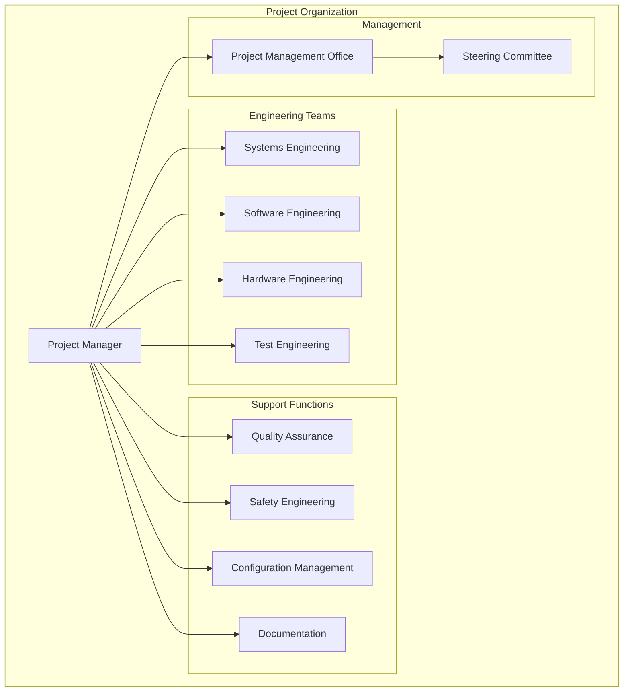
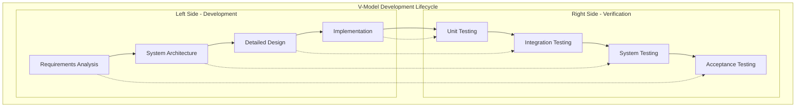
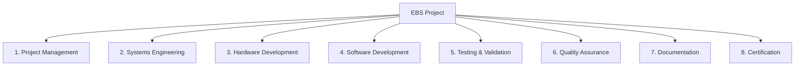
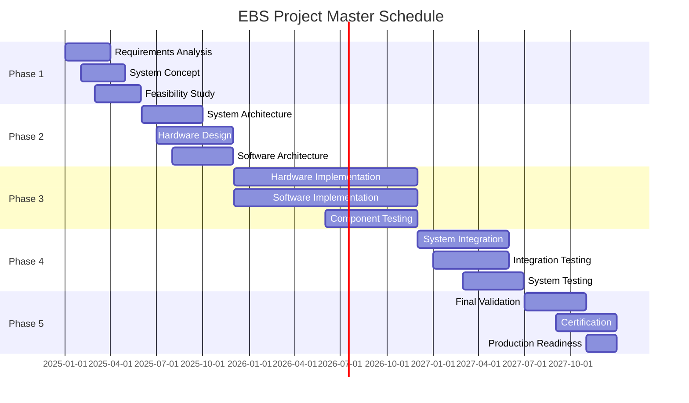
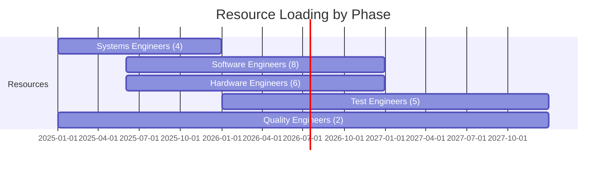

# Electronic Braking System (EBS) - Project Development Plan

## Document Information
- **Document Title**: EBS Project Development Plan
- **Version**: 1.0
- **Date**: 2025-07-29
- **Classification**: Project Management Document
- **Related Documents**: EBS_Requirements_Specification.md, EBS_Configuration_Management_Plan.md

## Table of Contents
1. [Introduction](#introduction)
2. [Project Overview](#project-overview)
3. [Project Organization](#project-organization)
4. [Development Lifecycle](#development-lifecycle)
5. [Work Breakdown Structure](#work-breakdown-structure)
6. [Schedule and Milestones](#schedule-and-milestones)
7. [Resource Management](#resource-management)
8. [Risk Management](#risk-management)
9. [Quality Management](#quality-management)
10. [Communication Management](#communication-management)
11. [Supplier Management](#supplier-management)
12. [Project Monitoring and Control](#project-monitoring-and-control)

---

## 1. Introduction

### 1.1 Purpose
This Project Development Plan defines the overall approach, organization, and management processes for the Electronic Braking System (EBS) development project. It serves as the master planning document that guides all project activities from concept through production.

### 1.2 Scope
The development plan covers:
- Complete EBS system development lifecycle
- All project phases from concept to production
- Resource allocation and management
- Schedule and milestone management
- Risk and quality management processes
- Stakeholder communication and coordination
- Supplier and vendor management

### 1.3 Project Objectives
- **Primary Objective**: Develop a safety-critical EBS system compliant with ISO 26262 ASIL-D requirements
- **Quality Objective**: Achieve zero critical defects in production release
- **Schedule Objective**: Complete development within 36 months
- **Cost Objective**: Stay within approved project budget
- **Compliance Objective**: Meet all automotive regulatory requirements

### 1.4 Success Criteria
- Successful completion of all development phases
- Achievement of all technical requirements
- Compliance with safety and regulatory standards
- On-time delivery within budget constraints
- Customer acceptance and market readiness

---

## 2. Project Overview

### 2.1 Project Description
The EBS project involves developing a next-generation electronic braking system that integrates Anti-lock Braking System (ABS), Electronic Stability Control (ESC), and Traction Control System (TCS) functionalities into a unified, safety-critical automotive system.

### 2.2 Project Scope

#### 2.2.1 In-Scope Items
- **System Development**: Complete EBS system design and implementation
- **Hardware Development**: ECU hardware design and manufacturing
- **Software Development**: Embedded software and control algorithms
- **Integration**: System integration and validation
- **Testing**: Comprehensive testing and validation
- **Documentation**: Complete technical documentation
- **Certification**: Safety certification and regulatory approval

#### 2.2.2 Out-of-Scope Items
- Vehicle integration (customer responsibility)
- Manufacturing tooling and production setup
- Field service and maintenance training
- Long-term product support beyond warranty
- Market-specific customizations

### 2.3 Project Constraints

#### 2.3.1 Technical Constraints
- Must comply with ISO 26262 ASIL-D requirements
- Operating temperature range: -40°C to +85°C
- Maximum system response time: 10ms
- Automotive EMC compliance required
- 15-year product lifecycle requirement

#### 2.3.2 Business Constraints
- Fixed project budget allocation
- Market launch deadline constraints
- Resource availability limitations
- Regulatory approval timelines
- Competitive market pressures

### 2.4 Project Assumptions
- Stable requirements throughout development
- Availability of qualified development resources
- Timely supplier deliveries and support
- Regulatory standards remain stable
- Customer cooperation during validation

---

## 3. Project Organization

### 3.1 Organizational Structure

### 3.2 Roles and Responsibilities

#### 3.2.1 Project Manager
- **Primary Responsibility**: Overall project leadership and coordination
- **Key Activities**:
  - Project planning and scheduling
  - Resource allocation and management
  - Stakeholder communication
  - Risk and issue management
  - Budget and cost control
  - Progress monitoring and reporting

#### 3.2.2 Systems Engineering Manager
- **Primary Responsibility**: System-level design and integration
- **Key Activities**:
  - System requirements management
  - System architecture definition
  - Interface specification
  - System integration planning
  - Verification and validation coordination

#### 3.2.3 Software Engineering Manager
- **Primary Responsibility**: Software development and delivery
- **Key Activities**:
  - Software architecture design
  - Software development coordination
  - Code quality assurance
  - Software testing coordination
  - Software configuration management

#### 3.2.4 Hardware Engineering Manager
- **Primary Responsibility**: Hardware design and development
- **Key Activities**:
  - Hardware architecture design
  - Component selection and qualification
  - PCB design and layout
  - Hardware testing coordination
  - Manufacturing support

#### 3.2.5 Test Engineering Manager
- **Primary Responsibility**: Test planning and execution
- **Key Activities**:
  - Test strategy development
  - Test plan creation
  - Test execution coordination
  - Test automation implementation
  - Test results analysis and reporting

### 3.3 Project Governance

#### 3.3.1 Steering Committee
- **Composition**: Senior management, customer representatives, key stakeholders
- **Frequency**: Monthly meetings
- **Responsibilities**:
  - Strategic direction and oversight
  - Major decision approval
  - Resource allocation approval
  - Risk escalation resolution
  - Project milestone approval

#### 3.3.2 Project Management Office (PMO)
- **Responsibilities**:
  - Project methodology and standards
  - Project portfolio management
  - Resource coordination across projects
  - Best practices sharing
  - Project performance monitoring

---

## 4. Development Lifecycle

### 4.1 Development Model
The EBS project follows a V-Model development approach, which is well-suited for safety-critical automotive systems and aligns with ISO 26262 requirements.

### 4.2 Development Phases

#### 4.2.1 Phase 1: Concept and Requirements (Months 1-6)
- **Objectives**: Define system concept and requirements
- **Key Activities**:
  - Market and customer requirements analysis
  - System concept development
  - Requirements specification
  - Preliminary system architecture
  - Feasibility studies
- **Deliverables**:
  - System Requirements Specification
  - System Architecture Document
  - Feasibility Study Report
  - Project Charter

#### 4.2.2 Phase 2: System Design (Months 7-12)
- **Objectives**: Develop detailed system design
- **Key Activities**:
  - Detailed system architecture
  - Hardware and software partitioning
  - Interface design
  - Safety analysis (HARA)
  - Design reviews
- **Deliverables**:
  - System Design Specification
  - Hardware Design Specification
  - Software Architecture Specification
  - Safety Analysis Report

#### 4.2.3 Phase 3: Implementation (Months 13-24)
- **Objectives**: Implement hardware and software components
- **Key Activities**:
  - Hardware development and prototyping
  - Software development and coding
  - Component testing
  - Integration planning
  - Supplier coordination
- **Deliverables**:
  - Hardware prototypes
  - Software components
  - Component test results
  - Integration test plans

#### 4.2.4 Phase 4: Integration and Testing (Months 25-30)
- **Objectives**: Integrate system and conduct comprehensive testing
- **Key Activities**:
  - System integration
  - Integration testing
  - System testing
  - Performance validation
  - Safety validation
- **Deliverables**:
  - Integrated system
  - Test results and reports
  - Validation reports
  - Safety assessment

#### 4.2.5 Phase 5: Validation and Certification (Months 31-36)
- **Objectives**: Final validation and regulatory certification
- **Key Activities**:
  - Final system validation
  - Regulatory testing
  - Certification activities
  - Production readiness
  - Documentation finalization
- **Deliverables**:
  - Certified system
  - Production-ready design
  - Complete documentation
  - Regulatory approvals

---

## 5. Work Breakdown Structure

### 5.1 Level 1 - Major Work Packages

### 5.2 Level 2 - Work Package Breakdown

#### 5.2.1 Project Management (WP 1)
- 1.1 Project Planning and Control
- 1.2 Resource Management
- 1.3 Risk Management
- 1.4 Communication Management
- 1.5 Supplier Management
- 1.6 Configuration Management

#### 5.2.2 Systems Engineering (WP 2)
- 2.1 Requirements Engineering
- 2.2 System Architecture
- 2.3 Interface Design
- 2.4 System Integration
- 2.5 Safety Engineering
- 2.6 Verification Planning

#### 5.2.3 Hardware Development (WP 3)
- 3.1 Hardware Architecture
- 3.2 Electronic Design
- 3.3 PCB Design and Layout
- 3.4 Component Selection
- 3.5 Prototyping
- 3.6 Hardware Testing

#### 5.2.4 Software Development (WP 4)
- 4.1 Software Architecture
- 4.2 Algorithm Development
- 4.3 Software Implementation
- 4.4 Software Integration
- 4.5 Software Testing
- 4.6 Software Configuration

#### 5.2.5 Testing & Validation (WP 5)
- 5.1 Test Planning
- 5.2 Test Environment Setup
- 5.3 Component Testing
- 5.4 Integration Testing
- 5.5 System Testing
- 5.6 Validation Testing

### 5.3 Work Package Effort Estimation

| Work Package | Effort (Person-Months) | Duration (Months) | Dependencies |
|--------------|------------------------|-------------------|--------------|
| **Project Management** | 36 | 36 | All packages |
| **Systems Engineering** | 48 | 30 | Requirements |
| **Hardware Development** | 72 | 24 | System design |
| **Software Development** | 96 | 24 | System design |
| **Testing & Validation** | 60 | 18 | Implementation |
| **Quality Assurance** | 24 | 36 | All packages |
| **Documentation** | 18 | 30 | All packages |
| **Certification** | 12 | 6 | Validation |
| **Total** | **366** | **36** | - |

---

## 6. Schedule and Milestones

### 6.1 Master Schedule

### 6.2 Key Milestones

| Milestone | Date | Description | Success Criteria |
|-----------|------|-------------|------------------|
| **M1: Requirements Baseline** | 2025-03-31 | Requirements approved and baselined | All requirements reviewed and approved |
| **M2: System Design Review** | 2025-09-30 | System architecture approved | Design review passed, architecture approved |
| **M3: Hardware Prototype** | 2026-06-30 | First hardware prototype available | Prototype functional, basic tests passed |
| **M4: Software Alpha** | 2026-06-30 | Software alpha version complete | Core functionality implemented and tested |
| **M5: System Integration** | 2027-01-31 | Hardware and software integrated | Integration successful, basic system tests passed |
| **M6: System Validation** | 2027-06-30 | System validation complete | All validation tests passed |
| **M7: Certification** | 2027-10-31 | Safety certification obtained | ISO 26262 certification achieved |
| **M8: Production Release** | 2027-12-31 | System ready for production | All deliverables complete, production approved |

### 6.3 Critical Path Analysis

#### 6.3.1 Critical Path Activities
1. Requirements Analysis → System Architecture → Hardware Design → Hardware Implementation → System Integration → System Testing → Validation → Certification

#### 6.3.2 Critical Path Duration
- **Total Duration**: 36 months
- **Critical Path Float**: 0 months
- **Risk Buffer**: 2 months included in each phase

---

## 7. Resource Management

### 7.1 Resource Requirements

#### 7.1.1 Human Resources
| Role | Peak Requirement | Average Requirement | Total Effort (PM) |
|------|------------------|---------------------|-------------------|
| **Project Manager** | 1 | 1 | 36 |
| **Systems Engineers** | 4 | 3 | 48 |
| **Software Engineers** | 8 | 6 | 96 |
| **Hardware Engineers** | 6 | 4 | 72 |
| **Test Engineers** | 5 | 3 | 60 |
| **Quality Engineers** | 2 | 1.5 | 24 |
| **Safety Engineers** | 2 | 1 | 18 |
| **Documentation** | 1 | 0.5 | 12 |
| **Total** | **29** | **20** | **366** |

#### 7.1.2 Equipment and Tools
| Category | Item | Quantity | Cost Estimate |
|----------|------|----------|---------------|
| **Development Tools** | Software licenses | 20 | $200,000 |
| **Test Equipment** | HIL test systems | 3 | $300,000 |
| **Lab Equipment** | Oscilloscopes, analyzers | 10 | $150,000 |
| **Prototyping** | PCB fabrication | 50 | $100,000 |
| **Computing** | Workstations, servers | 25 | $250,000 |
| **Total** | - | - | **$1,000,000** |

### 7.2 Resource Allocation Plan

#### 7.2.1 Resource Loading by Phase

#### 7.2.2 Resource Acquisition Strategy
- **Internal Resources**: Utilize existing company resources where possible
- **External Resources**: Hire contractors for peak demand periods
- **Training**: Provide necessary training for new technologies
- **Retention**: Implement retention strategies for key personnel

---

## 8. Risk Management

### 8.1 Risk Management Process

#### 8.1.1 Risk Identification
- **Sources**: Technical risks, schedule risks, resource risks, external risks
- **Methods**: Risk workshops, expert interviews, historical data analysis
- **Frequency**: Monthly risk assessment meetings
- **Documentation**: Risk register with detailed risk descriptions

#### 8.1.2 Risk Assessment
- **Probability Scale**: 1 (Very Low) to 5 (Very High)
- **Impact Scale**: 1 (Negligible) to 5 (Catastrophic)
- **Risk Score**: Probability × Impact
- **Risk Categories**: Technical, Schedule, Cost, Resource, External

#### 8.1.3 Risk Response Strategies
- **Avoid**: Eliminate the risk by changing project approach
- **Mitigate**: Reduce probability or impact of risk
- **Transfer**: Transfer risk to third party (insurance, contracts)
- **Accept**: Accept risk and develop contingency plans

### 8.2 Key Project Risks

| Risk ID | Risk Description | Probability | Impact | Score | Response Strategy |
|---------|------------------|-------------|--------|-------|-------------------|
| **R001** | Key personnel leaving project | 3 | 4 | 12 | Mitigate: Cross-training, retention bonuses |
| **R002** | Supplier delivery delays | 4 | 3 | 12 | Mitigate: Multiple suppliers, early orders |
| **R003** | Requirements changes | 3 | 4 | 12 | Mitigate: Requirements freeze, change control |
| **R004** | Technology maturity issues | 2 | 5 | 10 | Mitigate: Proof of concept, alternative solutions |
| **R005** | Certification delays | 2 | 4 | 8 | Mitigate: Early engagement, parallel activities |
| **R006** | Integration complexity | 3 | 3 | 9 | Mitigate: Incremental integration, early testing |
| **R007** | Budget overrun | 2 | 4 | 8 | Mitigate: Regular cost monitoring, contingency |
| **R008** | Market changes | 2 | 3 | 6 | Accept: Monitor market, flexible design |

### 8.3 Risk Monitoring and Control

#### 8.3.1 Risk Monitoring
- **Risk Reviews**: Monthly risk review meetings
- **Risk Metrics**: Risk exposure, risk velocity, risk burndown
- **Early Warning Indicators**: Leading indicators for risk materialization
- **Risk Reporting**: Monthly risk reports to stakeholders

#### 8.3.2 Contingency Planning
- **Schedule Contingency**: 10% schedule buffer for high-risk activities
- **Cost Contingency**: 15% cost contingency for project budget
- **Resource Contingency**: Backup resources identified for critical roles
- **Technical Contingency**: Alternative technical solutions prepared

---

## 9. Quality Management

### 9.1 Quality Management System

#### 9.1.1 Quality Standards
- **ISO 26262**: Functional safety for automotive systems
- **Automotive SPICE**: Process assessment model
- **ISO 9001**: Quality management systems
- **IEC 61508**: Functional safety of electrical systems
- **Company Quality Standards**: Internal quality procedures

#### 9.1.2 Quality Objectives
- **Defect Rate**: <1 defect per 1000 lines of code
- **Test Coverage**: >95% code coverage for safety-critical functions
- **Review Effectiveness**: >90% defects found in reviews
- **Customer Satisfaction**: >95% customer satisfaction rating
- **Process Compliance**: 100% compliance with defined processes

### 9.2 Quality Assurance Activities

#### 9.2.1 Quality Planning
- **Quality Plan**: Detailed quality plan for each phase
- **Quality Metrics**: Defined metrics and measurement procedures
- **Quality Reviews**: Scheduled quality reviews and audits
- **Quality Training**: Training on quality procedures and standards

#### 9.2.2 Quality Control
- **Design Reviews**: Formal design reviews at each phase
- **Code Reviews**: Peer reviews of all software code
- **Testing**: Comprehensive testing at all levels
- **Inspections**: Formal inspections of deliverables
- **Audits**: Internal and external quality audits

#### 9.2.3 Quality Improvement
- **Lessons Learned**: Capture and apply lessons learned
- **Process Improvement**: Continuous process improvement
- **Root Cause Analysis**: Analysis of defects and issues
- **Best Practices**: Sharing of best practices across teams

---

## 10. Communication Management

### 10.1 Communication Strategy

#### 10.1.1 Communication Objectives
- Ensure timely and accurate information flow
- Maintain stakeholder engagement and alignment
- Facilitate effective decision making
- Support project coordination and collaboration
- Manage expectations and address concerns

#### 10.1.2 Stakeholder Analysis
| Stakeholder | Interest Level | Influence Level | Communication Needs |
|-------------|----------------|-----------------|-------------------|
| **Customer** | High | High | Regular progress updates, milestone reviews |
| **Management** | High | High | Executive summaries, risk reports |
| **Project Team** | High | Medium | Detailed technical information, task assignments |
| **Suppliers** | Medium | Medium | Technical specifications, delivery schedules |
| **Regulators** | Medium | High | Compliance documentation, test results |

### 10.2 Communication Plan

#### 10.2.1 Regular Communications
| Communication | Frequency | Audience | Format | Owner |
|---------------|-----------|----------|--------|-------|
| **Project Status Report** | Weekly | Project team, management | Email report | Project Manager |
| **Steering Committee Meeting** | Monthly | Senior management | Presentation | Project Manager |
| **Technical Review** | Bi-weekly | Engineering teams | Meeting | Technical leads |
| **Customer Update** | Monthly | Customer | Presentation | Project Manager |
| **Risk Review** | Monthly | Project team | Meeting | Project Manager |

#### 10.2.2 Communication Tools and Methods
- **Project Portal**: Central repository for project information
- **Email**: Routine communications and notifications
- **Video Conferencing**: Remote meetings and reviews
- **Collaboration Tools**: Shared workspaces and document collaboration
- **Reporting Tools**: Automated status reports and dashboards

---

## 11. Supplier Management

### 11.1 Supplier Strategy

#### 11.1.1 Supplier Categories
- **Critical Suppliers**: Key technology providers, single source
- **Strategic Suppliers**: Important capabilities, limited alternatives
- **Preferred Suppliers**: Proven performance, multiple alternatives
- **Commodity Suppliers**: Standard components, many alternatives

#### 11.1.2 Supplier Selection Criteria
- **Technical Capability**: Ability to meet technical requirements
- **Quality System**: Quality management system and certifications
- **Financial Stability**: Financial health and business continuity
- **Delivery Performance**: Track record of on-time delivery
- **Cost Competitiveness**: Competitive pricing and cost structure

### 11.2 Supplier Management Process

#### 11.2.1 Supplier Qualification
1. **Initial Assessment**: Technical and business evaluation
2. **Quality Audit**: On-site quality system audit
3. **Sample Evaluation**: Technical evaluation of samples
4. **Business Review**: Commercial terms and conditions
5. **Approval**: Formal supplier approval and agreement

#### 11.2.2 Supplier Performance Management
- **Performance Metrics**: Quality, delivery, cost, service metrics
- **Regular Reviews**: Monthly performance reviews
- **Improvement Plans**: Corrective action plans for issues
- **Relationship Management**: Regular business reviews and planning

### 11.3 Key Suppliers

| Supplier Category | Supplier | Products/Services | Risk Level |
|-------------------|----------|-------------------|------------|
| **Semiconductor** | Infineon | Microcontrollers, power devices | Medium |
| **Sensors** | Bosch | Inertial sensors, pressure sensors | Low |
| **Connectors** | TE Connectivity | Automotive connectors | Low |
| **PCB** | Local PCB House | PCB fabrication and assembly | Medium |
| **Testing** | dSPACE | HIL testing systems | Medium |

---

## 12. Project Monitoring and Control

### 12.1 Performance Measurement

#### 12.1.1 Key Performance Indicators (KPIs)
| KPI | Target | Measurement Method | Frequency |
|-----|--------|-------------------|-----------|
| **Schedule Performance Index (SPI)** | ≥0.95 | Earned Value Analysis | Weekly |
| **Cost Performance Index (CPI)** | ≥0.95 | Earned Value Analysis | Weekly |
| **Quality Index** | ≥95% | Defect tracking | Monthly |
| **Risk Exposure** | <$500K | Risk assessment | Monthly |
| **Resource Utilization** | 85-95% | Resource tracking | Weekly |

#### 12.1.2 Earned Value Management
- **Planned Value (PV)**: Budgeted cost of scheduled work
- **Earned Value (EV)**: Budgeted cost of completed work
- **Actual Cost (AC)**: Actual cost of completed work
- **Schedule Variance (SV)**: EV - PV
- **Cost Variance (CV)**: EV - AC

### 12.2 Project Control Processes

#### 12.2.1 Change Control
- **Change Request Process**: Formal change request procedure
- **Impact Assessment**: Technical, schedule, and cost impact analysis
- **Change Approval**: Change control board approval process
- **Change Implementation**: Controlled implementation of approved changes

#### 12.2.2 Issue Management
- **Issue Identification**: Proactive issue identification
- **Issue Analysis**: Root cause analysis and impact assessment
- **Issue Resolution**: Action plans and resolution tracking
- **Issue Escalation**: Escalation procedures for critical issues

### 12.3 Project Reporting

#### 12.3.1 Status Reporting
- **Weekly Status Reports**: Progress, issues, risks, next steps
- **Monthly Dashboard**: KPIs, trends, milestone status
- **Quarterly Reviews**: Comprehensive project health assessment
- **Exception Reports**: Immediate notification of critical issues

#### 12.3.2 Project Reviews
- **Phase Gate Reviews**: Formal reviews at end of each phase
- **Milestone Reviews**: Reviews at major project milestones
- **Management Reviews**: Regular management oversight reviews
- **Customer Reviews**: Customer progress and acceptance reviews

---

## Document Control

### Project Development Plan Maintenance

#### Plan Updates
- **Update Frequency**: Monthly updates or as needed
- **Change Control**: All changes through formal change process
- **Version Control**: Maintained under configuration management
- **Distribution**: Controlled distribution to stakeholders

#### Plan Approval
- **Review Process**: Multi-disciplinary review of plan updates
- **Approval Authority**: Project steering committee
- **Implementation**: Controlled implementation of plan changes
- **Communication**: Communication of plan changes to all stakeholders

### Revision History
| Version | Date | Author | Changes |
|---------|------|--------|---------|
| 1.0 | 2025-07-29 | Project Manager | Initial Project Development Plan |

### Approval
- **Project Manager**: [Signature Required]
- **Engineering Director**: [Signature Required]
- **Quality Manager**: [Signature Required]
- **Customer Representative**: [Signature Required]
- **Date**: [Approval Date]

---

*This document contains proprietary and confidential information. Distribution is restricted to authorized personnel only.*