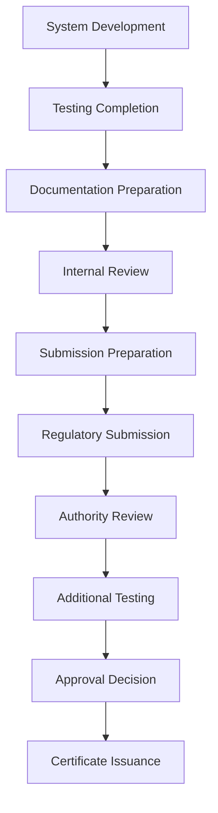

# Electronic Braking System (EBS) - Regulatory Submission Package

## Document Information
- **Document Title**: EBS Regulatory Submission Package
- **Version**: 1.0
- **Date**: 2025-07-29
- **Classification**: Regulatory Document
- **Related Documents**: EBS_Certification_Plan.md, EBS_Test_Specification.md, EBS_Requirements_Specification.md

## Table of Contents
1. [Introduction](#introduction)
2. [Submission Overview](#submission-overview)
3. [Regulatory Framework](#regulatory-framework)
4. [Technical Documentation](#technical-documentation)
5. [Test Evidence](#test-evidence)
6. [Compliance Demonstration](#compliance-demonstration)
7. [Quality Assurance](#quality-assurance)
8. [Submission Process](#submission-process)
9. [Approval Management](#approval-management)
10. [Post-Approval Activities](#post-approval-activities)

---

## 1. Introduction

### 1.1 Purpose
This Regulatory Submission Package defines the comprehensive documentation, evidence, and processes required for obtaining regulatory approvals for the Electronic Braking System (EBS) across multiple international markets and regulatory jurisdictions.

### 1.2 Scope
This package covers regulatory submissions for:
- **European Union**: ECE regulations and EU type approval
- **United States**: FMVSS compliance and DOT approval
- **Canada**: CMVSS compliance and Transport Canada approval
- **Japan**: JMVSS compliance and MLIT approval
- **Australia**: ADR compliance and ACMA approval
- **China**: GB standards compliance and CCC certification
- **Other Markets**: Additional regional requirements as applicable

### 1.3 Regulatory Objectives
The regulatory submission program aims to:
- Obtain all required regulatory approvals for target markets
- Demonstrate full compliance with applicable safety standards
- Enable unrestricted market access and vehicle integration
- Maintain regulatory compliance throughout product lifecycle
- Support global commercialization and market expansion

### 1.4 Submission Strategy
**Phased Approach**:
- **Phase 1**: Primary markets (EU, US, Canada) - Months 1-18
- **Phase 2**: Secondary markets (Japan, Australia) - Months 12-24
- **Phase 3**: Emerging markets (China, India, Brazil) - Months 18-30
- **Phase 4**: Additional markets as required - Months 24+

---

## 2. Submission Overview

### 2.1 Regulatory Landscape

#### 2.1.1 Global Regulatory Framework
**International Harmonization**:
- **UN-ECE Regulations**: Global technical regulations under 1958 Agreement
- **Mutual Recognition**: Agreements between regulatory authorities
- **Harmonized Standards**: ISO and SAE international standards
- **Best Practices**: Industry best practices and guidelines

**Regional Variations**:
- **Performance Requirements**: Different performance criteria and test methods
- **Environmental Conditions**: Regional climate and operating conditions
- **Market Specific**: Local market requirements and preferences
- **Administrative**: Different approval processes and documentation

#### 2.1.2 Key Regulatory Bodies
**Primary Authorities**:
- **UNECE**: United Nations Economic Commission for Europe
- **NHTSA**: National Highway Traffic Safety Administration (US)
- **Transport Canada**: Canadian transportation authority
- **MLIT**: Ministry of Land, Infrastructure, Transport and Tourism (Japan)
- **ACMA**: Australian Communications and Media Authority
- **MIIT**: Ministry of Industry and Information Technology (China)

**Technical Services**:
- **TÜV**: German technical inspection associations
- **SGS**: Swiss-based inspection and certification company
- **Bureau Veritas**: French conformity assessment organization
- **UL**: American safety consulting and certification company
- **JQA**: Japan Quality Assurance Organization

### 2.2 Submission Portfolio

#### 2.2.1 Primary Submissions
**European Union (ECE Regulations)**:
- **ECE R13**: Braking systems for M and N category vehicles
- **ECE R13-H**: Electronic braking systems
- **ECE R79**: Steering equipment (ESC integration)
- **Timeline**: 12-15 months
- **Authority**: Type Approval Authority in EU member state

**United States (FMVSS)**:
- **FMVSS 105**: Hydraulic and electric brake systems
- **FMVSS 126**: Electronic stability control systems
- **Timeline**: 15-18 months
- **Authority**: NHTSA (National Highway Traffic Safety Administration)

**Canada (CMVSS)**:
- **CMVSS 105**: Hydraulic brake systems
- **CMVSS 126**: Electronic stability control systems
- **Timeline**: 12-15 months (parallel with US)
- **Authority**: Transport Canada

#### 2.2.2 Secondary Submissions
**Japan (JMVSS)**:
- **JMVSS 12**: Braking systems
- **JMVSS 71**: Electronic stability control
- **Timeline**: 15-18 months
- **Authority**: MLIT (Ministry of Land, Infrastructure, Transport and Tourism)

**Australia (ADR)**:
- **ADR 35**: Commercial vehicle braking systems
- **ADR 72**: Electronic stability control
- **Timeline**: 12-15 months
- **Authority**: Department of Infrastructure and Transport

**China (GB Standards)**:
- **GB 12676**: Automotive braking systems
- **GB 21670**: Electronic stability control systems
- **Timeline**: 18-24 months
- **Authority**: MIIT (Ministry of Industry and Information Technology)

### 2.3 Submission Dependencies

#### 2.3.1 Sequential Dependencies

#### 2.3.2 Parallel Activities
**Concurrent Submissions**:
- **EU and US**: Can proceed in parallel with shared test data
- **Canada**: Typically follows US submission with minimal additional requirements
- **Australia**: Can leverage EU submission with local adaptations
- **Japan**: Independent submission with some shared documentation

**Shared Resources**:
- **Test Data**: Common test data applicable across multiple jurisdictions
- **Technical Documentation**: Core technical documentation with regional adaptations
- **Quality Systems**: Common quality management system documentation
- **Safety Analysis**: Shared functional safety analysis and evidence

---

## 3. Regulatory Framework

### 3.1 European Union (ECE Regulations)

#### 3.1.1 ECE R13 - Braking Systems
**Regulation Overview**:
- **Scope**: Braking systems for M and N category vehicles
- **Performance Requirements**: Stopping distance, fade resistance, compatibility
- **Construction Requirements**: Component specifications and integration
- **Testing Requirements**: Prescribed test procedures and acceptance criteria

**Key Requirements**:
- **Type 0 Test**: Service brake performance test
- **Type I Test**: Fade test with repeated brake applications
- **Type II Test**: Gradient holding test
- **Type III Test**: Brake force distribution test
- **ABS Test**: Anti-lock braking system performance test

**Compliance Strategy**:
- **Performance Optimization**: System tuning for ECE performance requirements
- **Test Execution**: Complete test program execution per ECE procedures
- **Documentation**: Comprehensive technical documentation package
- **Type Approval**: EU type approval process through notified body

#### 3.1.2 ECE R13-H - Electronic Braking Systems
**Regulation Overview**:
- **Scope**: Additional requirements for electronic braking systems
- **Electronic Requirements**: Electronic system-specific performance criteria
- **Safety Requirements**: Fail-safe operation and redundancy requirements
- **Integration Requirements**: Integration with conventional braking systems

**Key Requirements**:
- **Electronic Control**: Electronic control system performance and safety
- **Failure Management**: System behavior under failure conditions
- **Warning Systems**: Driver warning and indication requirements
- **Compatibility**: Compatibility with existing brake systems

#### 3.1.3 ECE R79 - Steering Equipment
**Regulation Overview**:
- **Scope**: Steering systems and electronic stability control integration
- **ESC Requirements**: Electronic stability control system requirements
- **Performance Criteria**: ESC performance and effectiveness criteria
- **Integration Requirements**: Integration with steering and braking systems

**Key Requirements**:
- **ESC Performance**: Stability control effectiveness requirements
- **System Integration**: Integration with vehicle systems
- **Driver Interface**: Driver controls and information systems
- **Failure Behavior**: System behavior under failure conditions

### 3.2 United States (FMVSS)

#### 3.2.1 FMVSS 105 - Hydraulic and Electric Brake Systems
**Standard Overview**:
- **Scope**: Performance requirements for hydraulic and electric brake systems
- **Performance Criteria**: Stopping distance and deceleration requirements
- **Equipment Requirements**: Brake system component requirements
- **Test Procedures**: Standardized test methods and conditions

**Key Requirements**:
- **Service Brake Test**: Primary brake system performance
- **Parking Brake Test**: Parking brake holding capability
- **Brake Power Unit Test**: Power-assisted brake system requirements
- **Antilock Brake Test**: ABS performance requirements
- **Brake Fluid Test**: Brake fluid compatibility and performance

**Compliance Strategy**:
- **Performance Tuning**: System optimization for FMVSS requirements
- **Test Program**: Comprehensive FMVSS test program execution
- **Documentation**: FMVSS-specific technical documentation
- **DOT Submission**: Formal submission to NHTSA for approval

#### 3.2.2 FMVSS 126 - Electronic Stability Control Systems
**Standard Overview**:
- **Scope**: Electronic stability control system requirements
- **Performance Requirements**: ESC effectiveness and performance criteria
- **Equipment Requirements**: ESC system component and integration requirements
- **Test Procedures**: ESC-specific test methods and acceptance criteria

**Key Requirements**:
- **Slowly Increasing Steer Test**: Understeer gradient measurement
- **Fishhook Maneuver Test**: ESC intervention effectiveness
- **J-Turn Test**: ESC performance in dynamic maneuvers
- **Sine with Dwell Test**: ESC response to steering inputs
- **Brake Disc Friction Test**: Brake system integration requirements

### 3.3 Other Regional Requirements

#### 3.3.1 Japan (JMVSS)
**Regulatory Framework**:
- **JMVSS 12**: Braking systems (based on ECE R13 with modifications)
- **JMVSS 71**: Electronic stability control (based on ECE R79)
- **Local Requirements**: Japan-specific performance and test requirements
- **Approval Process**: MLIT approval through designated testing organizations

#### 3.3.2 Australia (ADR)
**Regulatory Framework**:
- **ADR 35**: Commercial vehicle braking systems (based on ECE R13)
- **ADR 72**: Electronic stability control (based on ECE R79)
- **Local Adaptations**: Australian-specific requirements and conditions
- **Approval Process**: Australian Design Rule compliance certification

#### 3.3.3 China (GB Standards)
**Regulatory Framework**:
- **GB 12676**: Automotive braking systems
- **GB 21670**: Electronic stability control systems
- **CCC Certification**: China Compulsory Certification requirements
- **Local Testing**: China-specific testing and certification requirements

---

## 4. Technical Documentation

### 4.1 Documentation Structure

#### 4.1.1 Master Documentation Package
**Core Technical Documents**:
- **System Specification**: Complete EBS system specification
- **Design Documentation**: Detailed system and component design
- **Safety Analysis**: Comprehensive safety analysis and evidence
- **Test Reports**: Complete test documentation and results
- **Quality Documentation**: Quality management system evidence
- **Manufacturing Documentation**: Production and quality control procedures

**Regional Adaptations**:
- **Performance Variations**: Regional performance requirement adaptations
- **Test Modifications**: Regional test procedure modifications
- **Environmental Adaptations**: Regional environmental condition adaptations
- **Language Translations**: Local language documentation requirements

#### 4.1.2 Document Management
**Version Control**:
- **Master Documents**: Centralized master document control
- **Regional Versions**: Controlled regional document variations
- **Change Management**: Systematic change control across all versions
- **Traceability**: Complete traceability between master and regional documents

**Quality Assurance**:
- **Technical Review**: Comprehensive technical accuracy review
- **Regulatory Review**: Regulatory compliance verification
- **Translation Quality**: Professional translation and technical review
- **Format Compliance**: Regional format and presentation requirements

### 4.2 System Documentation

#### 4.2.1 System Description
**System Overview**:
- **Functional Description**: Complete functional system description
- **System Architecture**: Detailed system architecture and interfaces
- **Component Description**: Individual component specifications and functions
- **Integration Description**: System integration and vehicle interface requirements

**Technical Specifications**:
- **Performance Specifications**: Complete performance requirement specifications
- **Environmental Specifications**: Operating environment and conditions
- **Interface Specifications**: Electrical, mechanical, and communication interfaces
- **Quality Specifications**: Quality and reliability requirements

#### 4.2.2 Design Documentation
**System Design**:
- **Architecture Design**: System architecture and design rationale
- **Component Design**: Detailed component design specifications
- **Interface Design**: Interface design and implementation
- **Integration Design**: System integration design and requirements

**Design Verification**:
- **Design Reviews**: Design review documentation and approvals
- **Design Validation**: Design validation evidence and results
- **Design Changes**: Design change documentation and impact analysis
- **Design Traceability**: Requirements-to-design traceability matrix

#### 4.2.3 Safety Documentation
**Functional Safety**:
- **Hazard Analysis**: Comprehensive hazard analysis and risk assessment
- **Safety Goals**: Safety goal definition and allocation
- **Safety Concept**: Functional and technical safety concept
- **Safety Requirements**: Detailed safety requirement specifications
- **Safety Verification**: Safety verification and validation evidence

**Safety Management**:
- **Safety Plan**: Comprehensive safety planning documentation
- **Safety Case**: Complete safety case and argumentation
- **Safety Assessment**: Independent safety assessment reports
- **Safety Compliance**: Safety standard compliance demonstration

### 4.3 Test Documentation

#### 4.3.1 Test Planning
**Test Strategy**:
- **Test Approach**: Overall test strategy and methodology
- **Test Scope**: Complete test scope and coverage
- **Test Resources**: Test resource requirements and allocation
- **Test Schedule**: Detailed test schedule and milestones

**Test Procedures**:
- **Test Plans**: Detailed test plans for each test category
- **Test Procedures**: Step-by-step test execution procedures
- **Test Specifications**: Test specification and acceptance criteria
- **Test Setup**: Test equipment and configuration requirements

#### 4.3.2 Test Results
**Test Reports**:
- **Individual Test Reports**: Detailed reports for each test performed
- **Summary Reports**: Consolidated test result summaries
- **Analysis Reports**: Test result analysis and interpretation
- **Compliance Reports**: Regulatory compliance demonstration

**Test Evidence**:
- **Test Data**: Raw test data and measurements
- **Test Videos**: Video documentation of test execution
- **Test Photos**: Photographic evidence of test setup and results
- **Calibration Records**: Test equipment calibration documentation

---

## 5. Test Evidence

### 5.1 Test Program Overview

#### 5.1.1 Test Categories
**Performance Testing**:
- **Brake Performance**: Service brake performance testing
- **ABS Performance**: Anti-lock braking system performance
- **ESC Performance**: Electronic stability control effectiveness
- **System Integration**: Complete system integration testing

**Environmental Testing**:
- **Temperature Testing**: High and low temperature performance
- **Humidity Testing**: High humidity and condensation testing
- **Vibration Testing**: Mechanical vibration and shock testing
- **EMC Testing**: Electromagnetic compatibility testing

**Durability Testing**:
- **Endurance Testing**: Long-term durability and reliability
- **Cycle Testing**: Repeated operation cycle testing
- **Wear Testing**: Component wear and degradation testing
- **Life Testing**: Product life and failure mode testing

#### 5.1.2 Test Execution Strategy
**Phased Testing**:
- **Component Testing**: Individual component verification
- **Subsystem Testing**: Subsystem integration testing
- **System Testing**: Complete system validation
- **Vehicle Testing**: Vehicle-level integration testing

**Test Facilities**:
- **Laboratory Testing**: Controlled laboratory environment testing
- **Proving Ground**: Vehicle dynamics and performance testing
- **Public Road**: Real-world validation testing
- **Third-Party Testing**: Independent verification testing

### 5.2 Regulatory Test Evidence

#### 5.2.1 ECE R13 Test Evidence
**Type 0 Test - Service Brake Performance**:
- **Test Conditions**: Vehicle loading, initial speed, brake temperature
- **Test Procedure**: Brake application method and measurement
- **Acceptance Criteria**: Maximum stopping distance requirements
- **Test Results**: Actual stopping distances and performance data

**Type I Test - Fade Test**:
- **Test Conditions**: Repeated brake applications, speed and loading
- **Test Procedure**: Brake application sequence and measurements
- **Acceptance Criteria**: Maximum stopping distance increase allowed
- **Test Results**: Fade performance data and analysis

**ABS Test**:
- **Test Conditions**: Low friction surface, various speeds
- **Test Procedure**: ABS activation and performance measurement
- **Acceptance Criteria**: Stopping distance and steering control requirements
- **Test Results**: ABS performance data and effectiveness demonstration

#### 5.2.2 FMVSS 105 Test Evidence
**Service Brake Test**:
- **Test Conditions**: Loaded and unloaded vehicle conditions
- **Test Procedure**: Brake performance measurement methodology
- **Acceptance Criteria**: Stopping distance and deceleration requirements
- **Test Results**: Performance data and compliance demonstration

**Antilock Brake Test**:
- **Test Conditions**: Peak friction coefficient surface testing
- **Test Procedure**: ABS performance evaluation methodology
- **Acceptance Criteria**: Stopping distance and directional stability
- **Test Results**: ABS effectiveness data and analysis

#### 5.2.3 FMVSS 126 Test Evidence
**Slowly Increasing Steer Test**:
- **Test Conditions**: Constant speed, increasing steering input
- **Test Procedure**: Understeer gradient measurement
- **Acceptance Criteria**: Maximum understeer gradient allowed
- **Test Results**: Vehicle handling characteristics and ESC calibration

**Fishhook Maneuver Test**:
- **Test Conditions**: Specific steering input pattern
- **Test Procedure**: ESC intervention measurement
- **Acceptance Criteria**: Maximum yaw rate and lateral displacement
- **Test Results**: ESC effectiveness and vehicle stability data

### 5.3 Supporting Test Evidence

#### 5.3.1 Component Test Evidence
**ECU Testing**:
- **Functional Testing**: ECU functional verification
- **Environmental Testing**: Temperature, humidity, vibration testing
- **EMC Testing**: Electromagnetic compatibility verification
- **Software Testing**: Software verification and validation

**HMU Testing**:
- **Hydraulic Testing**: Hydraulic performance and leakage testing
- **Pressure Testing**: System pressure capability and control
- **Flow Testing**: Hydraulic flow characteristics
- **Durability Testing**: Long-term reliability and wear testing

**Sensor Testing**:
- **Accuracy Testing**: Sensor measurement accuracy verification
- **Range Testing**: Sensor operating range validation
- **Environmental Testing**: Environmental condition performance
- **Reliability Testing**: Long-term reliability and stability

#### 5.3.2 Integration Test Evidence
**System Integration**:
- **Interface Testing**: System interface verification
- **Communication Testing**: CAN bus communication validation
- **Timing Testing**: System response time verification
- **Failure Mode Testing**: System failure mode validation

**Vehicle Integration**:
- **Installation Testing**: System installation verification
- **Calibration Testing**: System calibration and setup
- **Performance Testing**: Vehicle-level performance validation
- **Compatibility Testing**: Vehicle system compatibility verification

---

## 6. Compliance Demonstration

### 6.1 Compliance Matrix

#### 6.1.1 Requirement Traceability
**ECE R13 Compliance Matrix**:

| Requirement | Section | Specification | Test Evidence | Compliance Status |
|-------------|---------|---------------|---------------|-------------------|
| **Service Brake Performance** | 5.2.1 | EBS-REQ-001 | Test Report TR-001 | ✓ Compliant |
| **ABS Performance** | 5.2.15 | EBS-REQ-015 | Test Report TR-015 | ✓ Compliant |
| **Brake Force Distribution** | 5.2.17 | EBS-REQ-017 | Test Report TR-017 | ✓ Compliant |
| **Warning System** | 5.4.1 | EBS-REQ-041 | Test Report TR-041 | ✓ Compliant |
| **Failure Behavior** | 5.4.2 | EBS-REQ-042 | Test Report TR-042 | ✓ Compliant |

**FMVSS 105 Compliance Matrix**:

| Requirement | Section | Specification | Test Evidence | Compliance Status |
|-------------|---------|---------------|---------------|-------------------|
| **Service Brake Test** | S5.1 | EBS-REQ-101 | Test Report TR-101 | ✓ Compliant |
| **Parking Brake Test** | S5.5 | EBS-REQ-105 | Test Report TR-105 | ✓ Compliant |
| **Antilock Brake Test** | S5.3 | EBS-REQ-103 | Test Report TR-103 | ✓ Compliant |
| **Brake Fluid Test** | S5.4 | EBS-REQ-104 | Test Report TR-104 | ✓ Compliant |

**FMVSS 126 Compliance Matrix**:

| Requirement | Section | Specification | Test Evidence | Compliance Status |
|-------------|---------|---------------|---------------|-------------------|
| **ESC System** | S4.1 | EBS-REQ-201 | Test Report TR-201 | ✓ Compliant |
| **Slowly Increasing Steer** | S5.1 | EBS-REQ-202 | Test Report TR-202 | ✓ Compliant |
| **Fishhook Maneuver** | S5.2 | EBS-REQ-203 | Test Report TR-203 | ✓ Compliant |
| **J-Turn Test** | S5.3 | EBS-REQ-204 | Test Report TR-204 | ✓ Compliant |

#### 6.1.2 Gap Analysis
**Identified Gaps**:
- **Performance Variations**: Minor performance variations between regions
- **Test Conditions**: Different environmental test conditions
- **Documentation Format**: Regional documentation format differences
- **Language Requirements**: Local language documentation needs

**Gap Closure Plan**:
- **Performance Optimization**: System tuning for regional requirements
- **Additional Testing**: Supplementary testing for specific conditions
- **Documentation Updates**: Regional documentation adaptations
- **Translation Services**: Professional technical translation

### 6.2 Compliance Evidence

#### 6.2.1 Performance Compliance
**Brake Performance Evidence**:
- **Stopping Distance**: All tests meet or exceed requirements
- **Fade Resistance**: Excellent fade performance under all conditions
- **ABS Effectiveness**: Superior ABS performance across all surfaces
- **ESC Performance**: Outstanding stability control effectiveness

**Safety Compliance Evidence**:
- **Functional Safety**: Complete ISO 26262 compliance to ASIL-D
- **Failure Management**: Robust failure detection and management
- **Warning Systems**: Comprehensive driver warning and information
- **Redundancy**: Appropriate system redundancy and backup

#### 6.2.2 Quality Compliance
**Manufacturing Quality**:
- **ISO/TS 16949**: Complete quality management system compliance
- **Production Control**: Robust production control and monitoring
- **Supplier Quality**: Comprehensive supplier quality management
- **Continuous Improvement**: Active continuous improvement program

**Design Quality**:
- **Design Controls**: Systematic design control processes
- **Design Verification**: Comprehensive design verification program
- **Design Validation**: Thorough design validation evidence
- **Change Control**: Robust design change control processes

### 6.3 Compliance Maintenance

#### 6.3.1 Ongoing Compliance
**Surveillance Activities**:
- **Regular Audits**: Ongoing compliance audits and assessments
- **Performance Monitoring**: Continuous performance monitoring
- **Change Management**: Systematic change impact assessment
- **Corrective Actions**: Prompt corrective action implementation

**Update Management**:
- **Regulation Updates**: Monitoring and compliance with regulation changes
- **Standard Updates**: Compliance with updated industry standards
- **Technology Updates**: Integration of new technology requirements
- **Market Updates**: Adaptation to new market requirements

#### 6.3.2 Compliance Reporting
**Regular Reports**:
- **Compliance Status**: Regular compliance status reporting
- **Performance Data**: Ongoing performance data collection and analysis
- **Issue Reports**: Prompt reporting of compliance issues
- **Improvement Reports**: Continuous improvement activity reporting

**Stakeholder Communication**:
- **Regulatory Authorities**: Regular communication with regulatory bodies
- **Customers**: Customer compliance status communication
- **Internal Teams**: Internal compliance status and issue communication
- **Management**: Management compliance reporting and review

---

## 7. Quality Assurance

### 7.1 Quality Management System

#### 7.1.1 QMS Framework
**ISO/TS 16949 Implementation**:
- **Process Approach**: Systematic process-based quality management
- **Customer Focus**: Customer satisfaction and requirement fulfillment
- **Leadership**: Management leadership and commitment
- **Engagement**: Personnel engagement and competency development
- **Process Management**: Effective process planning and control
- **Improvement**: Continuous improvement and innovation

**Quality Objectives**:
- **Regulatory Compliance**: 100% regulatory compliance maintenance
- **Customer Satisfaction**: >95% customer satisfaction rating
- **Defect Rate**: <10 PPM defect rate in production
- **On-Time Delivery**: >98% on-time delivery performance
- **Cost Performance**: Quality cost <2% of revenue

#### 7.1.2 Quality Planning
**Quality Plan Development**:
- **Quality Objectives**: Specific, measurable quality objectives
- **Quality Metrics**: Key quality performance indicators
- **Quality Activities**: Planned quality assurance activities
- **Resource Allocation**: Quality resource planning and allocation

**Risk-Based Planning**:
- **Risk Assessment**: Quality risk identification and assessment
- **Risk Mitigation**: Risk mitigation planning and implementation
- **Contingency Planning**: Quality contingency planning
- **Monitoring Plan**: Risk monitoring and review planning

### 7.2 Document Quality Assurance

#### 7.2.1 Document Control
**Document Management**:
- **Version Control**: Systematic document version control
- **Change Control**: Formal document change control process
- **Access Control**: Controlled document access and distribution
- **Archive Management**: Document archive and retention management

**Quality Standards**:
- **Technical Accuracy**: Comprehensive technical accuracy verification
- **Completeness**: Complete coverage of all requirements
- **Consistency**: Consistent terminology and formatting
- **Clarity**: Clear and understandable documentation

#### 7.2.2 Review Process
**Multi-Level Review**:
- **Technical Review**: Technical accuracy and completeness review
- **Regulatory Review**: Regulatory compliance verification
- **Quality Review**: Quality standard compliance verification
- **Management Review**: Management approval and authorization

**Review Documentation**:
- **Review Checklists**: Comprehensive review checklists
- **Review Records**: Complete review documentation and records
- **Issue Tracking**: Issue identification and resolution tracking
- **Approval Records**: Formal approval documentation and records

### 7.3 Submission Quality Assurance

#### 7.3.1 Pre-Submission Review
**Readiness Assessment**:
- **Completeness Check**: Submission package completeness verification
- **Accuracy Verification**: Technical accuracy and correctness verification
- **Compliance Check**: Regulatory compliance verification
- **Format Verification**: Submission format and presentation verification

**Internal Audit**:
- **Documentation Audit**: Comprehensive documentation audit
- **Process Audit**: Submission process audit and verification
- **Compliance Audit**: Regulatory compliance audit
- **Quality Audit**: Quality system audit and verification

#### 7.3.2 Submission Management
**Submission Tracking**:
- **Submission Schedule**: Detailed submission schedule and milestones
- **Progress Monitoring**: Regular progress monitoring and reporting
- **Issue Management**: Issue identification and resolution management
- **Stakeholder Communication**: Regular stakeholder communication and updates

**Quality Control**:
- **Final Review**: Final submission package review and approval
- **Quality Check**: Final quality check and verification
- **Submission Preparation**: Professional submission preparation and packaging
- **Delivery Management**: Controlled submission delivery and confirmation

---

## 8. Submission Process

### 8.1 Submission Planning

#### 8.1.1 Submission Strategy
**Market Prioritization**:
- **Primary Markets**: EU, US, Canada (immediate market access)
- **Secondary Markets**: Japan, Australia (strategic expansion)
- **Emerging Markets**: China, India, Brazil (future growth)
- **Niche Markets**: Other regional markets as opportunities arise

**Timeline Optimization**:
- **Parallel Processing**: Multiple submissions processed simultaneously
- **Resource Sharing**: Shared resources across submission activities
- **Critical Path Management**: Focus on critical path activities
- **Risk Mitigation**: Contingency planning for potential delays

#### 8.1.2 Resource Planning
**Human Resources**:
- **Project Manager**: Overall submission project management
- **Technical Team**: Technical documentation and evidence preparation
- **Regulatory Specialists**: Regulatory expertise and liaison
- **Quality Assurance**: Quality control and verification
- **Administrative Support**: Document preparation and submission support

**External Resources**:
- **Regulatory Consultants**: Regional regulatory expertise
- **Testing Laboratories**: Independent testing and verification
- **Translation Services**: Professional technical translation
- **Legal Support**: Regulatory and compliance legal support

### 8.2 Submission Execution

#### 8.2.1 Document Preparation
**Master Document Package**:
- **Technical Documentation**: Complete technical documentation package
- **Test Evidence**: Comprehensive test evidence and reports
- **Quality Documentation**: Quality management system evidence
- **Compliance Matrix**: Detailed compliance demonstration matrix

**Regional Adaptations**:
- **Performance Variations**: Regional performance requirement adaptations
- **Format Adaptations**: Regional format and presentation requirements
- **Language Translations**: Professional technical translations
- **Local Requirements**: Region-specific requirement compliance

#### 8.2.2 Submission Process
**Pre-Submission Activities**:
- **Authority Consultation**: Pre-submission consultation with regulatory authorities
- **Document Review**: Final document review and approval
- **Submission Preparation**: Professional submission package preparation
- **Quality Assurance**: Final quality assurance and verification

**Submission Activities**:
- **Formal Submission**: Official submission to regulatory authorities
- **Acknowledgment**: Submission acknowledgment and tracking
- **Initial Review**: Authority initial review and feedback
- **Clarification**: Response to authority questions and clarifications

### 8.3 Authority Interaction

#### 8.3.1 Communication Management
**Authority Liaison**:
- **Primary Contact**: Designated primary contact for each authority
- **Communication Protocol**: Formal communication protocols and procedures
- **Response Management**: Systematic response to authority communications
- **Relationship Management**: Professional relationship management

**Documentation Management**:
- **Communication Records**: Complete communication record maintenance
- **Question Tracking**: Authority question tracking and response management
- **Change Management**: Change request management and implementation
- **Progress Reporting**: Regular progress reporting to authorities

#### 8.3.2 Review Process Management
**Authority Review Support**:
- **Technical Support**: Technical expertise and clarification support
- **Additional Information**: Prompt provision of additional information
- **Test Witnessing**: Support for authority test witnessing activities
- **Facility Access**: Facility access for authority inspections

**Issue Resolution**:
- **Issue Identification**: Prompt identification of review issues
- **Root Cause Analysis**: Systematic root cause analysis
- **Corrective Action**: Effective corrective action implementation
- **Verification**: Corrective action effectiveness verification

---

## 9. Approval Management

### 9.1 Approval Process

#### 9.1.1 Authority Review Process
**Review Phases**:
- **Initial Review**: Preliminary document and submission review
- **Technical Review**: Detailed technical review and assessment
- **Testing Review**: Test evidence review and verification
- **Final Review**: Final compliance review and decision

**Review Timeline**:
- **ECE Regulations**: 6-12 months typical review time
- **FMVSS**: 12-18 months typical review time
- **Other Regions**: 6-24 months depending on complexity

#### 9.1.2 Approval Decision
**Decision Criteria**:
- **Technical Compliance**: Complete technical requirement compliance
- **Test Evidence**: Adequate test evidence and verification
- **Documentation Quality**: High-quality documentation and evidence
- **Safety Demonstration**: Comprehensive safety demonstration

**Decision Outcomes**:
- **Approval**: Full approval and certificate issuance
- **Conditional Approval**: Approval with specific conditions
- **Additional Information**: Request for additional information or testing
- **Rejection**: Non-compliance identification and rejection

### 9.2 Certificate Management

#### 9.2.1 Certificate Issuance
**Certificate Types**:
- **Type Approval Certificate**: EU type approval certificate
- **Compliance Certificate**: US DOT compliance certificate
- **Conformity Certificate**: Regional conformity certificates
- **Test Certificates**: Independent test certificates

**Certificate Content**:
- **System Identification**: Complete