# Electronic Braking System (EBS) - Software Architecture and Algorithm Specifications

## Document Information
- **Document Title**: EBS Software Architecture and Algorithm Specifications
- **Version**: 1.0
- **Date**: 2025-07-29
- **Classification**: Technical Design Document
- **Related Documents**: EBS_Requirements_Specification.md, EBS_System_Architecture_Specification.md

## Table of Contents
1. [Introduction](#introduction)
2. [Software Architecture Overview](#software-architecture-overview)
3. [Real-Time Operating System Specifications](#real-time-operating-system-specifications)
4. [Application Software Architecture](#application-software-architecture)
5. [Control Algorithm Specifications](#control-algorithm-specifications)
6. [Safety Software Architecture](#safety-software-architecture)
7. [Communication Software Specifications](#communication-software-specifications)
8. [Diagnostic and Monitoring Software](#diagnostic-and-monitoring-software)
9. [Software Development Standards](#software-development-standards)

---

## 1. Introduction

### 1.1 Purpose
This document defines the software architecture and algorithm specifications for the Electronic Braking System (EBS), including real-time operating system requirements, application software design, control algorithms, and safety mechanisms.

### 1.2 Scope
The specifications cover:
- Software architecture patterns and design principles
- Real-time operating system configuration
- Control algorithm implementations (ABS, ESC, TCS)
- Safety software mechanisms and monitoring
- Communication protocol implementations
- Diagnostic and fault management software

### 1.3 Software Design Principles
- **Safety First**: All software design prioritizes functional safety
- **Real-Time Performance**: Deterministic execution and response times
- **Modularity**: Loosely coupled, highly cohesive software modules
- **Testability**: Software designed for comprehensive testing
- **Maintainability**: Clear code structure and documentation

---

## 2. Software Architecture Overview

### 2.1 Layered Architecture

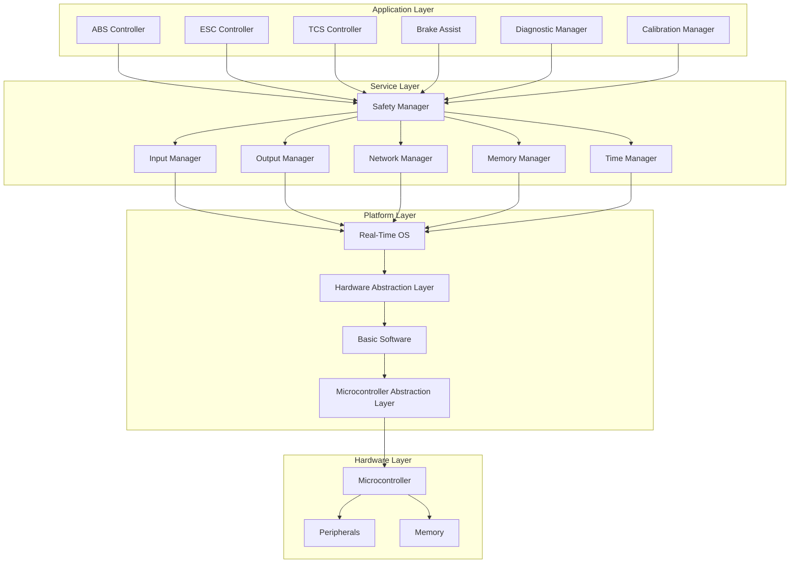

### 2.2 Software Components

| Component | Responsibility | ASIL Level | Execution Frequency |
|-----------|----------------|------------|-------------------|
| **ABS Controller** | Anti-lock braking algorithm | D | 1 ms |
| **ESC Controller** | Electronic stability control | D | 5 ms |
| **TCS Controller** | Traction control system | C | 10 ms |
| **Brake Assist** | Emergency brake assistance | D | 5 ms |
| **Safety Manager** | System safety monitoring | D | 1 ms |
| **Input Manager** | Sensor data acquisition | D | 1 ms |
| **Output Manager** | Actuator control | D | 1 ms |
| **Network Manager** | CAN communication | C | 10 ms |
| **Diagnostic Manager** | Fault detection and reporting | C | 100 ms |

### 2.3 Memory Architecture

#### 2.3.1 Memory Partitioning
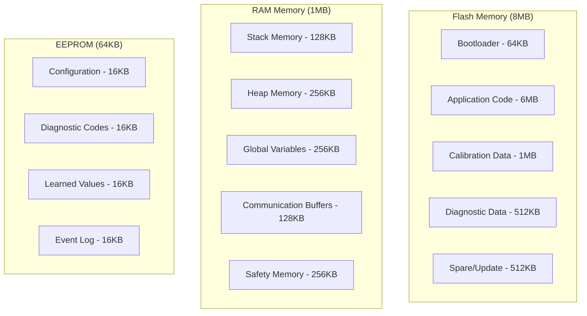

#### 2.3.2 Memory Protection
- **MPU Configuration**: Memory Protection Unit for memory isolation
- **Stack Protection**: Stack overflow detection and protection
- **Heap Protection**: Dynamic memory allocation monitoring
- **Code Protection**: Execute-only memory regions
- **Data Protection**: Read/write access control

---

## 3. Real-Time Operating System Specifications

### 3.1 RTOS Selection and Configuration

#### 3.1.1 RTOS Platform
- **Operating System**: AUTOSAR Classic Platform 4.4
- **Kernel Type**: Preemptive, priority-based scheduler
- **Scheduling Algorithm**: Fixed priority with round-robin for equal priorities
- **Memory Model**: Static memory allocation
- **Safety Certification**: ISO 26262 ASIL-D qualified

#### 3.1.2 Task Configuration

| Task Name | Priority | Period | WCET | Stack Size | ASIL |
|-----------|----------|--------|------|------------|------|
| **SafetyTask** | 255 (Highest) | 1 ms | 200 μs | 4 KB | D |
| **ABSTask** | 200 | 1 ms | 300 μs | 8 KB | D |
| **ESCTask** | 190 | 5 ms | 800 μs | 8 KB | D |
| **TCSTask** | 180 | 10 ms | 500 μs | 4 KB | C |
| **InputTask** | 170 | 1 ms | 150 μs | 4 KB | D |
| **OutputTask** | 160 | 1 ms | 200 μs | 4 KB | D |
| **CommTask** | 100 | 10 ms | 400 μs | 8 KB | C |
| **DiagTask** | 50 | 100 ms | 2 ms | 8 KB | C |
| **IdleTask** | 1 (Lowest) | Background | - | 2 KB | QM |

#### 3.1.3 Interrupt Configuration

| Interrupt Source | Priority | Handler WCET | Frequency | Purpose |
|------------------|----------|--------------|-----------|---------|
| **System Timer** | 15 (Highest) | 50 μs | 1 kHz | Task scheduling |
| **CAN RX** | 12 | 100 μs | Variable | Message reception |
| **ADC Complete** | 10 | 30 μs | 1 kHz | Sensor data ready |
| **PWM Update** | 8 | 40 μs | 1 kHz | Actuator control |
| **Watchdog** | 6 | 20 μs | 100 Hz | Safety monitoring |
| **External GPIO** | 4 | 60 μs | Variable | Emergency signals |

### 3.2 Timing Analysis

#### 3.2.1 Schedulability Analysis
```mermaid
gantt
    title Task Execution Timeline (10ms window)
    dateFormat X
    axisFormat %L
    
    section 1ms Cycle
    SafetyTask    :0, 200
    ABSTask       :200, 500
    InputTask     :500, 650
    OutputTask    :650, 850
    
    section 5ms Cycle
    ESCTask       :1000, 1800
    
    section 10ms Cycle
    TCSTask       :2000, 2500
    CommTask      :2500, 2900
    
    section 100ms Cycle
    DiagTask      :5000, 7000
```

#### 3.2.2 Response Time Analysis
- **Critical Path Analysis**: End-to-end response time calculation
- **Worst-Case Execution Time**: WCET analysis for all tasks
- **Jitter Analysis**: Task execution time variation
- **Deadline Monitoring**: Runtime deadline miss detection

### 3.3 Synchronization and Communication

#### 3.3.1 Inter-Task Communication
- **Message Queues**: FIFO queues for asynchronous communication
- **Shared Memory**: Protected shared data structures
- **Semaphores**: Binary and counting semaphores for resource protection
- **Events**: Event flags for task synchronization
- **Mailboxes**: Message passing between tasks

#### 3.3.2 Resource Management
- **Priority Inheritance**: Prevent priority inversion
- **Resource Locking**: Mutex-based resource protection
- **Deadlock Prevention**: Resource ordering and timeout mechanisms
- **Critical Sections**: Interrupt disable for atomic operations

---

## 4. Application Software Architecture

### 4.1 Control Loop Architecture

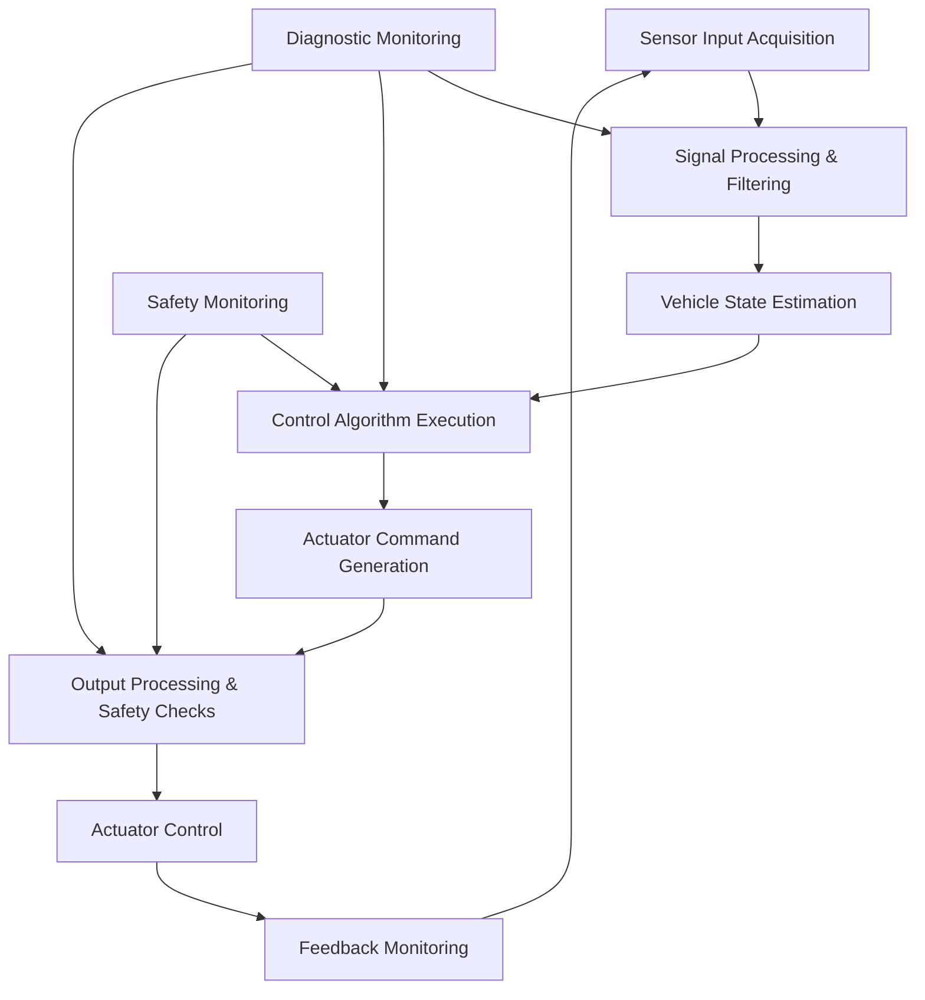

### 4.2 State Machine Architecture

#### 4.2.1 System State Machine
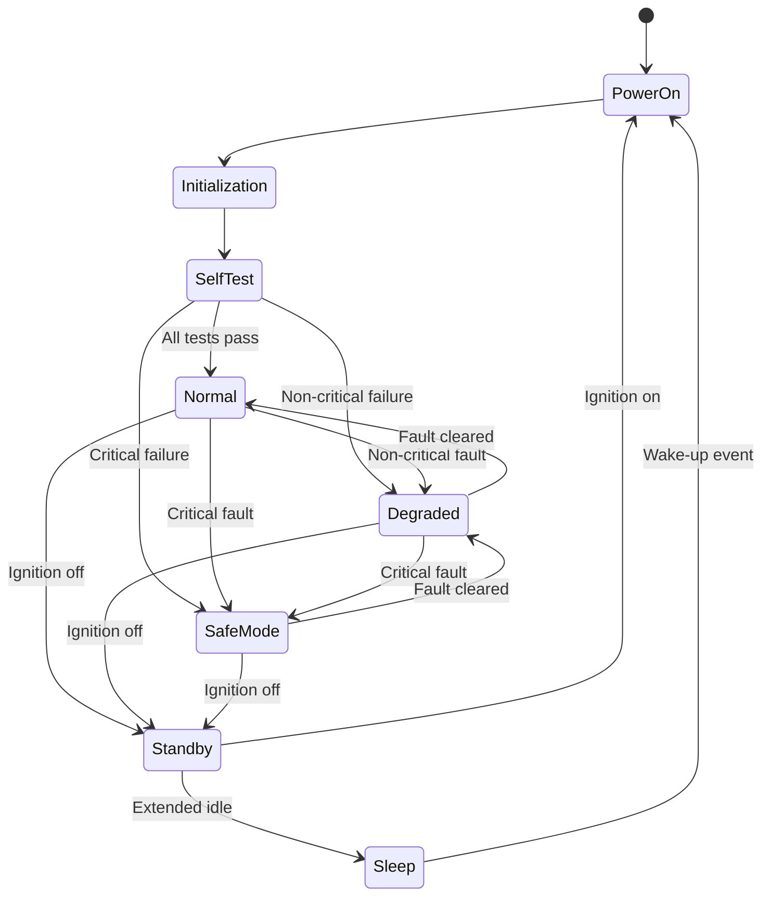

#### 4.2.2 ABS State Machine
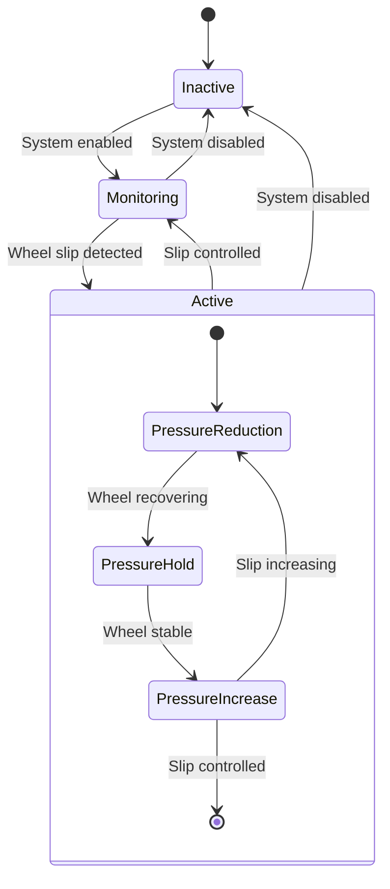

### 4.3 Data Flow Architecture

#### 4.3.1 Sensor Data Processing Pipeline
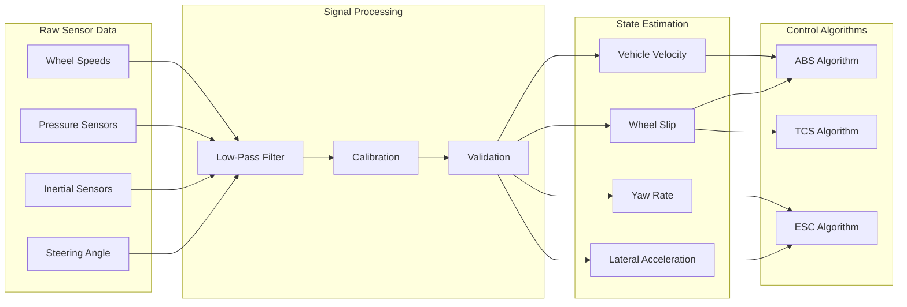

---

## 5. Control Algorithm Specifications

### 5.1 ABS (Anti-lock Braking System) Algorithm

#### 5.1.1 Algorithm Overview
The ABS algorithm prevents wheel lockup during braking by modulating brake pressure based on wheel slip calculations.

#### 5.1.2 Input Parameters
- **Wheel Speeds**: Individual wheel speed measurements (4 channels)
- **Vehicle Speed**: Estimated vehicle reference speed
- **Brake Pressure**: Master cylinder and wheel cylinder pressures
- **Road Surface**: Estimated friction coefficient (μ)

#### 5.1.3 Algorithm Implementation
```c
// ABS Control Algorithm (Pseudo-code)
void ABS_Control_Algorithm(void)
{
    // Calculate wheel slip for each wheel
    for (wheel = 0; wheel < 4; wheel++)
    {
        wheel_slip[wheel] = (vehicle_speed - wheel_speed[wheel]) / vehicle_speed;
        
        // Slip threshold detection
        if (wheel_slip[wheel] > ABS_SLIP_THRESHOLD)
        {
            abs_state[wheel] = ABS_ACTIVE;
            
            // Pressure reduction phase
            if (abs_phase[wheel] == PRESSURE_REDUCTION)
            {
                brake_pressure_cmd[wheel] = brake_pressure[wheel] * 0.8;
                
                // Check for wheel recovery
                if (wheel_acceleration[wheel] > RECOVERY_THRESHOLD)
                {
                    abs_phase[wheel] = PRESSURE_HOLD;
                }
            }
            
            // Pressure hold phase
            else if (abs_phase[wheel] == PRESSURE_HOLD)
            {
                brake_pressure_cmd[wheel] = brake_pressure[wheel];
                
                // Check for pressure increase condition
                if (wheel_slip[wheel] < SLIP_TARGET)
                {
                    abs_phase[wheel] = PRESSURE_INCREASE;
                }
            }
            
            // Pressure increase phase
            else if (abs_phase[wheel] == PRESSURE_INCREASE)
            {
                brake_pressure_cmd[wheel] = brake_pressure[wheel] * 1.1;
                
                // Check for slip increase
                if (wheel_slip[wheel] > ABS_SLIP_THRESHOLD)
                {
                    abs_phase[wheel] = PRESSURE_REDUCTION;
                }
            }
        }
        else
        {
            abs_state[wheel] = ABS_INACTIVE;
            brake_pressure_cmd[wheel] = master_cylinder_pressure;
        }
    }
}
```

#### 5.1.4 Algorithm Parameters
| Parameter | Value | Unit | Description |
|-----------|-------|------|-------------|
| **ABS_SLIP_THRESHOLD** | 0.15 | - | Wheel slip activation threshold |
| **RECOVERY_THRESHOLD** | 2.0 | m/s² | Wheel acceleration recovery limit |
| **SLIP_TARGET** | 0.10 | - | Target slip ratio for optimal braking |
| **PRESSURE_REDUCTION_RATE** | 0.2 | -/cycle | Pressure reduction factor |
| **PRESSURE_INCREASE_RATE** | 0.1 | -/cycle | Pressure increase factor |
| **CYCLE_TIME** | 1 | ms | Algorithm execution period |

### 5.2 ESC (Electronic Stability Control) Algorithm

#### 5.2.1 Algorithm Overview
The ESC algorithm maintains vehicle stability by detecting and correcting understeer and oversteer conditions through individual wheel braking and engine torque reduction.

#### 5.2.2 Vehicle Model
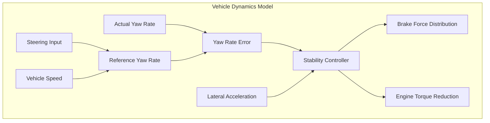

#### 5.2.3 Algorithm Implementation
```c
// ESC Control Algorithm (Pseudo-code)
void ESC_Control_Algorithm(void)
{
    // Calculate reference yaw rate
    float reference_yaw_rate = (vehicle_speed * steering_angle) / 
                              (wheelbase * (1 + understeer_gradient * vehicle_speed * vehicle_speed));
    
    // Calculate yaw rate error
    float yaw_rate_error = actual_yaw_rate - reference_yaw_rate;
    
    // Determine vehicle stability state
    if (fabs(yaw_rate_error) > YAW_RATE_THRESHOLD)
    {
        esc_active = true;
        
        // Oversteer detection (yaw rate error positive)
        if (yaw_rate_error > 0)
        {
            // Apply braking to outside front wheel
            if (steering_angle > 0) // Right turn
            {
                brake_force_cmd[FRONT_LEFT] = Calculate_Brake_Force(yaw_rate_error);
            }
            else // Left turn
            {
                brake_force_cmd[FRONT_RIGHT] = Calculate_Brake_Force(yaw_rate_error);
            }
        }
        
        // Understeer detection (yaw rate error negative)
        else
        {
            // Apply braking to inside rear wheel
            if (steering_angle > 0) // Right turn
            {
                brake_force_cmd[REAR_RIGHT] = Calculate_Brake_Force(yaw_rate_error);
            }
            else // Left turn
            {
                brake_force_cmd[REAR_LEFT] = Calculate_Brake_Force(yaw_rate_error);
            }
        }
        
        // Engine torque reduction
        engine_torque_reduction = Calculate_Torque_Reduction(yaw_rate_error);
    }
    else
    {
        esc_active = false;
        // Reset brake forces and torque reduction
        for (int i = 0; i < 4; i++)
        {
            brake_force_cmd[i] = 0;
        }
        engine_torque_reduction = 0;
    }
}

float Calculate_Brake_Force(float yaw_error)
{
    // PID controller for brake force calculation
    static float integral_error = 0;
    static float previous_error = 0;
    
    float proportional = ESC_KP * yaw_error;
    integral_error += yaw_error * CYCLE_TIME;
    float integral = ESC_KI * integral_error;
    float derivative = ESC_KD * (yaw_error - previous_error) / CYCLE_TIME;
    
    previous_error = yaw_error;
    
    float brake_force = proportional + integral + derivative;
    
    // Limit brake force
    if (brake_force > MAX_BRAKE_FORCE)
        brake_force = MAX_BRAKE_FORCE;
    if (brake_force < 0)
        brake_force = 0;
    
    return brake_force;
}
```

#### 5.2.4 Algorithm Parameters
| Parameter | Value | Unit | Description |
|-----------|-------|------|-------------|
| **YAW_RATE_THRESHOLD** | 5.0 | deg/s | ESC activation threshold |
| **ESC_KP** | 1000 | N/(deg/s) | Proportional gain |
| **ESC_KI** | 500 | N/(deg/s·s) | Integral gain |
| **ESC_KD** | 100 | N·s/(deg/s) | Derivative gain |
| **MAX_BRAKE_FORCE** | 8000 | N | Maximum individual wheel brake force |
| **UNDERSTEER_GRADIENT** | 0.002 | s²/m² | Vehicle understeer gradient |

### 5.3 TCS (Traction Control System) Algorithm

#### 5.3.1 Algorithm Overview
The TCS algorithm prevents excessive wheel spin during acceleration by reducing engine torque and applying brake force to spinning wheels.

#### 5.3.2 Algorithm Implementation
```c
// TCS Control Algorithm (Pseudo-code)
void TCS_Control_Algorithm(void)
{
    // Calculate drive wheel slip
    float left_drive_slip = (drive_wheel_speed[LEFT] - vehicle_speed) / vehicle_speed;
    float right_drive_slip = (drive_wheel_speed[RIGHT] - vehicle_speed) / vehicle_speed;
    
    bool tcs_intervention = false;
    
    // Check left drive wheel
    if (left_drive_slip > TCS_SLIP_THRESHOLD)
    {
        tcs_active[LEFT] = true;
        tcs_intervention = true;
        
        // Apply brake force to spinning wheel
        brake_force_cmd[LEFT_DRIVE] = Calculate_TCS_Brake_Force(left_drive_slip);
    }
    else
    {
        tcs_active[LEFT] = false;
        brake_force_cmd[LEFT_DRIVE] = 0;
    }
    
    // Check right drive wheel
    if (right_drive_slip > TCS_SLIP_THRESHOLD)
    {
        tcs_active[RIGHT] = true;
        tcs_intervention = true;
        
        // Apply brake force to spinning wheel
        brake_force_cmd[RIGHT_DRIVE] = Calculate_TCS_Brake_Force(right_drive_slip);
    }
    else
    {
        tcs_active[RIGHT] = false;
        brake_force_cmd[RIGHT_DRIVE] = 0;
    }
    
    // Engine torque reduction
    if (tcs_intervention)
    {
        float max_slip = fmax(left_drive_slip, right_drive_slip);
        engine_torque_reduction = Calculate_TCS_Torque_Reduction(max_slip);
    }
    else
    {
        engine_torque_reduction = 0;
    }
}

float Calculate_TCS_Brake_Force(float slip)
{
    // Proportional controller for brake force
    float brake_force = TCS_BRAKE_GAIN * (slip - TCS_SLIP_TARGET);
    
    // Limit brake force
    if (brake_force > MAX_TCS_BRAKE_FORCE)
        brake_force = MAX_TCS_BRAKE_FORCE;
    if (brake_force < 0)
        brake_force = 0;
    
    return brake_force;
}

float Calculate_TCS_Torque_Reduction(float slip)
{
    // Calculate torque reduction percentage
    float torque_reduction = TCS_TORQUE_GAIN * (slip - TCS_SLIP_TARGET);
    
    // Limit torque reduction
    if (torque_reduction > MAX_TORQUE_REDUCTION)
        torque_reduction = MAX_TORQUE_REDUCTION;
    if (torque_reduction < 0)
        torque_reduction = 0;
    
    return torque_reduction;
}
```

#### 5.3.3 Algorithm Parameters
| Parameter | Value | Unit | Description |
|-----------|-------|------|-------------|
| **TCS_SLIP_THRESHOLD** | 0.10 | - | TCS activation threshold |
| **TCS_SLIP_TARGET** | 0.05 | - | Target slip ratio for traction |
| **TCS_BRAKE_GAIN** | 5000 | N | Brake force gain |
| **TCS_TORQUE_GAIN** | 50 | %/slip | Torque reduction gain |
| **MAX_TCS_BRAKE_FORCE** | 3000 | N | Maximum TCS brake force |
| **MAX_TORQUE_REDUCTION** | 50 | % | Maximum torque reduction |

---

## 6. Safety Software Architecture

### 6.1 Safety Monitoring Framework

#### 6.1.1 Safety Manager Architecture
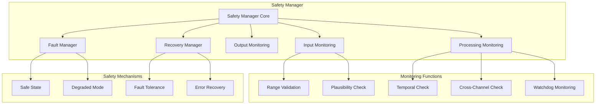

#### 6.1.2 Input Validation
```c
// Input Validation Framework (Pseudo-code)
typedef enum {
    VALIDATION_OK,
    VALIDATION_RANGE_ERROR,
    VALIDATION_PLAUSIBILITY_ERROR,
    VALIDATION_TEMPORAL_ERROR,
    VALIDATION_CROSS_CHECK_ERROR
} ValidationResult_t;

ValidationResult_t Validate_Sensor_Input(SensorData_t* sensor_data)
{
    // Range validation
    if (!Range_Check(sensor_data))
    {
        return VALIDATION_RANGE_ERROR;
    }
    
    // Plausibility check
    if (!Plausibility_Check(sensor_data))
    {
        return VALIDATION_PLAUSIBILITY_ERROR;
    }
    
    // Temporal validation
    if (!Temporal_Check(sensor_data))
    {
        return VALIDATION_TEMPORAL_ERROR;
    }
    
    // Cross-channel validation
    if (!Cross_Channel_Check(sensor_data))
    {
        return VALIDATION_CROSS_CHECK_ERROR;
    }
    
    return VALIDATION_OK;
}

bool Range_Check(SensorData_t* data)
{
    return (data->value >= data->min_value && data->value <= data->max_value);
}

bool Plausibility_Check(SensorData_t* data)
{
    // Check rate of change
    float rate = fabs(data->value - data->previous_value) / CYCLE_TIME;
    return (rate <= data->max_rate);
}

bool Temporal_Check(SensorData_t* data)
{
    // Check for stuck sensor
    static uint32_t stuck_counter = 0;
    
    if (fabs(data->value - data->previous_value) < data->resolution)
    {
        stuck_counter++;
    }
    else
    {
        stuck_counter = 0;
    }
    
    return (stuck_counter < MAX_STUCK_COUNT);
}
```

### 6.2 Watchdog Implementation

#### 6.2.1 Multi-Level Watchdog Architecture
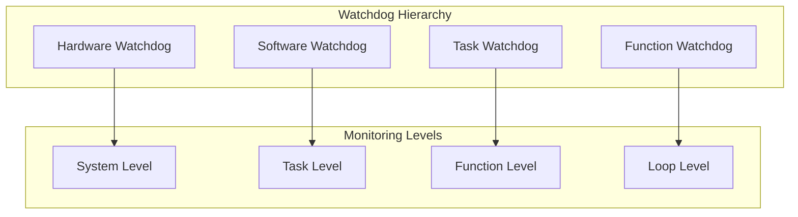

#### 6.2.2 Watchdog Implementation
```c
// Watchdog Management System (Pseudo-code)
typedef struct {
    uint32_t timeout_ms;
    uint32_t last_refresh;
    bool enabled;
    uint32_t violation_count;
} Watchdog_t;

static Watchdog_t system_watchdog = {100, 0, true, 0};
static Watchdog_t task_watchdogs[MAX_TASKS];

void Watchdog_Init(void)
{
    // Initialize hardware watchdog
    Hardware_Watchdog_Init(HARDWARE_WD_TIMEOUT);
    
    // Initialize software watchdogs
    for (int i = 0; i < MAX_TASKS; i++)
    {
        task_watchdogs[i].timeout_ms = task_timeout_table[i];
        task_watchdogs[i].enabled = true;
        task_watchdogs[i].violation_count = 0;
    }
}

void Watchdog_Refresh(WatchdogType_t type, uint32_t id)
{
    uint32_t current_time = Get_System_Time();
    
    switch (type)
    {
        case SYSTEM_WATCHDOG:
            system_watchdog.last_refresh = current_time;
            Hardware_Watchdog_Refresh();
            break;
            
        case TASK_WATCHDOG:
            if (id < MAX_TASKS)
            {
                task_watchdogs[id].last_refresh = current_time;
            }
            break;
    }
}

void Watchdog_Monitor(void)
{
    uint32_t current_time = Get_System_Time();
    
    // Check system watchdog
    if ((current_time - system_watchdog.last_refresh) > system_watchdog.timeout_ms)
    {
        Handle_Watchdog_Violation(SYSTEM_WATCHDOG, 0);
    }
    
    // Check task watchdogs
    for (int i = 0; i < MAX_TASKS; i++)
    {
        if (task_watchdogs[i].enabled)
        {
            if ((current_time - task_watchdogs[i].last_refresh) > task_watchdogs[i].timeout_ms)
            {
                Handle_Watchdog_Violation(TASK_WATCHDOG, i);
            }
        }
    }
}

void Handle_Watchdog_Violation(WatchdogType_t type, uint32_t id)
{
    // Log the violation
    Log_Safety_Event(WATCHDOG_VIOLATION, type, id);
    
    // Increment violation counter
    if (type == TASK_WATCHDOG && id < MAX_TASKS)
    {
        task_watchdogs[id].violation_count++;
        
        // Take corrective action based on violation count
        if (task_watchdogs[id].violation_count > MAX_VIOLATIONS)
        {
            // Disable the faulty task and enter degraded mode
            Disable_Task(id);
            Enter_Degraded_Mode();
        }
    }
    else if (type == SYSTEM_WATCHDOG)
    {
        // System-level violation - enter safe state
        Enter_Safe_State();
}
}
```

### 6.3 Dual-Channel Architecture

#### 6.3.1 Channel Implementation
```c
// Dual-Channel Safety Architecture (Pseudo-code)
typedef struct {
    float value;
    uint32_t timestamp;
    uint16_t crc;
    bool valid;
} ChannelData_t;

typedef struct {
    ChannelData_t channel_a;
    ChannelData_t channel_b;
    bool channels_agree;
    uint32_t disagreement_count;
} DualChannelData_t;

bool Dual_Channel_Compare(DualChannelData_t* data)
{
    float difference = fabs(data->channel_a.value - data->channel_b.value);
    float tolerance = DUAL_CHANNEL_TOLERANCE;
    
    if (difference <= tolerance)
    {
        data->channels_agree = true;
        data->disagreement_count = 0;
        return true;
    }
    else
    {
        data->channels_agree = false;
        data->disagreement_count++;
        
        if (data->disagreement_count > MAX_DISAGREEMENT_COUNT)
        {
            // Channels persistently disagree - fault condition
            Handle_Channel_Fault(data);
            return false;
        }
        
        return true; // Temporary disagreement allowed
    }
}
```

---

## 7. Communication Software Specifications

### 7.1 CAN Communication Stack

#### 7.1.1 CAN Protocol Stack
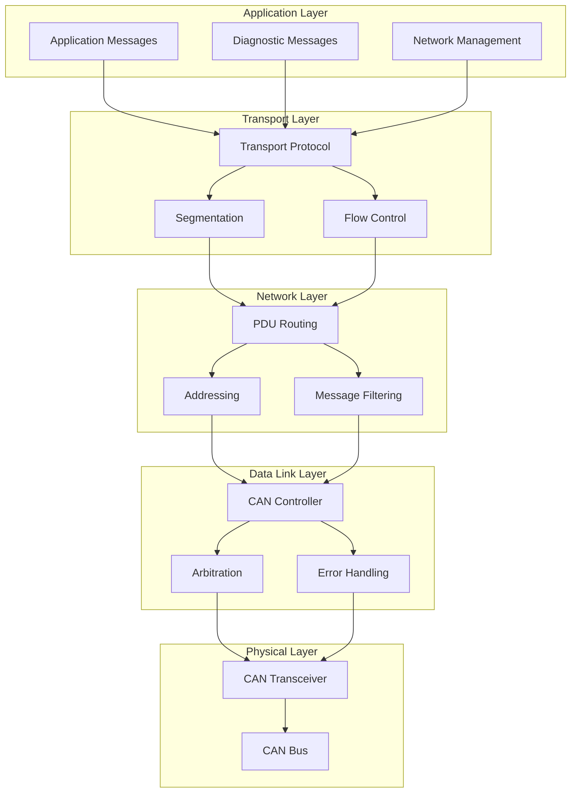

#### 7.1.2 Message Definition
```c
// CAN Message Definitions (Pseudo-code)
typedef struct {
    uint32_t id;
    uint8_t dlc;
    uint8_t data[8];
    uint32_t timestamp;
    bool extended_id;
} CANMessage_t;

// EBS Status Message (ID: 0x100)
typedef struct {
    uint8_t abs_active : 1;
    uint8_t esc_active : 1;
    uint8_t tcs_active : 1;
    uint8_t brake_assist_active : 1;
    uint8_t system_fault : 1;
    uint8_t reserved : 3;
    uint8_t brake_pressure_fl;
    uint8_t brake_pressure_fr;
    uint8_t brake_pressure_rl;
    uint8_t brake_pressure_rr;
    uint16_t vehicle_speed;
    uint8_t checksum;
} EBS_Status_Message_t;

// Engine Torque Request Message (ID: 0x101)
typedef struct {
    uint16_t torque_reduction_percent;
    uint8_t torque_reduction_active : 1;
    uint8_t reserved : 7;
    uint8_t sequence_counter;
    uint32_t reserved_data;
} Engine_Torque_Request_t;

void Send_EBS_Status(void)
{
    EBS_Status_Message_t status_msg;
    CANMessage_t can_msg;
    
    // Populate status message
    status_msg.abs_active = abs_system_active;
    status_msg.esc_active = esc_system_active;
    status_msg.tcs_active = tcs_system_active;
    status_msg.brake_assist_active = brake_assist_active;
    status_msg.system_fault = system_fault_present;
    
    status_msg.brake_pressure_fl = (uint8_t)(brake_pressure[FL] / 2.0); // Scale to 0-255
    status_msg.brake_pressure_fr = (uint8_t)(brake_pressure[FR] / 2.0);
    status_msg.brake_pressure_rl = (uint8_t)(brake_pressure[RL] / 2.0);
    status_msg.brake_pressure_rr = (uint8_t)(brake_pressure[RR] / 2.0);
    
    status_msg.vehicle_speed = (uint16_t)(vehicle_speed * 100); // Scale to 0.01 km/h resolution
    
    // Calculate checksum
    status_msg.checksum = Calculate_Checksum((uint8_t*)&status_msg, sizeof(status_msg) - 1);
    
    // Prepare CAN message
    can_msg.id = 0x100;
    can_msg.dlc = sizeof(EBS_Status_Message_t);
    can_msg.extended_id = false;
    memcpy(can_msg.data, &status_msg, sizeof(status_msg));
    
    // Send message
    CAN_Transmit(&can_msg);
}
```

### 7.2 Diagnostic Communication

#### 7.2.1 UDS (Unified Diagnostic Services) Implementation
```c
// UDS Service Implementation (Pseudo-code)
typedef enum {
    UDS_DIAGNOSTIC_SESSION_CONTROL = 0x10,
    UDS_ECU_RESET = 0x11,
    UDS_READ_DATA_BY_IDENTIFIER = 0x22,
    UDS_READ_DTC_INFORMATION = 0x19,
    UDS_CLEAR_DTC_INFORMATION = 0x14,
    UDS_ROUTINE_CONTROL = 0x31
} UDS_Service_t;

typedef enum {
    UDS_POSITIVE_RESPONSE = 0x00,
    UDS_GENERAL_REJECT = 0x10,
    UDS_SERVICE_NOT_SUPPORTED = 0x11,
    UDS_REQUEST_OUT_OF_RANGE = 0x31,
    UDS_CONDITIONS_NOT_CORRECT = 0x22
} UDS_Response_Code_t;

void Process_UDS_Request(uint8_t* request, uint8_t length, uint8_t* response, uint8_t* response_length)
{
    UDS_Service_t service = (UDS_Service_t)request[0];
    
    switch (service)
    {
        case UDS_READ_DATA_BY_IDENTIFIER:
            Handle_Read_Data_By_Identifier(request, length, response, response_length);
            break;
            
        case UDS_READ_DTC_INFORMATION:
            Handle_Read_DTC_Information(request, length, response, response_length);
            break;
            
        case UDS_CLEAR_DTC_INFORMATION:
            Handle_Clear_DTC_Information(request, length, response, response_length);
            break;
            
        default:
            // Service not supported
            response[0] = 0x7F; // Negative response
            response[1] = service;
            response[2] = UDS_SERVICE_NOT_SUPPORTED;
            *response_length = 3;
            break;
    }
}

void Handle_Read_Data_By_Identifier(uint8_t* request, uint8_t length, uint8_t* response, uint8_t* response_length)
{
    if (length < 3)
    {
        // Invalid request length
        response[0] = 0x7F;
        response[1] = UDS_READ_DATA_BY_IDENTIFIER;
        response[2] = UDS_REQUEST_OUT_OF_RANGE;
        *response_length = 3;
        return;
    }
    
    uint16_t data_identifier = (request[1] << 8) | request[2];
    
    switch (data_identifier)
    {
        case 0xF190: // VIN (Vehicle Identification Number)
            response[0] = UDS_READ_DATA_BY_IDENTIFIER + 0x40; // Positive response
            response[1] = request[1];
            response[2] = request[2];
            memcpy(&response[3], vehicle_vin, 17);
            *response_length = 20;
            break;
            
        case 0xF1A0: // Software Version
            response[0] = UDS_READ_DATA_BY_IDENTIFIER + 0x40;
            response[1] = request[1];
            response[2] = request[2];
            memcpy(&response[3], software_version, 4);
            *response_length = 7;
            break;
            
        default:
            // Data identifier not supported
            response[0] = 0x7F;
            response[1] = UDS_READ_DATA_BY_IDENTIFIER;
            response[2] = UDS_REQUEST_OUT_OF_RANGE;
            *response_length = 3;
            break;
    }
}
```

---

## 8. Diagnostic and Monitoring Software

### 8.1 Fault Detection and Diagnosis

#### 8.1.1 Diagnostic Trouble Code (DTC) Management
```c
// DTC Management System (Pseudo-code)
typedef struct {
    uint32_t dtc_code;
    uint8_t status;
    uint32_t occurrence_count;
    uint32_t first_occurrence_time;
    uint32_t last_occurrence_time;
    uint8_t freeze_frame_data[32];
} DTC_Entry_t;

typedef enum {
    DTC_STATUS_INACTIVE = 0x00,
    DTC_STATUS_ACTIVE = 0x01,
    DTC_STATUS_PENDING = 0x02,
    DTC_STATUS_CONFIRMED = 0x04,
    DTC_STATUS_TEST_FAILED = 0x08,
    DTC_STATUS_TEST_NOT_COMPLETED = 0x10
} DTC_Status_t;

#define MAX_DTC_ENTRIES 50
static DTC_Entry_t dtc_table[MAX_DTC_ENTRIES];
static uint8_t dtc_count = 0;

void DTC_Set(uint32_t dtc_code, uint8_t* freeze_frame)
{
    // Find existing DTC entry
    for (int i = 0; i < dtc_count; i++)
    {
        if (dtc_table[i].dtc_code == dtc_code)
        {
            // Update existing entry
            dtc_table[i].status |= DTC_STATUS_ACTIVE;
            dtc_table[i].occurrence_count++;
            dtc_table[i].last_occurrence_time = Get_System_Time();
            
            if (freeze_frame != NULL)
            {
                memcpy(dtc_table[i].freeze_frame_data, freeze_frame, 32);
            }
            
            return;
        }
    }
    
    // Create new DTC entry
    if (dtc_count < MAX_DTC_ENTRIES)
    {
        dtc_table[dtc_count].dtc_code = dtc_code;
        dtc_table[dtc_count].status = DTC_STATUS_ACTIVE;
        dtc_table[dtc_count].occurrence_count = 1;
        dtc_table[dtc_count].first_occurrence_time = Get_System_Time();
        dtc_table[dtc_count].last_occurrence_time = Get_System_Time();
        
        if (freeze_frame != NULL)
        {
            memcpy(dtc_table[dtc_count].freeze_frame_data, freeze_frame, 32);
        }
        
        dtc_count++;
    }
}

void DTC_Clear(uint32_t dtc_code)
{
    for (int i = 0; i < dtc_count; i++)
    {
        if (dtc_table[i].dtc_code == dtc_code)
        {
            dtc_table[i].status = DTC_STATUS_INACTIVE;
            break;
        }
    }
}

void DTC_Clear_All(void)
{
    for (int i = 0; i < dtc_count; i++)
    {
        dtc_table[i].status = DTC_STATUS_INACTIVE;
    }
}
```

#### 8.1.2 System Health Monitoring
```c
// System Health Monitoring (Pseudo-code)
typedef struct {
    float cpu_utilization;
    float memory_utilization;
    float temperature;
    uint32_t can_error_count;
    uint32_t sensor_fault_count;
    uint32_t actuator_fault_count;
} SystemHealth_t;

static SystemHealth_t system_health;

void Monitor_System_Health(void)
{
    // Monitor CPU utilization
    system_health.cpu_utilization = Calculate_CPU_Utilization();
    
    // Monitor memory utilization
    system_health.memory_utilization = Calculate_Memory_Utilization();
    
    // Monitor temperature
    system_health.temperature = Read_Temperature_Sensor();
    
    // Monitor CAN bus health
    system_health.can_error_count = Get_CAN_Error_Count();
    
    // Monitor sensor health
    system_health.sensor_fault_count = Get_Sensor_Fault_Count();
    
    // Monitor actuator health
    system_health.actuator_fault_count = Get_Actuator_Fault_Count();
    
    // Check for critical conditions
    if (system_health.cpu_utilization > 90.0)
    {
        DTC_Set(0xC00001, NULL); // CPU overload
    }
    
    if (system_health.temperature > 85.0)
    {
        DTC_Set(0xC00002, NULL); // Overtemperature
    }
    
    if (system_health.can_error_count > 1000)
    {
        DTC_Set(0xC00003, NULL); // CAN bus fault
    }
}

float Calculate_CPU_Utilization(void)
{
    static uint32_t last_idle_time = 0;
    static uint32_t last_total_time = 0;
    
    uint32_t current_idle_time = Get_Idle_Task_Runtime();
    uint32_t current_total_time = Get_System_Runtime();
    
    uint32_t idle_delta = current_idle_time - last_idle_time;
    uint32_t total_delta = current_total_time - last_total_time;
    
    last_idle_time = current_idle_time;
    last_total_time = current_total_time;
    
    if (total_delta > 0)
    {
        return (100.0 * (total_delta - idle_delta)) / total_delta;
    }
    
    return 0.0;
}
```

---

## 9. Software Development Standards

### 9.1 Coding Standards

#### 9.1.1 MISRA C Compliance
- **Standard**: MISRA C:2012 (Amendment 1)
- **Compliance Level**: Mandatory rules must be followed
- **Required Rules**: Should be followed unless justified
- **Advisory Rules**: Recommended to follow
- **Deviations**: Must be documented and justified

#### 9.1.2 Code Structure Guidelines
```c
// File Header Template
/*******************************************************************************
 * File Name: ebs_abs_controller.c
 * Description: ABS control algorithm implementation
 * Author: [Author Name]
 * Date: [Creation Date]
 * Version: [Version Number]
 * ASIL Level: D
 * 
 * Copyright (c) 2025 [Company Name]. All rights reserved.
 ******************************************************************************/

// Include guards for header files
#ifndef EBS_ABS_CONTROLLER_H
#define EBS_ABS_CONTROLLER_H

// Standard includes
#include <stdint.h>
#include <stdbool.h>
#include <string.h>

// Project includes
#include "ebs_types.h"
#include "ebs_config.h"

// Constants and macros
#define ABS_MAX_WHEELS          (4U)
#define ABS_SLIP_THRESHOLD      (0.15F)
#define ABS_CYCLE_TIME_MS       (1U)

// Type definitions
typedef enum {
    ABS_STATE_INACTIVE = 0U,
    ABS_STATE_ACTIVE = 1U,
    ABS_STATE_FAULT = 2U
} ABS_State_t;

// Function prototypes
void ABS_Init(void);
void ABS_Main(void);
ABS_State_t ABS_GetState(uint8_t wheel);

#endif /* EBS_ABS_CONTROLLER_H */
```

### 9.2 Software Quality Metrics

#### 9.2.1 Code Quality Metrics
| Metric | Target Value | Measurement Method |
|--------|--------------|-------------------|
| **Cyclomatic Complexity** | ≤ 10 per function | Static analysis |
| **Function Length** | ≤ 50 lines | Static analysis |
| **File Length** | ≤ 1000 lines | Static analysis |
| **Comment Ratio** | ≥ 20% | Static analysis |
| **Code Coverage** | ≥ 95% (MC/DC) | Dynamic testing |
| **MISRA Compliance** | 100% mandatory rules | Static analysis |

#### 9.2.2 Software Testing Requirements
- **Unit Testing**: 100% function coverage
- **Integration Testing**: Interface and interaction testing
- **System Testing**: End-to-end functionality testing
- **Safety Testing**: Fault injection and failure mode testing
- **Performance Testing**: Timing and resource utilization testing

### 9.3 Configuration Management

#### 9.3.1 Version Control
- **System**: Git with branching strategy
- **Branching Model**: GitFlow with feature branches
- **Commit Standards**: Conventional commit messages
- **Code Reviews**: Mandatory peer review before merge
- **Release Tagging**: Semantic versioning (MAJOR.MINOR.PATCH)

#### 9.3.2 Build and Release Process
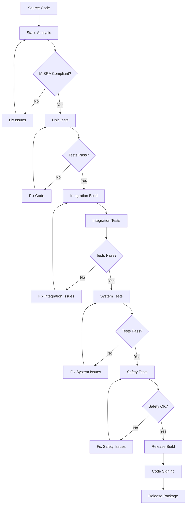

---

## Document Control

### Revision History
| Version | Date | Author | Changes |
|---------|------|--------|---------|
| 1.0 | 2025-07-29 | Software Architect | Initial software architecture and algorithm specifications |

### Approval
- **Software Architect**: [Signature Required]
- **Safety Engineer**: [Signature Required]
- **Technical Lead**: [Signature Required]
- **Date**: [Approval Date]

---

*This document contains proprietary and confidential information. Distribution is restricted to authorized personnel only.*