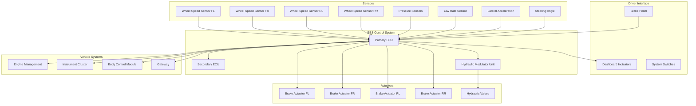
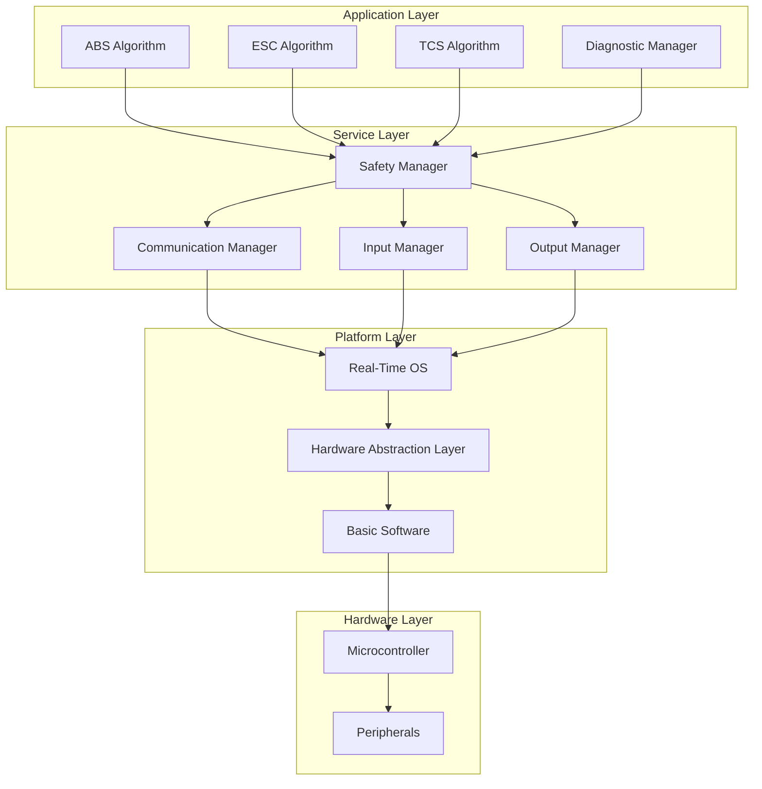
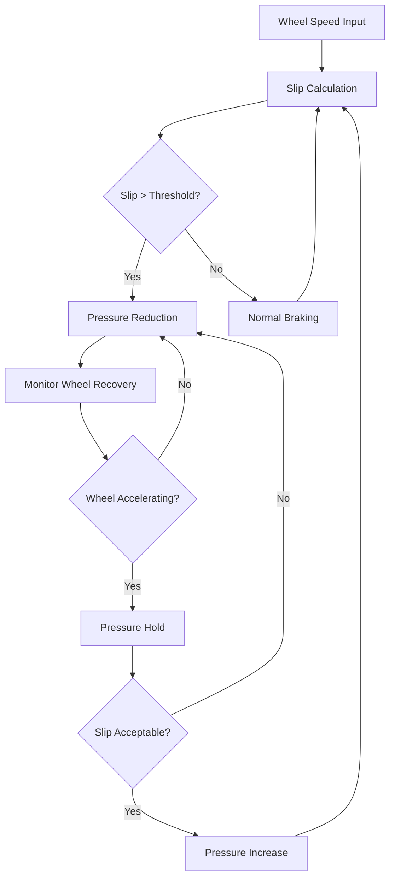
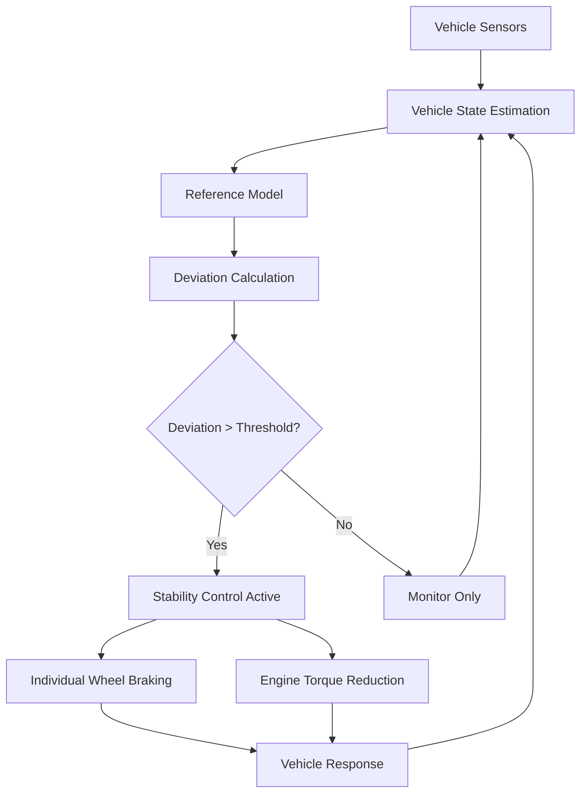
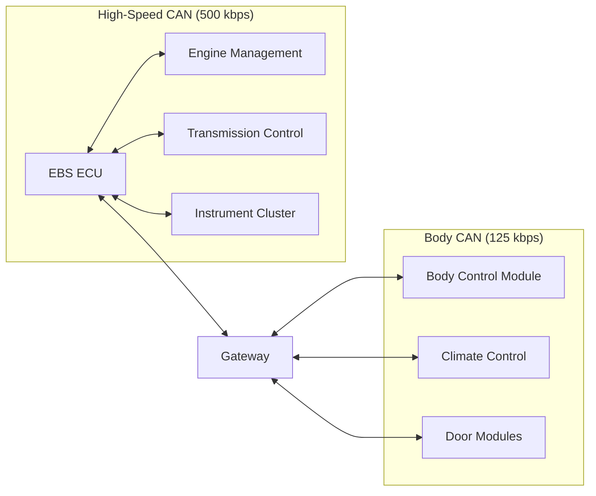
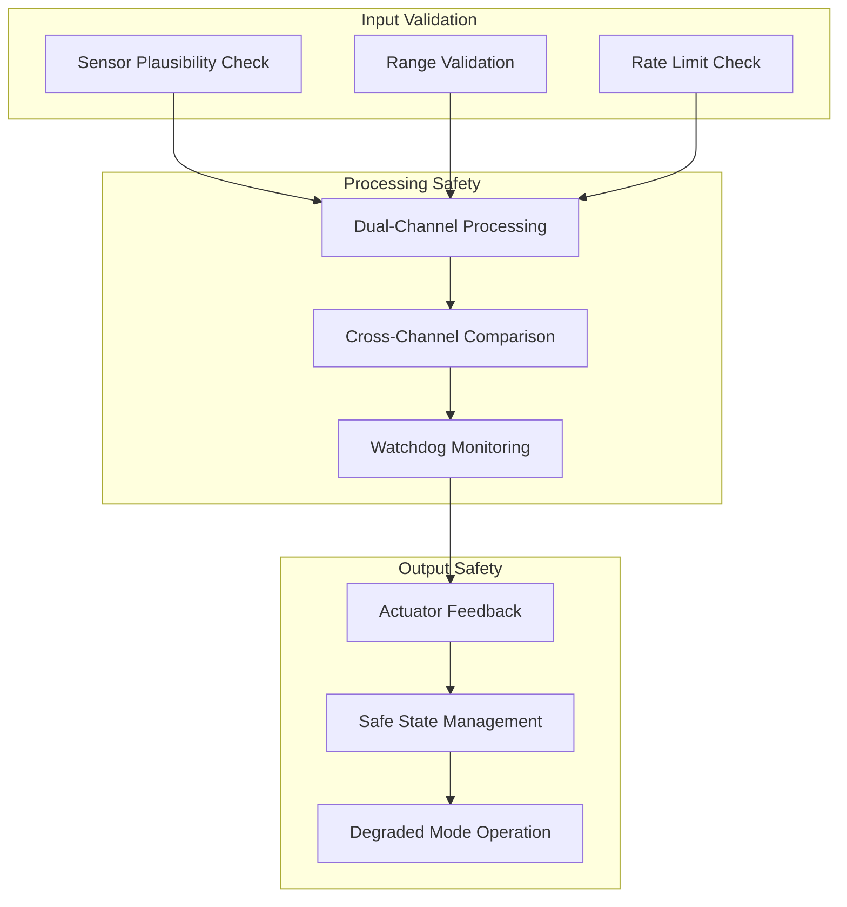
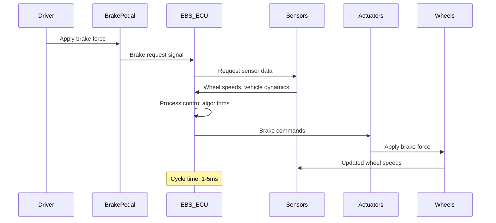
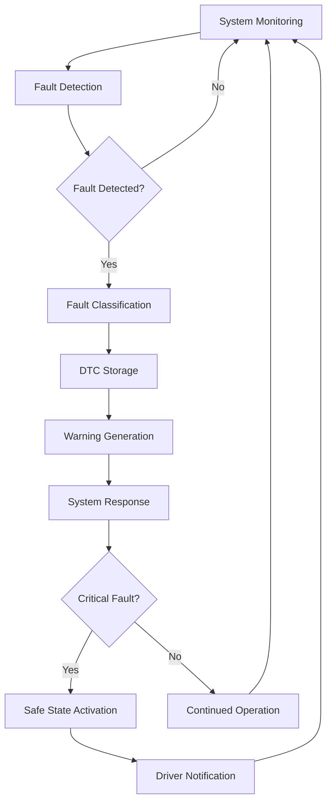
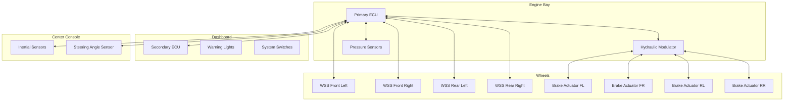

# Electronic Braking System (EBS) - System Architecture Specification

## Document Information
- **Document Title**: EBS System Architecture Specification
- **Version**: 1.0
- **Date**: 2025-07-29
- **Classification**: Technical Design Document
- **Related Documents**: EBS_Requirements_Specification.md

## Table of Contents
1. [Introduction](#introduction)
2. [System Architecture Overview](#system-architecture-overview)
3. [Hardware Architecture](#hardware-architecture)
4. [Software Architecture](#software-architecture)
5. [Network Architecture](#network-architecture)
6. [Safety Architecture](#safety-architecture)
7. [Data Flow Architecture](#data-flow-architecture)
8. [Deployment Architecture](#deployment-architecture)

---

## 1. Introduction

### 1.1 Purpose
This document defines the system architecture for the Electronic Braking System (EBS), providing detailed technical specifications for hardware, software, network, and safety architectures.

### 1.2 Scope
The architecture covers:
- System-level design and component interactions
- Hardware and software architecture patterns
- Communication protocols and data flows
- Safety mechanisms and redundancy strategies
- Deployment and integration considerations

### 1.3 Architecture Principles
- **Safety First**: All architectural decisions prioritize functional safety
- **Redundancy**: Critical functions have backup mechanisms
- **Modularity**: Components are designed for maintainability and testability
- **Scalability**: Architecture supports future enhancements
- **Real-time Performance**: Deterministic response times for safety-critical functions

---

## 2. System Architecture Overview

### 2.1 High-Level Architecture

### 2.2 System Layers

| Layer | Components | Responsibility |
|-------|------------|----------------|
| **Application Layer** | ABS, ESC, TCS Algorithms | Safety functions and control logic |
| **Control Layer** | ECU Software, Real-time OS | System coordination and resource management |
| **Communication Layer** | CAN, SPI, PWM Interfaces | Inter-component communication |
| **Hardware Layer** | ECUs, Sensors, Actuators | Physical system components |

---

## 3. Hardware Architecture

### 3.1 ECU Architecture

#### 3.1.1 Primary ECU Specifications
- **Processor**: Dual-core ARM Cortex-R5F @ 300MHz
- **Memory**: 2MB Flash, 512KB RAM, 64KB EEPROM
- **Safety**: ASIL-D certified microcontroller
- **Interfaces**: 2x CAN, 4x SPI, 8x PWM, 16x ADC, 32x GPIO
- **Power**: 12V automotive supply with voltage regulation
- **Temperature Range**: -40°C to +125°C

#### 3.1.2 Secondary ECU (Backup)
- **Processor**: Single-core ARM Cortex-R4F @ 200MHz
- **Memory**: 1MB Flash, 256KB RAM, 32KB EEPROM
- **Safety**: ASIL-D certified microcontroller
- **Interfaces**: 1x CAN, 2x SPI, 4x PWM, 8x ADC, 16x GPIO
- **Function**: Monitors primary ECU and provides backup control

### 3.2 Sensor Architecture

#### 3.2.1 Wheel Speed Sensors
- **Type**: Hall Effect with magnetic encoder ring
- **Resolution**: 48 pulses per revolution
- **Frequency Range**: 0-10 kHz
- **Supply Voltage**: 5V ±5%
- **Output**: Digital square wave
- **Cable**: Twisted pair with shield

#### 3.2.2 Inertial Measurement Unit (IMU)
- **Components**: 3-axis gyroscope, 3-axis accelerometer
- **Range**: ±300°/s (yaw), ±16g (acceleration)
- **Resolution**: 16-bit ADC
- **Sample Rate**: 1000 Hz
- **Interface**: SPI
- **Calibration**: Factory calibrated with runtime compensation

#### 3.2.3 Pressure Sensors
- **Type**: Piezoresistive silicon sensor
- **Range**: 0-250 bar
- **Accuracy**: ±1% full scale
- **Response Time**: <1ms
- **Output**: 0.5-4.5V analog
- **Temperature Compensation**: Integrated

### 3.3 Actuator Architecture

#### 3.3.1 Hydraulic Modulator Unit
- **Valves**: 8x solenoid valves (inlet/outlet per wheel)
- **Pump**: Electric motor driven piston pump
- **Accumulator**: High-pressure brake fluid storage
- **Control**: PWM valve control (1-5 kHz)
- **Pressure Rating**: 300 bar maximum
- **Response Time**: <10ms valve switching

#### 3.3.2 Electric Brake Actuators (Future Enhancement)
- **Type**: Electromechanical brake calipers
- **Force**: 0-50 kN clamping force
- **Control**: CAN-based position/force control
- **Feedback**: Integrated position and force sensors
- **Redundancy**: Dual motor configuration

---

## 4. Software Architecture

### 4.1 Software Stack

### 4.2 Real-Time Operating System
- **RTOS**: AUTOSAR Classic Platform
- **Scheduling**: Priority-based preemptive scheduling
- **Tasks**: 
  - Safety Task (1ms cycle, highest priority)
  - Control Task (5ms cycle, high priority)
  - Communication Task (10ms cycle, medium priority)
  - Diagnostic Task (100ms cycle, low priority)

### 4.3 Safety Architecture
- **Safety Concept**: Freedom from Interference (FFI)
- **Memory Protection**: MPU-based memory partitioning
- **Time Protection**: Watchdog timers and execution time monitoring
- **Communication Protection**: CRC and sequence number checking
- **Redundancy**: Dual-channel architecture with cross-checking

### 4.4 Algorithm Architecture

#### 4.4.1 ABS Algorithm

#### 4.4.2 ESC Algorithm

---

## 5. Network Architecture

### 5.1 CAN Network Topology

### 5.2 Message Architecture

#### 5.2.1 Critical Messages (High Priority)
| Message ID | Source | Destination | Cycle Time | Data Length |
|------------|--------|-------------|------------|-------------|
| 0x100 | EBS | Engine | 10ms | 8 bytes |
| 0x101 | EBS | Instrument | 20ms | 8 bytes |
| 0x102 | Engine | EBS | 10ms | 8 bytes |
| 0x103 | Steering | EBS | 20ms | 8 bytes |

#### 5.2.2 Diagnostic Messages (Low Priority)
| Message ID | Source | Destination | Cycle Time | Data Length |
|------------|--------|-------------|------------|-------------|
| 0x7E0 | Tester | EBS | On-demand | 8 bytes |
| 0x7E8 | EBS | Tester | Response | 8 bytes |

---

## 6. Safety Architecture

### 6.1 Safety Concept

#### 6.1.1 Hazard Analysis Results
| Hazard | ASIL | Safety Goal | Safety Mechanism |
|--------|------|-------------|------------------|
| Unintended braking | D | Prevent false activation | Dual-channel validation |
| Loss of braking | D | Maintain stopping capability | Fallback to manual braking |
| Delayed braking | D | Ensure timely response | Watchdog monitoring |
| Asymmetric braking | C | Prevent vehicle instability | Cross-axle monitoring |

#### 6.1.2 Safety Mechanisms

### 6.2 Fault Tolerance Architecture

#### 6.2.1 Redundancy Levels
- **Level 1**: Sensor redundancy (multiple sensors for critical measurements)
- **Level 2**: Processing redundancy (dual ECU architecture)
- **Level 3**: Actuator redundancy (hydraulic backup for electric actuators)
- **Level 4**: System redundancy (manual brake backup)

#### 6.2.2 Degraded Operation Modes
1. **Normal Mode**: All systems operational
2. **Reduced Mode**: Non-critical functions disabled
3. **Limp Mode**: Basic braking only
4. **Safe Mode**: Manual braking fallback

---

## 7. Data Flow Architecture

### 7.1 Real-Time Data Flow

### 7.2 Diagnostic Data Flow

---

## 8. Deployment Architecture

### 8.1 Physical Deployment

### 8.2 Installation Requirements

#### 8.2.1 ECU Mounting
- **Location**: Engine bay, protected from water and heat
- **Mounting**: Vibration-isolated bracket
- **Orientation**: Connector facing downward
- **Access**: Service access for diagnostics
- **Cooling**: Natural convection cooling

#### 8.2.2 Sensor Installation
- **Wheel Speed Sensors**: Integrated with wheel bearings
- **IMU**: Vehicle center of gravity location
- **Pressure Sensors**: Brake line integration points
- **Steering Sensor**: Steering column integration

#### 8.2.3 Wiring Harness
- **Protection**: Automotive-grade wire protection
- **Routing**: Away from heat sources and moving parts
- **Connectors**: Sealed automotive connectors
- **Shielding**: Twisted pair with shield for critical signals

---

## Document Control

### Revision History
| Version | Date | Author | Changes |
|---------|------|--------|---------|
| 1.0 | 2025-07-29 | System Architect | Initial architecture specification |

### Approval
- **Chief Architect**: [Signature Required]
- **Safety Engineer**: [Signature Required]
- **Technical Lead**: [Signature Required]
- **Date**: [Approval Date]

---

*This document contains proprietary and confidential information. Distribution is restricted to authorized personnel only.*