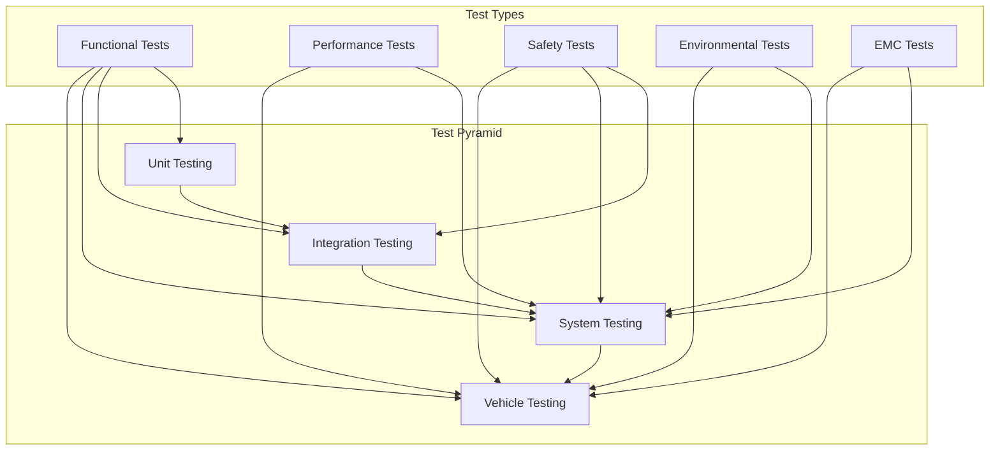
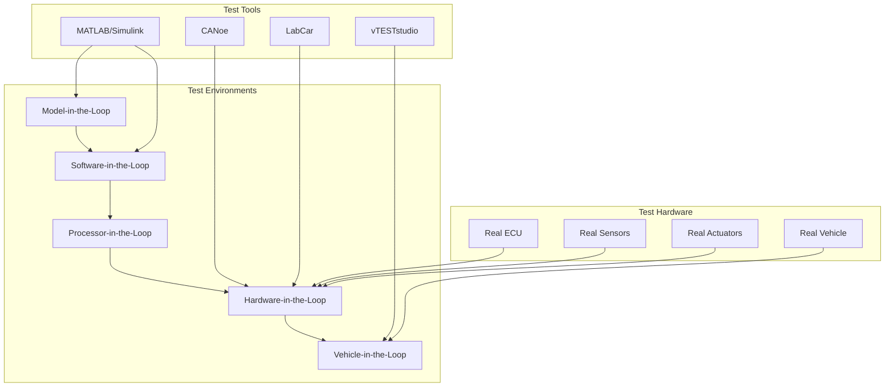
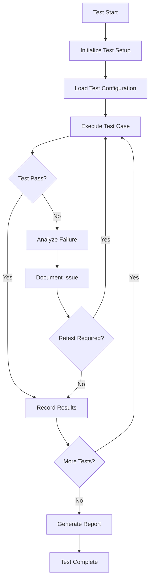

# Electronic Braking System (EBS) - Test Specification

## Document Information
- **Document Title**: EBS Test Specification
- **Version**: 1.0
- **Date**: 2025-07-29
- **Classification**: Technical Test Document
- **Related Documents**: EBS_Requirements_Specification.md, EBS_System_Architecture_Specification.md

## Table of Contents
1. [Introduction](#introduction)
2. [Test Strategy and Approach](#test-strategy-and-approach)
3. [Unit Testing Specifications](#unit-testing-specifications)
4. [Integration Testing Specifications](#integration-testing-specifications)
5. [System Testing Specifications](#system-testing-specifications)
6. [Safety Testing Specifications](#safety-testing-specifications)
7. [Performance Testing Specifications](#performance-testing-specifications)
8. [Environmental Testing Specifications](#environmental-testing-specifications)
9. [EMC Testing Specifications](#emc-testing-specifications)
10. [Vehicle Testing Specifications](#vehicle-testing-specifications)
11. [Test Equipment and Tools](#test-equipment-and-tools)
12. [Test Execution and Reporting](#test-execution-and-reporting)

---

## 1. Introduction

### 1.1 Purpose
This document defines comprehensive testing specifications for the Electronic Braking System (EBS), covering all levels of testing from unit tests to complete vehicle validation.

### 1.2 Scope
The test specifications cover:
- Unit testing of individual software modules
- Integration testing of hardware and software components
- System-level functional testing
- Safety and fault injection testing
- Performance and timing validation
- Environmental and durability testing
- Electromagnetic compatibility testing
- Complete vehicle integration testing

### 1.3 Test Objectives
- **Functional Verification**: Verify all functional requirements are met
- **Safety Validation**: Ensure all safety requirements are satisfied
- **Performance Validation**: Confirm performance specifications are achieved
- **Reliability Testing**: Validate system reliability and durability
- **Compliance Testing**: Verify regulatory and standard compliance

### 1.4 Test Standards and References
- **ISO 26262**: Functional Safety for Road Vehicles
- **ISO 16750**: Environmental Conditions and Testing for Automotive Equipment
- **ISO 11452**: Road Vehicles - Component Test Methods for Electrical Disturbances
- **CISPR 25**: Vehicles, Boats and Internal Combustion Engines - Radio Disturbance Characteristics
- **UN-ECE R13-H**: Brake System Regulations

---

## 2. Test Strategy and Approach

### 2.1 Test Levels



### 2.2 Test Approach by ASIL Level

| ASIL Level | Test Coverage | Test Methods | Verification |
|------------|---------------|--------------|--------------|
| **ASIL-D** | 100% MC/DC | Formal methods, fault injection | Independent verification |
| **ASIL-C** | 100% Modified Condition/Decision | Structural testing | Independent verification |
| **ASIL-B** | 100% Decision Coverage | Functional testing | Review-based verification |
| **ASIL-A** | 100% Statement Coverage | Functional testing | Review-based verification |
| **QM** | Function Coverage | Black-box testing | Internal verification |

### 2.3 Test Environment Architecture



---

## 3. Unit Testing Specifications

### 3.1 Software Unit Testing

#### 3.1.1 Test Coverage Requirements
- **Statement Coverage**: 100% for all ASIL levels
- **Branch Coverage**: 100% for ASIL-B and above
- **MC/DC Coverage**: 100% for ASIL-C and above
- **Function Coverage**: 100% for all functions
- **Call Coverage**: 100% for all function calls

#### 3.1.2 ABS Algorithm Unit Tests

**Test Case: ABS_UT_001 - Slip Calculation**
```c
// Test Case Implementation
void Test_ABS_Slip_Calculation(void)
{
    // Test Setup
    float vehicle_speed = 50.0; // km/h
    float wheel_speed = 40.0;   // km/h
    float expected_slip = 0.2;  // 20% slip
    
    // Execute Function
    float actual_slip = Calculate_Wheel_Slip(vehicle_speed, wheel_speed);
    
    // Verify Result
    ASSERT_FLOAT_EQUAL(expected_slip, actual_slip, 0.001);
}
```

**Test Case: ABS_UT_002 - Threshold Detection**
```c
void Test_ABS_Threshold_Detection(void)
{
    // Test Setup
    float wheel_slip = 0.16; // Above threshold (0.15)
    bool expected_active = true;
    
    // Execute Function
    bool actual_active = ABS_Check_Activation_Threshold(wheel_slip);
    
    // Verify Result
    ASSERT_TRUE(actual_active);
}
```

**Test Case: ABS_UT_003 - Pressure Modulation**
```c
void Test_ABS_Pressure_Modulation(void)
{
    // Test Setup
    float current_pressure = 100.0; // bar
    ABS_Phase_t phase = PRESSURE_REDUCTION;
    float expected_pressure = 80.0; // 20% reduction
    
    // Execute Function
    float actual_pressure = ABS_Calculate_Pressure_Command(current_pressure, phase);
    
    // Verify Result
    ASSERT_FLOAT_EQUAL(expected_pressure, actual_pressure, 0.1);
}
```

#### 3.1.3 ESC Algorithm Unit Tests

**Test Case: ESC_UT_001 - Reference Yaw Rate Calculation**
```c
void Test_ESC_Reference_Yaw_Rate(void)
{
    // Test Setup
    float vehicle_speed = 60.0; // km/h
    float steering_angle = 10.0; // degrees
    float wheelbase = 2.7; // meters
    float understeer_gradient = 0.002;
    
    // Execute Function
    float actual_yaw_rate = ESC_Calculate_Reference_Yaw_Rate(
        vehicle_speed, steering_angle, wheelbase, understeer_gradient);
    
    // Verify Result (expected calculation)
    float expected_yaw_rate = 3.45; // deg/s (calculated)
    ASSERT_FLOAT_EQUAL(expected_yaw_rate, actual_yaw_rate, 0.1);
}
```

#### 3.1.4 Safety Function Unit Tests

**Test Case: SAFETY_UT_001 - Range Validation**
```c
void Test_Safety_Range_Validation(void)
{
    // Test Setup - Valid Range
    SensorData_t sensor_data = {
        .value = 50.0,
        .min_value = 0.0,
        .max_value = 100.0
    };
    
    // Execute Function
    bool result = Range_Check(&sensor_data);
    
    // Verify Result
    ASSERT_TRUE(result);
    
    // Test Setup - Invalid Range
    sensor_data.value = 150.0; // Out of range
    
    // Execute Function
    result = Range_Check(&sensor_data);
    
    // Verify Result
    ASSERT_FALSE(result);
}
```

### 3.2 Unit Test Execution Framework

#### 3.2.1 Test Framework Configuration
- **Framework**: Unity Test Framework
- **Mock Framework**: CMock for dependency mocking
- **Coverage Tool**: gcov/lcov for coverage analysis
- **Build System**: CMake with CTest integration
- **Continuous Integration**: Jenkins with automated test execution

#### 3.2.2 Test Data Management
- **Test Vectors**: Stored in CSV files for data-driven testing
- **Expected Results**: Pre-calculated reference values
- **Boundary Values**: Systematic boundary value testing
- **Error Conditions**: Comprehensive error condition testing

---

## 4. Integration Testing Specifications

### 4.1 Hardware-Software Integration Testing

#### 4.1.1 Sensor Integration Tests

**Test Case: INT_001 - Wheel Speed Sensor Integration**
- **Objective**: Verify wheel speed sensor data acquisition and processing
- **Setup**: Real wheel speed sensors connected to ECU
- **Stimulus**: Simulated wheel rotation at various speeds
- **Expected Result**: Accurate speed measurement within ±2% tolerance
- **Pass Criteria**: All four sensors provide consistent readings

**Test Case: INT_002 - Pressure Sensor Integration**
- **Objective**: Verify brake pressure sensor integration
- **Setup**: Pressure sensors in hydraulic test bench
- **Stimulus**: Applied pressure from 0 to 250 bar
- **Expected Result**: Linear response within ±0.25% accuracy
- **Pass Criteria**: All pressure sensors meet accuracy requirements

#### 4.1.2 Actuator Integration Tests

**Test Case: INT_003 - Hydraulic Valve Control**
- **Objective**: Verify solenoid valve control and response
- **Setup**: Hydraulic modulator unit with pressure measurement
- **Stimulus**: PWM commands from 0% to 100% duty cycle
- **Expected Result**: Proportional pressure response
- **Pass Criteria**: Valve response time <10ms, pressure accuracy ±5%

**Test Case: INT_004 - Pump Motor Control**
- **Objective**: Verify brake pump motor control
- **Setup**: Pump motor with flow and pressure measurement
- **Stimulus**: Motor speed commands from 0 to maximum RPM
- **Expected Result**: Proportional flow rate response
- **Pass Criteria**: Flow rate within ±10% of commanded value

### 4.2 Software Integration Testing

#### 4.2.1 Inter-Module Communication Tests

**Test Case: INT_005 - Task Communication**
- **Objective**: Verify communication between RTOS tasks
- **Setup**: Complete software stack on target hardware
- **Stimulus**: Message passing between safety and control tasks
- **Expected Result**: Messages delivered within timing constraints
- **Pass Criteria**: 100% message delivery, <1ms latency

#### 4.2.2 CAN Communication Tests

**Test Case: INT_006 - CAN Message Transmission**
- **Objective**: Verify CAN message transmission and reception
- **Setup**: EBS ECU connected to CAN network simulator
- **Stimulus**: Various CAN message scenarios
- **Expected Result**: Correct message format and timing
- **Pass Criteria**: All messages conform to specification

---

## 5. System Testing Specifications

### 5.1 Functional System Tests

#### 5.1.1 ABS System Tests

**Test Case: SYS_001 - ABS Activation Test**
- **Objective**: Verify ABS activation under wheel lock conditions
- **Test Setup**: HIL system with vehicle dynamics model
- **Test Procedure**:
  1. Initialize system in normal braking mode
  2. Apply brake input causing wheel lock
  3. Verify ABS activation within 50ms
  4. Verify pressure modulation begins
  5. Verify wheel speed recovery
- **Expected Results**:
  - ABS activates when slip exceeds 15%
  - Pressure modulation frequency 4-20 Hz
  - Wheel speed recovers to <10% slip
- **Pass Criteria**: All wheels maintain optimal slip ratio

**Test Case: SYS_002 - ABS Performance Test**
- **Objective**: Verify ABS braking performance on various surfaces
- **Test Setup**: Vehicle dynamics simulation with different friction coefficients
- **Test Surfaces**: Dry asphalt (μ=0.9), Wet asphalt (μ=0.7), Ice (μ=0.1)
- **Expected Results**:
  - Stopping distance within specification limits
  - Vehicle stability maintained
  - Steering control preserved
- **Pass Criteria**: Performance meets UN-ECE R13-H requirements

#### 5.1.2 ESC System Tests

**Test Case: SYS_003 - ESC Oversteer Correction**
- **Objective**: Verify ESC response to oversteer conditions
- **Test Setup**: Vehicle dynamics model with oversteer scenario
- **Test Procedure**:
  1. Simulate high-speed cornering maneuver
  2. Induce oversteer condition (yaw rate error >5°/s)
  3. Verify ESC activation and brake intervention
  4. Verify vehicle stability restoration
- **Expected Results**:
  - ESC activates within 100ms of detection
  - Outside front wheel braking applied
  - Yaw rate error reduced to <2°/s
- **Pass Criteria**: Vehicle returns to stable trajectory

**Test Case: SYS_004 - ESC Understeer Correction**
- **Objective**: Verify ESC response to understeer conditions
- **Test Setup**: Vehicle dynamics model with understeer scenario
- **Test Procedure**:
  1. Simulate cornering with excessive speed
  2. Induce understeer condition
  3. Verify ESC activation and brake intervention
  4. Verify vehicle path correction
- **Expected Results**:
  - Inside rear wheel braking applied
  - Engine torque reduction requested
  - Vehicle follows intended path
- **Pass Criteria**: Understeer condition corrected within 500ms

#### 5.1.3 TCS System Tests

**Test Case: SYS_005 - TCS Wheel Spin Control**
- **Objective**: Verify TCS response to wheel spin during acceleration
- **Test Setup**: Vehicle dynamics model with low friction surface
- **Test Procedure**:
  1. Simulate acceleration on slippery surface
  2. Induce wheel spin condition (slip >10%)
  3. Verify TCS activation
  4. Verify brake and torque intervention
- **Expected Results**:
  - TCS activates when drive wheel slip exceeds 10%
  - Brake force applied to spinning wheel
  - Engine torque reduction requested
  - Wheel slip reduced to target level (5%)
- **Pass Criteria**: Optimal traction maintained during acceleration

### 5.2 System Integration Tests

#### 5.2.1 Multi-System Interaction Tests

**Test Case: SYS_006 - ABS-ESC Interaction**
- **Objective**: Verify proper interaction between ABS and ESC systems
- **Test Setup**: Combined braking and stability scenario
- **Test Procedure**:
  1. Simulate emergency braking in a turn
  2. Verify both ABS and ESC activation
  3. Verify coordinated brake pressure control
  4. Verify vehicle stability and stopping performance
- **Expected Results**:
  - Both systems activate appropriately
  - No interference between systems
  - Optimal braking and stability performance
- **Pass Criteria**: Combined performance exceeds individual system performance

---

## 6. Safety Testing Specifications

### 6.1 Fault Injection Testing

#### 6.1.1 Sensor Fault Injection

**Test Case: SAFETY_001 - Wheel Speed Sensor Fault**
- **Objective**: Verify system response to wheel speed sensor failures
- **Fault Types**:
  - Open circuit (sensor disconnected)
  - Short circuit (sensor shorted to ground/power)
  - Stuck signal (sensor output frozen)
  - Noisy signal (excessive signal noise)
- **Test Procedure**:
  1. Inject fault during normal operation
  2. Verify fault detection within 100ms
  3. Verify appropriate system response
  4. Verify DTC generation and storage
- **Expected Results**:
  - Fault detected and isolated
  - Affected wheel ABS disabled
  - System continues operation with remaining sensors
  - Driver warning activated
- **Pass Criteria**: System maintains safe operation with degraded performance

**Test Case: SAFETY_002 - Pressure Sensor Fault**
- **Objective**: Verify system response to pressure sensor failures
- **Fault Types**: Similar to wheel speed sensor faults
- **Expected Results**:
  - Fault detection within 50ms
  - Backup pressure estimation activated
  - System performance degraded but functional
- **Pass Criteria**: System maintains braking capability

#### 6.1.2 Actuator Fault Injection

**Test Case: SAFETY_003 - Solenoid Valve Fault**
- **Objective**: Verify system response to valve failures
- **Fault Types**:
  - Valve stuck open
  - Valve stuck closed
  - Valve coil open circuit
  - Valve coil short circuit
- **Expected Results**:
  - Fault detection through current monitoring
  - Affected wheel isolated from ABS control
  - Manual braking capability maintained
- **Pass Criteria**: Vehicle can be stopped safely

#### 6.1.3 ECU Fault Injection

**Test Case: SAFETY_004 - Primary ECU Failure**
- **Objective**: Verify secondary ECU takeover capability
- **Fault Types**:
  - Primary ECU power loss
  - Primary ECU software crash
  - Primary ECU communication failure
- **Expected Results**:
  - Secondary ECU detects primary failure within 100ms
  - Secondary ECU assumes control
  - Basic braking functions maintained
- **Pass Criteria**: Seamless transition to backup system

### 6.2 FMEA-Based Testing

#### 6.2.1 Failure Mode Testing Matrix

| Component | Failure Mode | Detection Method | System Response | Test Case |
|-----------|--------------|------------------|-----------------|-----------|
| **Wheel Speed Sensor** | Open Circuit | Signal monitoring | Disable ABS for wheel | SAFETY_001 |
| **Pressure Sensor** | Out of Range | Range checking | Use backup estimation | SAFETY_002 |
| **Solenoid Valve** | Stuck Open | Current monitoring | Isolate wheel | SAFETY_003 |
| **ECU** | Power Loss | Watchdog timeout | Switch to backup | SAFETY_004 |
| **CAN Bus** | Bus Off | CAN controller status | Local operation mode | SAFETY_005 |
| **IMU** | Calibration Error | Plausibility check | Disable ESC | SAFETY_006 |

---

## 7. Performance Testing Specifications

### 7.1 Timing and Response Tests

#### 7.1.1 Real-Time Performance Tests

**Test Case: PERF_001 - System Response Time**
- **Objective**: Verify system response times meet specifications
- **Test Setup**: HIL system with precise timing measurement
- **Measurements**:
  - Brake pedal input to pressure application: <150ms
  - ABS activation time: <50ms
  - ESC activation time: <100ms
  - CAN message transmission time: <10ms
- **Test Method**: Statistical analysis over 1000 test cycles
- **Pass Criteria**: 99.9% of responses within specification limits

**Test Case: PERF_002 - Task Execution Timing**
- **Objective**: Verify RTOS task execution times
- **Test Setup**: Target hardware with execution time profiling
- **Measurements**:
  - Safety task WCET: <200μs
  - ABS task WCET: <300μs
  - ESC task WCET: <800μs
  - Communication task WCET: <400μs
- **Pass Criteria**: All tasks complete within allocated time slots

#### 7.1.2 Throughput and Capacity Tests

**Test Case: PERF_003 - CAN Bus Load Test**
- **Objective**: Verify CAN bus performance under maximum load
- **Test Setup**: CAN network with maximum message traffic
- **Test Conditions**:
  - All nodes transmitting at maximum rate
  - Bus load at 70% capacity
  - Error injection for robustness testing
- **Measurements**:
  - Message transmission success rate
  - Message latency distribution
  - Bus error recovery time
- **Pass Criteria**: >99.9% message delivery success

### 7.2 Braking Performance Tests

#### 7.2.1 Stopping Distance Tests

**Test Case: PERF_004 - Emergency Braking Performance**
- **Objective**: Verify stopping distance performance
- **Test Setup**: Vehicle dynamics simulation
- **Test Conditions**:
  - Initial speed: 100 km/h
  - Surface: Dry asphalt (μ=0.9)
  - Maximum brake force application
- **Expected Results**:
  - Stopping distance: <40m
  - Deceleration: >9.5 m/s²
  - Vehicle stability maintained
- **Pass Criteria**: Performance meets regulatory requirements

#### 7.2.2 Brake Fade Tests

**Test Case: PERF_005 - Repeated Emergency Braking**
- **Objective**: Verify brake performance under repeated use
- **Test Setup**: Thermal simulation with brake temperature modeling
- **Test Procedure**:
  1. Perform 10 consecutive emergency stops
  2. Monitor brake temperature and performance
  3. Measure performance degradation
- **Expected Results**:
  - Performance degradation <10%
  - System remains functional throughout test
- **Pass Criteria**: Brake fade within acceptable limits

---

## 8. Environmental Testing Specifications

### 8.1 Temperature Testing

#### 8.1.1 Operating Temperature Tests

**Test Case: ENV_001 - Cold Temperature Operation**
- **Objective**: Verify system operation at minimum temperature
- **Test Conditions**:
  - Temperature: -40°C
  - Duration: 4 hours stabilization + 2 hours operation
  - Full functional testing at temperature
- **Test Procedure**:
  1. Cool system to -40°C in environmental chamber
  2. Power up system and verify initialization
  3. Execute complete functional test suite
  4. Monitor performance parameters
- **Expected Results**:
  - System initializes within 500ms
  - All functions operate within specification
  - No performance degradation >5%
- **Pass Criteria**: Full functionality maintained at temperature

**Test Case: ENV_002 - High Temperature Operation**
- **Objective**: Verify system operation at maximum temperature
- **Test Conditions**:
  - Temperature: +85°C
  - Duration: 4 hours stabilization + 2 hours operation
  - Full functional testing at temperature
- **Expected Results**:
  - System operates without thermal shutdown
  - Performance within specification limits
  - No component failures
- **Pass Criteria**: Continuous operation for test duration

#### 8.1.2 Temperature Cycling Tests

**Test Case: ENV_003 - Temperature Cycling**
- **Objective**: Verify system reliability under temperature cycling
- **Test Profile**:
  - Temperature range: -40°C to +85°C
  - Ramp rate: 2°C/minute
  - Dwell time: 30 minutes at each extreme
  - Number of cycles: 1000
- **Monitoring**:
  - Functional testing every 100 cycles
  - Electrical parameter drift
  - Physical inspection for damage
- **Pass Criteria**: No failures or significant parameter drift

### 8.2 Vibration and Shock Testing

#### 8.2.1 Random Vibration Tests

**Test Case: ENV_004 - Random Vibration**
- **Objective**: Verify system durability under vehicle vibration
- **Test Standard**: ISO 16750-3, Table 1
- **Test Profile**:
  - Frequency range: 10-2000 Hz
  - Acceleration: 30g RMS
  - Duration: 8 hours per axis (X, Y, Z)
- **Monitoring**:
  - Functional testing during vibration
  - Electrical continuity monitoring
  - Mechanical integrity inspection
- **Pass Criteria**: No functional failures or mechanical damage

#### 8.2.2 Mechanical Shock Tests

**Test Case: ENV_005 - Mechanical Shock**
- **Objective**: Verify system survival under shock conditions
- **Test Standard**: ISO 16750-3, Table 2
- **Test Profile**:
  - Acceleration: 100g peak
  - Duration: 11ms half-sine pulse
  - Direction: All six directions (±X, ±Y, ±Z)
  - Quantity: 3 shocks per direction
- **Pass Criteria**: System functions normally after shock testing

### 8.3 Environmental Durability Tests

#### 8.3.1 Humidity Testing

**Test Case: ENV_006 - Humidity Exposure**
- **Objective**: Verify system performance under high humidity
- **Test Conditions**:
  - Temperature: 85°C
  - Humidity: 85% RH
  - Duration: 1000 hours
- **Monitoring**:
  - Insulation resistance measurement
  - Functional testing every 168 hours
  - Corrosion inspection
- **Pass Criteria**: No degradation in electrical or functional performance

#### 8.3.2 Salt Spray Testing

**Test Case: ENV_007 - Corrosion Resistance**
- **Objective**: Verify corrosion resistance of exposed components
- **Test Standard**: ASTM B117
- **Test Conditions**:
  - 5% NaCl solution
  - Temperature: 35°C
  - Duration: 240 hours
- **Pass Criteria**: No corrosion affecting functionality

---

## 9. EMC Testing Specifications

### 9.1 Electromagnetic Emissions Testing

#### 9.1.1 Conducted Emissions

**Test Case: EMC_001 - Conducted Emissions**
- **Objective**: Verify conducted emissions compliance
- **Test Standard**: CISPR 25, Class 5 limits
- **Test Setup**:
  - LISN (Line Impedance Stabilization Network)
  - EMI receiver with peak and average detection
  - Frequency range: 150 kHz to 108 MHz
- **Test Procedure**:
  1. Connect EBS system to LISN
  2. Operate system in all functional modes
  3. Measure conducted emissions on power lines
  4. Compare results to CISPR 25 limits
- **Pass Criteria**: All emissions below Class 5 limits

#### 9.1.2 Radiated Emissions

**Test Case: EMC_002 - Radiated Emissions**
- **Objective**: Verify radiated emissions compliance
- **Test Standard**: CISPR 25, Class 5 limits
- **Test Setup**:
  - Semi-anechoic chamber
  - Biconical and log-periodic antennas
  - Frequency range: 30 MHz to 1 GHz
- **Test Procedure**:
  1. Position EBS system on test table
  2. Operate in all functional modes
  3. Measure radiated emissions at 3m distance
  4. Test both horizontal and vertical polarizations
- **Pass Criteria**: All emissions below Class 5 limits

### 9.2 Electromagnetic Immunity Testing

#### 9.2.1 Bulk Current Injection (BCI)

**Test Case: EMC_003 - BCI Immunity**
- **Objective**: Verify immunity to conducted RF disturbances
- **Test Standard**: ISO 11452-4
- **Test Setup**:
  - BCI probe on cable harness
  - RF signal generator and amplifier
  - Frequency range: 1-400 MHz
- **Test Levels**:
  - Level III: 60 mA (1-400 MHz)
  - Modulation: 1 kHz AM, 80% depth
- **Pass Criteria**: No functional degradation during test

#### 9.2.2 Radiated Immunity

**Test Case: EMC_004 - Radiated RF Immunity**
- **Objective**: Verify immunity to radiated RF fields
- **Test Standard**: ISO 11452-2
- **Test Setup**:
  - Anechoic chamber with uniform field area
  - Transmit antenna and RF amplifier
  - Frequency range: 80 MHz to 1 GHz
- **Test Levels**:
  - Level IV: 200 V/m (80 MHz-1 GHz)
  - Modulation: 1 kHz AM, 80% depth
- **Pass Criteria**: No functional degradation during test

#### 9.2.3 Electrostatic Discharge (ESD)

**Test Case: EMC_005 - ESD Immunity**
- **Objective**: Verify immunity to electrostatic discharge
- **Test Standard**: ISO 10605
- **Test Setup**:
  - ESD generator with discharge electrodes
  - Ground plane and coupling plane
- **Test Levels**:
  - Contact discharge: ±8 kV
  - Air discharge: ±15 kV
- **Test Points**:
  - All accessible conductive surfaces
  - Connector pins and housings
- **Pass Criteria**: No permanent damage or functional degradation

---

## 10. Vehicle Testing Specifications

### 10.1 Proving Ground Tests

#### 10.1.1 ABS Performance Tests

**Test Case: VEH_001 - ABS Straight Line Braking**
- **Objective**: Validate ABS performance in real vehicle
- **Test Setup**:
  - Test vehicle with EBS system
  - Instrumentation for speed, deceleration, wheel speeds
  - Various road surfaces (dry, wet, gravel)
- **Test Procedure**:
  1. Accelerate to test speed (60, 80, 100 km/h)
  2. Apply maximum brake force
  3. Measure stopping distance and vehicle behavior
  4. Verify ABS activation and performance
- **Expected Results**:
  - Stopping distances within specification
  - Vehicle remains stable and steerable
  - ABS prevents wheel lockup
- **Pass Criteria**: Performance meets UN-ECE R13-H requirements

**Test Case: VEH_002 - ABS Split-μ Braking**
- **Objective**: Verify ABS performance on split friction surfaces
- **Test Setup**:
  - Split-μ surface (e.g., dry asphalt/ice)
  - Vehicle instrumentation for lateral forces
- **Test Procedure**:
  1. Position vehicle with left/right wheels on different surfaces
  2. Apply maximum braking force
  3. Measure vehicle trajectory and stability
- **Expected Results**:
  - Vehicle maintains straight trajectory
  - Steering control preserved
  - No excessive yaw moments
- **Pass Criteria**: Vehicle deviation <1.5m over 100m stopping distance

#### 10.1.2 ESC Performance Tests

**Test Case: VEH_003 - ESC Sine-with-Dwell Test**
- **Objective**: Validate ESC performance using standard test maneuver
- **Test Standard**: FMVSS 126 / UN-ECE R13-H
- **Test Procedure**:
  1. Accelerate to 80 km/h
  2. Execute sine-with-dwell steering input
  3. Measure yaw rate and lateral displacement
  4. Verify ESC intervention
- **Expected Results**:
  - Yaw rate stays within stability boundaries
  - Vehicle follows intended path
  - ESC activates when needed
- **Pass Criteria**: Meets regulatory stability criteria

**Test Case: VEH_004 - ESC J-Turn Test**
- **Objective**: Verify ESC performance in severe cornering
- **Test Procedure**:
  1. Approach corner at excessive speed
  2. Apply steering input to induce understeer/oversteer
  3. Verify ESC intervention and vehicle response
- **Expected Results
:
  - ESC prevents loss of control
  - Vehicle stability maintained
- **Pass Criteria**: Vehicle remains controllable throughout maneuver

### 10.2 Public Road Testing

#### 10.2.1 Real-World Validation Tests

**Test Case: VEH_005 - City Driving Validation**
- **Objective**: Validate EBS performance in urban driving conditions
- **Test Route**: Predefined city route with various traffic scenarios
- **Test Duration**: 100 hours of driving
- **Monitoring**:
  - System activation frequency
  - Performance consistency
  - Driver feedback
  - System reliability
- **Pass Criteria**: No system failures, consistent performance

**Test Case: VEH_006 - Highway Driving Validation**
- **Objective**: Validate EBS performance at highway speeds
- **Test Conditions**:
  - Sustained high-speed driving (120+ km/h)
  - Emergency braking scenarios
  - Lane change maneuvers
- **Pass Criteria**: System performs within specifications at all speeds

### 10.3 Extreme Condition Testing

#### 10.3.1 Weather Condition Tests

**Test Case: VEH_007 - Rain/Wet Surface Testing**
- **Objective**: Verify performance on wet surfaces
- **Test Conditions**:
  - Wet asphalt surface (μ ≈ 0.7)
  - Various speeds and braking intensities
  - Standing water conditions
- **Expected Results**:
  - ABS prevents wheel lockup
  - Stopping distances within wet surface limits
  - Vehicle stability maintained
- **Pass Criteria**: Performance meets wet surface requirements

**Test Case: VEH_008 - Snow/Ice Testing**
- **Objective**: Verify performance on low friction surfaces
- **Test Conditions**:
  - Snow-covered surface (μ ≈ 0.3)
  - Ice surface (μ ≈ 0.1)
  - Temperature range: -20°C to 0°C
- **Expected Results**:
  - System adapts to low friction conditions
  - Vehicle remains controllable
  - ESC prevents skidding
- **Pass Criteria**: Safe vehicle control maintained

---

## 11. Test Equipment and Tools

### 11.1 Hardware Test Equipment

#### 11.1.1 HIL (Hardware-in-the-Loop) Systems

**Primary HIL System Specifications:**
- **Vendor**: dSPACE SCALEXIO or Vector VT System
- **Real-time Processor**: Multi-core processor with <1μs cycle time
- **I/O Capabilities**:
  - 64 analog inputs (16-bit resolution)
  - 32 analog outputs (16-bit resolution)
  - 128 digital I/O channels
  - 8 CAN interfaces
  - 16 PWM outputs
- **Vehicle Dynamics Model**: High-fidelity 14-DOF vehicle model
- **Environmental Simulation**: Road surface, weather, traffic scenarios

**Sensor Simulation Equipment:**
- **Wheel Speed Simulation**: 4-channel wheel speed simulators
- **Pressure Simulation**: Hydraulic pressure simulation system
- **IMU Simulation**: 6-DOF inertial measurement simulation
- **CAN Simulation**: Multi-node CAN network simulation

#### 11.1.2 Environmental Test Chambers

**Temperature Chamber Specifications:**
- **Temperature Range**: -55°C to +180°C
- **Humidity Range**: 10% to 95% RH
- **Temperature Accuracy**: ±0.5°C
- **Ramp Rate**: Up to 5°C/minute
- **Chamber Size**: Minimum 1m³ working volume

**Vibration Test System:**
- **Frequency Range**: 5 Hz to 3000 Hz
- **Maximum Force**: 50 kN
- **Maximum Acceleration**: 100g
- **Table Size**: 1m x 1m minimum
- **Control**: Closed-loop digital control system

#### 11.1.3 EMC Test Equipment

**EMC Test Chamber:**
- **Type**: Semi-anechoic chamber
- **Size**: 10m x 6m x 6m minimum
- **Frequency Range**: 30 MHz to 18 GHz
- **Quiet Zone**: 3m x 3m x 3m

**EMC Test Instruments:**
- **EMI Receiver**: 9 kHz to 26.5 GHz frequency range
- **Signal Generator**: 9 kHz to 6 GHz with AM/FM modulation
- **RF Amplifiers**: Various power levels up to 1000W
- **Antennas**: Biconical, log-periodic, horn antennas
- **LISN**: 50Ω/50μH + 5Ω line impedance stabilization network

### 11.2 Software Test Tools

#### 11.2.1 Test Automation Tools

**Test Management:**
- **Tool**: PTC Integrity or Polarion ALM
- **Capabilities**:
  - Test case management
  - Requirements traceability
  - Test execution tracking
  - Defect management
  - Test reporting and metrics

**Test Execution:**
- **Tool**: Vector vTESTstudio or National Instruments TestStand
- **Capabilities**:
  - Automated test sequence execution
  - Real-time data acquisition
  - Pass/fail criteria evaluation
  - Test report generation

#### 11.2.2 Analysis and Measurement Tools

**CAN Analysis:**
- **Tool**: Vector CANoe or ETAS INCA
- **Capabilities**:
  - CAN message monitoring and analysis
  - Protocol compliance checking
  - Network simulation
  - Diagnostic communication

**Code Coverage Analysis:**
- **Tool**: Vector VectorCAST or LDRA Testbed
- **Capabilities**:
  - Statement, branch, MC/DC coverage
  - Structural coverage analysis
  - Safety standard compliance reporting
  - Integration with CI/CD pipelines

### 11.3 Measurement and Instrumentation

#### 11.3.1 Vehicle Instrumentation

**Data Acquisition System:**
- **Channels**: 128 analog + 64 digital channels minimum
- **Sample Rate**: Up to 10 kHz per channel
- **Resolution**: 16-bit minimum
- **Storage**: Minimum 1 TB solid-state storage
- **Real-time Display**: Multi-channel oscilloscope functionality

**Sensor Suite:**
- **GPS/INS System**: RTK-GPS with inertial navigation
- **Accelerometers**: 3-axis, ±50g range, 1000 Hz bandwidth
- **Gyroscopes**: 3-axis, ±300°/s range, 100 Hz bandwidth
- **Wheel Speed Sensors**: High-resolution optical encoders
- **Brake Pressure Sensors**: 0-300 bar range, 0.1% accuracy

#### 11.3.2 Calibration Equipment

**Pressure Calibration:**
- **Pressure Controller**: 0-300 bar, 0.01% accuracy
- **Reference Standards**: NIST traceable pressure standards
- **Calibration Procedure**: Automated multi-point calibration

**Speed Calibration:**
- **Reference**: GPS-based speed reference system
- **Accuracy**: ±0.1 km/h
- **Calibration Range**: 0-200 km/h

---

## 12. Test Execution and Reporting

### 12.1 Test Execution Process

#### 12.1.1 Test Preparation Phase

**Pre-Test Activities:**
1. **Test Setup Verification**
   - Equipment calibration check
   - Test environment preparation
   - Software configuration verification
   - Hardware connection verification

2. **Test Data Preparation**
   - Test vector generation
   - Expected result calculation
   - Boundary condition identification
   - Error condition definition

3. **Test Readiness Review**
   - Test procedure review
   - Equipment readiness check
   - Personnel training verification
   - Safety procedure review

#### 12.1.2 Test Execution Phase

**Execution Workflow:**


**Test Execution Guidelines:**
- **Automated Execution**: Use automated test scripts where possible
- **Manual Verification**: Manual verification for subjective assessments
- **Real-time Monitoring**: Continuous monitoring during test execution
- **Data Recording**: Comprehensive data logging for analysis
- **Immediate Analysis**: Quick analysis for go/no-go decisions

### 12.2 Test Result Analysis

#### 12.2.1 Pass/Fail Criteria

**Quantitative Criteria:**
- **Performance Metrics**: Must meet specified numerical targets
- **Timing Requirements**: Must meet specified time constraints
- **Accuracy Requirements**: Must meet specified accuracy limits
- **Statistical Requirements**: Must meet specified confidence levels

**Qualitative Criteria:**
- **Functional Behavior**: System must behave as specified
- **Safety Response**: Appropriate response to fault conditions
- **User Experience**: Acceptable driver feedback and interaction
- **Regulatory Compliance**: Compliance with applicable standards

#### 12.2.2 Data Analysis Methods

**Statistical Analysis:**
- **Descriptive Statistics**: Mean, standard deviation, min/max values
- **Distribution Analysis**: Normal distribution verification
- **Confidence Intervals**: 95% confidence intervals for key metrics
- **Outlier Detection**: Identification and analysis of outliers

**Trend Analysis:**
- **Performance Trends**: Analysis of performance over time
- **Degradation Analysis**: Detection of performance degradation
- **Correlation Analysis**: Correlation between different parameters
- **Root Cause Analysis**: Investigation of failures and anomalies

### 12.3 Test Reporting

#### 12.3.1 Test Report Structure

**Executive Summary:**
- Test objectives and scope
- Overall test results summary
- Key findings and recommendations
- Compliance status

**Detailed Results:**
- Test case execution results
- Performance metrics analysis
- Failure analysis and root causes
- Corrective actions taken

**Supporting Data:**
- Raw test data (in appendices)
- Statistical analysis results
- Graphs and charts
- Test setup documentation

#### 12.3.2 Report Templates

**Unit Test Report Template:**
```
1. Test Summary
   - Test scope and objectives
   - Test environment description
   - Test execution summary

2. Test Results
   - Pass/fail summary by module
   - Code coverage results
   - Performance metrics
   - Defect summary

3. Analysis
   - Failure analysis
   - Coverage analysis
   - Performance analysis
   - Risk assessment

4. Recommendations
   - Required fixes
   - Process improvements
   - Additional testing needs
```

**System Test Report Template:**
```
1. Executive Summary
   - Test objectives
   - Overall results
   - Compliance status
   - Recommendations

2. Test Configuration
   - Test setup description
   - Equipment used
   - Software versions
   - Test conditions

3. Test Results
   - Functional test results
   - Performance test results
   - Safety test results
   - Environmental test results

4. Analysis and Conclusions
   - Performance analysis
   - Safety analysis
   - Reliability analysis
   - Compliance analysis

5. Appendices
   - Detailed test data
   - Test procedures
   - Equipment calibration
   - Traceability matrix
```

### 12.4 Test Documentation Management

#### 12.4.1 Document Control

**Version Control:**
- All test documents under version control
- Change tracking and approval process
- Document distribution control
- Archive management

**Traceability:**
- Requirements to test case traceability
- Test case to test result traceability
- Defect to test case traceability
- Change request to test impact traceability

#### 12.4.2 Test Metrics and KPIs

**Test Execution Metrics:**
- Test case execution rate
- Test pass rate
- Defect detection rate
- Test coverage percentage

**Quality Metrics:**
- Defect density
- Defect escape rate
- Mean time to failure
- Reliability growth metrics

**Process Metrics:**
- Test preparation time
- Test execution time
- Defect resolution time
- Test automation percentage

---

## Document Control

### Test Specification Change Control

#### Change Management Process
1. **Change Request**: Formal change request submission
2. **Impact Analysis**: Assessment of change impact on testing
3. **Approval**: Change approval by test manager and stakeholders
4. **Implementation**: Update of test specifications and procedures
5. **Verification**: Verification of test specification changes
6. **Communication**: Notification to all affected parties

### Revision History
| Version | Date | Author | Changes |
|---------|------|--------|---------|
| 1.0 | 2025-07-29 | Test Engineer | Initial test specification document |

### Approval
- **Test Manager**: [Signature Required]
- **Quality Manager**: [Signature Required]
- **Safety Manager**: [Signature Required]
- **Project Manager**: [Signature Required]
- **Date**: [Approval Date]

---

*This document contains proprietary and confidential information. Distribution is restricted to authorized personnel only.*