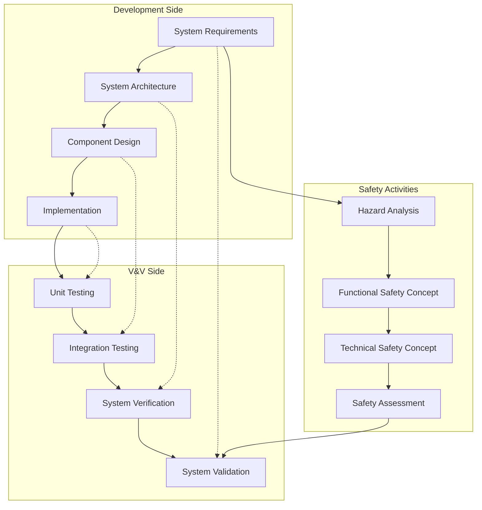
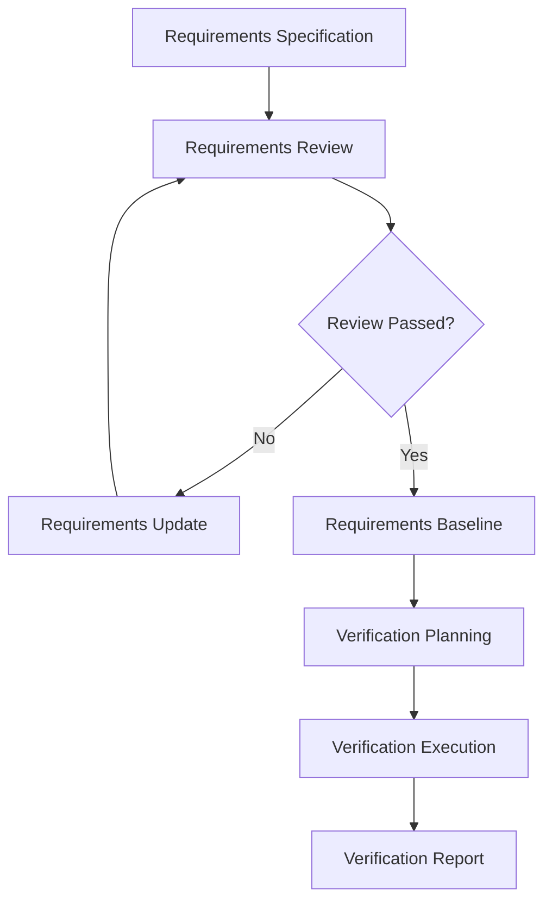
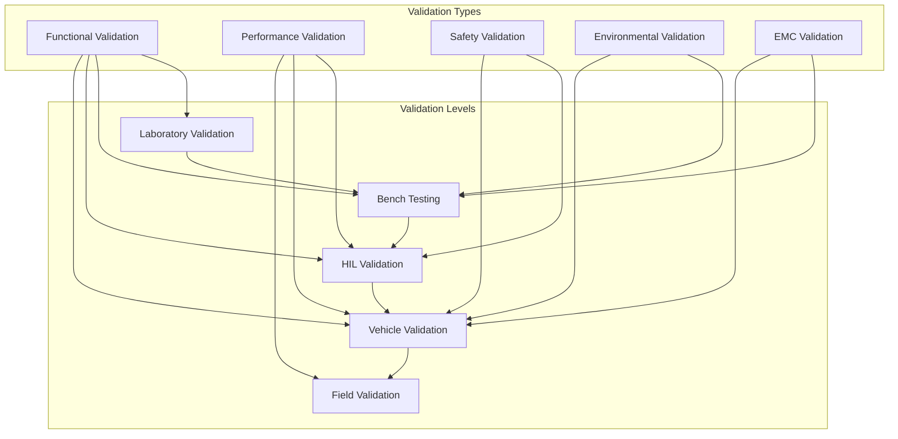
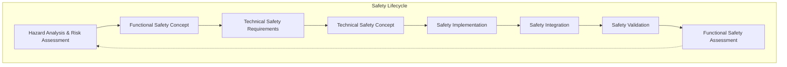
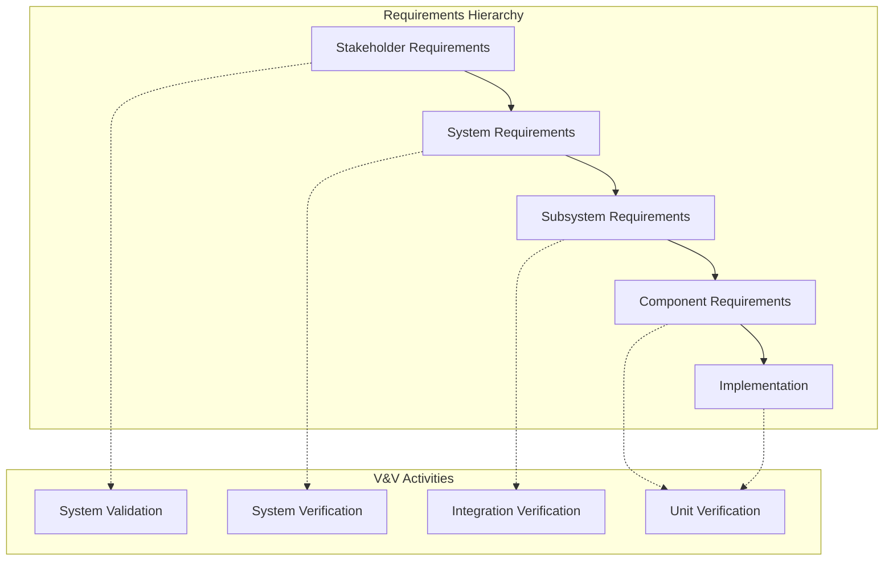
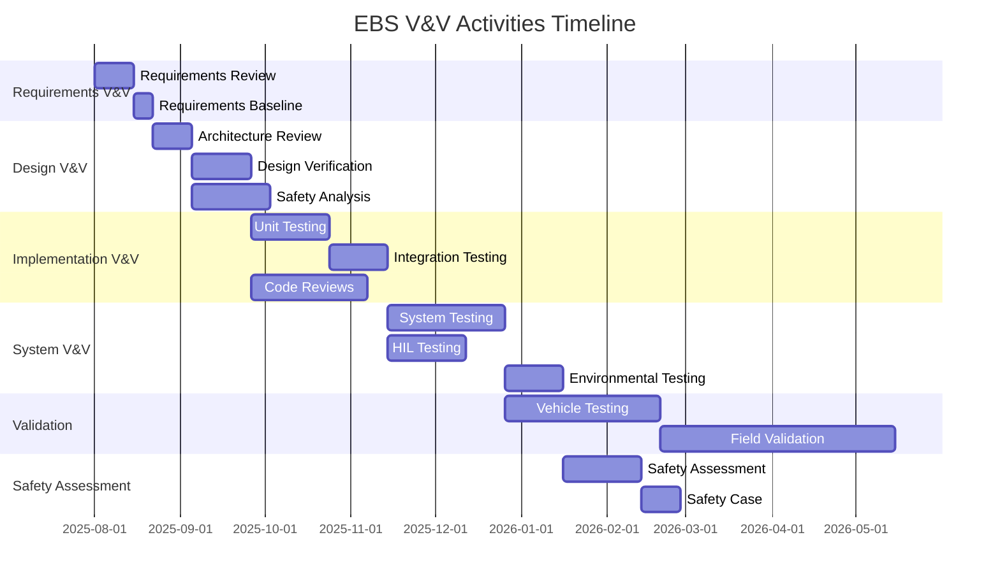
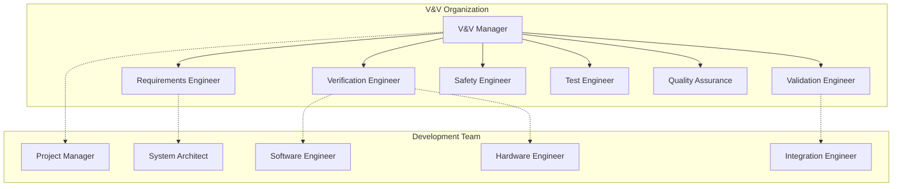

# Electronic Braking System (EBS) - Validation and Verification Plan

## Document Information
- **Document Title**: EBS Validation and Verification Plan
- **Version**: 1.0
- **Date**: 2025-07-29
- **Classification**: Technical Planning Document
- **Related Documents**: EBS_Requirements_Specification.md, EBS_Test_Specification.md

## Table of Contents
1. [Introduction](#introduction)
2. [V&V Strategy and Approach](#vv-strategy-and-approach)
3. [Verification Planning](#verification-planning)
4. [Validation Planning](#validation-planning)
5. [Safety Assessment Planning](#safety-assessment-planning)
6. [Requirements Traceability](#requirements-traceability)
7. [V&V Activities Schedule](#vv-activities-schedule)
8. [Resources and Responsibilities](#resources-and-responsibilities)
9. [Risk Management](#risk-management)
10. [Quality Assurance](#quality-assurance)
11. [Configuration Management](#configuration-management)
12. [Reporting and Documentation](#reporting-and-documentation)

---

## 1. Introduction

### 1.1 Purpose
This document defines the comprehensive Validation and Verification (V&V) plan for the Electronic Braking System (EBS), ensuring that the system meets all specified requirements and is suitable for its intended use in automotive applications.

### 1.2 Scope
The V&V plan covers:
- Verification activities to ensure the system is built correctly
- Validation activities to ensure the right system is built
- Safety assessment activities for functional safety compliance
- Requirements traceability throughout the development lifecycle
- Quality assurance and configuration management processes

### 1.3 Definitions
- **Verification**: Confirmation by examination and provision of objective evidence that specified requirements have been fulfilled
- **Validation**: Confirmation by examination and provision of objective evidence that the requirements for a specific intended use are fulfilled
- **Safety Assessment**: Systematic evaluation of safety-related aspects of the system

### 1.4 V&V Objectives
- **Completeness**: Verify all requirements are implemented and validated
- **Correctness**: Ensure the system functions as specified
- **Safety**: Validate safety requirements and functional safety compliance
- **Performance**: Verify performance requirements are met
- **Reliability**: Validate system reliability and availability
- **Compliance**: Ensure regulatory and standard compliance

---

## 2. V&V Strategy and Approach

### 2.1 V-Model Implementation

### 2.2 V&V Approach by System Level

| System Level | Verification Focus | Validation Focus | Methods |
|--------------|-------------------|------------------|---------|
| **System Level** | Requirements compliance | User needs satisfaction | System testing, field trials |
| **Subsystem Level** | Interface compliance | Functional behavior | Integration testing, HIL testing |
| **Component Level** | Design specification | Component function | Component testing, SIL testing |
| **Unit Level** | Code correctness | Algorithm behavior | Unit testing, static analysis |

### 2.3 V&V Activities by ASIL Level

#### 2.3.1 ASIL-D Activities (Critical Functions)
- **Requirements**: Formal specification and review
- **Design**: Independent verification and validation
- **Implementation**: 100% MC/DC code coverage
- **Testing**: Comprehensive fault injection testing
- **Assessment**: Independent safety assessment

#### 2.3.2 ASIL-C Activities (Important Functions)
- **Requirements**: Semi-formal specification
- **Design**: Independent verification
- **Implementation**: 100% decision coverage
- **Testing**: Structural and functional testing
- **Assessment**: Safety assessment with review

#### 2.3.3 ASIL-B/A Activities (Supporting Functions)
- **Requirements**: Structured specification
- **Design**: Review-based verification
- **Implementation**: Statement/branch coverage
- **Testing**: Functional testing
- **Assessment**: Review-based assessment

---

## 3. Verification Planning

### 3.1 Requirements Verification

#### 3.1.1 Requirements Review Process

**Requirements Review Criteria:**
- **Completeness**: All necessary requirements are specified
- **Consistency**: No contradictory requirements
- **Clarity**: Requirements are unambiguous
- **Testability**: Requirements can be verified
- **Traceability**: Requirements are traceable to higher-level requirements

#### 3.1.2 Requirements Verification Matrix

| Requirement ID | Verification Method | Test Case ID | Verification Status |
|----------------|-------------------|--------------|-------------------|
| REQ-FUNC-001 | Testing | SYS_001 | Planned |
| REQ-FUNC-002 | Testing | SYS_002 | Planned |
| REQ-PERF-001 | Testing | PERF_001 | Planned |
| REQ-SAFE-001 | Analysis + Testing | SAFETY_001 | Planned |

### 3.2 Design Verification

#### 3.2.1 Architecture Verification
- **Design Reviews**: Formal architecture review sessions
- **Design Analysis**: Static analysis of system architecture
- **Interface Verification**: Verification of interface specifications
- **Safety Analysis**: FMEA, FTA, and hazard analysis
- **Performance Analysis**: Timing and resource utilization analysis

#### 3.2.2 Software Verification
- **Code Reviews**: Peer review of all safety-critical code
- **Static Analysis**: MISRA C compliance and code quality analysis
- **Dynamic Analysis**: Runtime behavior verification
- **Coverage Analysis**: Code coverage measurement and analysis
- **Complexity Analysis**: Cyclomatic complexity measurement

### 3.3 Implementation Verification

#### 3.3.1 Unit Verification
- **Unit Testing**: White-box testing of individual functions
- **Code Coverage**: Statement, branch, and MC/DC coverage
- **Static Analysis**: Automated code analysis tools
- **Peer Review**: Code review by independent developers

#### 3.3.2 Integration Verification
- **Interface Testing**: Verification of component interfaces
- **Data Flow Testing**: Verification of data flow between components
- **Control Flow Testing**: Verification of control flow logic
- **Resource Testing**: Memory and CPU utilization verification

---

## 4. Validation Planning

### 4.1 System Validation Strategy

#### 4.1.1 Validation Approach

### 4.2 Functional Validation

#### 4.2.1 ABS Function Validation
**Validation Objectives:**
- Verify ABS prevents wheel lockup under all conditions
- Validate optimal braking performance on various surfaces
- Confirm driver control is maintained during ABS operation

**Validation Methods:**
- HIL simulation with vehicle dynamics models
- Proving ground testing on various surfaces
- Real-world driving scenarios

**Acceptance Criteria:**
- Wheel slip maintained below 15% threshold
- Stopping distance within regulatory limits
- Vehicle stability and steerability preserved

#### 4.2.2 ESC Function Validation
**Validation Objectives:**
- Verify ESC prevents loss of vehicle control
- Validate stability intervention effectiveness
- Confirm minimal impact on normal driving

**Validation Methods:**
- Standardized test maneuvers (sine-with-dwell, J-turn)
- Extreme weather condition testing
- Professional driver evaluation

**Acceptance Criteria:**
- Vehicle remains within stability boundaries
- ESC intervention is smooth and effective
- Driver maintains control in all scenarios

#### 4.2.3 TCS Function Validation
**Validation Objectives:**
- Verify TCS prevents excessive wheel spin
- Validate traction optimization during acceleration
- Confirm smooth power delivery

**Validation Methods:**
- Low friction surface testing
- Hill start scenarios
- Various load conditions

**Acceptance Criteria:**
- Drive wheel slip maintained at optimal level
- Smooth acceleration without wheel spin
- No negative impact on vehicle performance

### 4.3 Performance Validation

#### 4.3.1 Response Time Validation
**Validation Objectives:**
- Verify system response times meet specifications
- Validate real-time performance under all conditions
- Confirm deterministic behavior

**Test Scenarios:**
- Emergency braking response time
- ABS activation time
- ESC intervention time
- System initialization time

**Measurement Methods:**
- High-speed data acquisition systems
- Oscilloscope measurements
- Statistical analysis of response times

#### 4.3.2 Accuracy Validation
**Validation Objectives:**
- Verify sensor accuracy meets specifications
- Validate control algorithm precision
- Confirm system calibration accuracy

**Test Methods:**
- Reference standard comparisons
- Calibrated test equipment
- Statistical accuracy analysis

### 4.4 Environmental Validation

#### 4.4.1 Temperature Validation
**Test Conditions:**
- Operating temperature range: -40°C to +85°C
- Storage temperature range: -55°C to +125°C
- Temperature cycling: 1000 cycles

**Validation Criteria:**
- Full functionality maintained across temperature range
- Performance degradation within acceptable limits
- No permanent damage from temperature extremes

#### 4.4.2 Vibration and Shock Validation
**Test Standards:**
- ISO 16750-3 for automotive vibration
- Mechanical shock per automotive standards
- Long-term durability testing

**Validation Criteria:**
- No functional failures during vibration
- Mechanical integrity maintained
- Electrical connections remain secure

---

## 5. Safety Assessment Planning

### 5.1 Functional Safety Assessment

#### 5.1.1 Safety Lifecycle Activities

#### 5.1.2 Safety Assessment Activities

**Item Definition and HARA:**
- Define EBS system boundaries and interfaces
- Identify operational situations and hazards
- Assess risk and determine ASIL levels
- Define safety goals

**Functional Safety Concept:**
- Derive functional safety requirements
- Allocate safety requirements to system elements
- Define safe states and fault detection mechanisms
- Specify warning and degradation strategies

**Technical Safety Concept:**
- Implement safety mechanisms in hardware and software
- Define safety architecture and redundancy
- Specify diagnostic coverage and fault handling
- Design fail-safe and fail-operational behaviors

### 5.2 Safety Validation Activities

#### 5.2.1 Safety Mechanism Validation
**Fault Injection Testing:**
- Hardware fault injection (power, signals, components)
- Software fault injection (memory corruption, timing faults)
- Environmental fault injection (temperature, vibration, EMI)

**Diagnostic Coverage Validation:**
- Verify fault detection mechanisms
- Measure diagnostic coverage ratios
- Validate fault reaction times
- Confirm safe state transitions

#### 5.2.2 Safety Case Development
**Safety Argument Structure:**
- Top-level safety claims
- Supporting evidence from V&V activities
- Confidence arguments for evidence quality
- Explicit treatment of uncertainties and assumptions

**Evidence Collection:**
- Test results and analysis reports
- Review records and inspection reports
- Analysis results (FMEA, FTA, etc.)
- Expert judgments and assessments

---

## 6. Requirements Traceability

### 6.1 Traceability Strategy

#### 6.1.1 Traceability Levels

#### 6.1.2 Traceability Matrix Structure

| Stakeholder Req | System Req | Component Req | Test Case | Verification Method | Status |
|----------------|------------|---------------|-----------|-------------------|--------|
| STAKE-001 | SYS-FUNC-001 | COMP-ABS-001 | TC-ABS-001 | Testing | Planned |
| STAKE-002 | SYS-PERF-001 | COMP-ECU-001 | TC-PERF-001 | Analysis + Testing | Planned |

### 6.2 Traceability Management

#### 6.2.1 Traceability Tools
- **Requirements Management**: IBM DOORS or PTC Integrity
- **Test Management**: Polarion ALM or TestRail
- **Traceability Analysis**: Automated traceability reports
- **Gap Analysis**: Identification of missing traces

#### 6.2.2 Traceability Verification
- **Forward Traceability**: From requirements to implementation
- **Backward Traceability**: From implementation to requirements
- **Bidirectional Traceability**: Complete trace relationships
- **Impact Analysis**: Change impact assessment

---

## 7. V&V Activities Schedule

### 7.1 V&V Timeline

### 7.2 Milestone Schedule

| Milestone | Date | Deliverables | Criteria |
|-----------|------|--------------|----------|
| **Requirements Baseline** | 2025-08-15 | Verified requirements specification | All requirements reviewed and approved |
| **Design Verification Complete** | 2025-09-15 | Design verification report | All design elements verified |
| **Unit Testing Complete** | 2025-10-15 | Unit test report, code coverage report | 100% code coverage achieved |
| **Integration Testing Complete** | 2025-11-01 | Integration test report | All interfaces verified |
| **System Testing Complete** | 2025-12-15 | System test report | All system requirements verified |
| **Vehicle Testing Complete** | 2026-02-15 | Vehicle test report | All validation objectives met |
| **Safety Assessment Complete** | 2026-03-15 | Safety assessment report | Functional safety compliance demonstrated |

---

## 8. Resources and Responsibilities

### 8.1 V&V Organization

#### 8.1.1 V&V Team Structure

#### 8.1.2 Roles and Responsibilities

**V&V Manager:**
- Overall V&V planning and coordination
- Resource allocation and schedule management
- V&V process definition and improvement
- Stakeholder communication and reporting

**Requirements Engineer:**
- Requirements analysis and verification
- Requirements traceability management
- Requirements change impact assessment
- Requirements quality assurance

**Verification Engineer:**
- Verification planning and execution
- Test case design and implementation
- Verification report generation
- Defect analysis and resolution

**Validation Engineer:**
- Validation planning and execution
- User acceptance testing coordination
- Field trial management
- Customer feedback integration

**Safety Engineer:**
- Safety assessment planning and execution
- Hazard analysis and risk assessment
- Safety case development
- Functional safety compliance

### 8.2 Resource Requirements

#### 8.2.1 Human Resources

| Role | FTE | Duration | Skills Required |
|------|-----|----------|----------------|
| **V&V Manager** | 1.0 | 18 months | V&V processes, project management |
| **Requirements Engineer** | 1.0 | 12 months | Requirements engineering, traceability |
| **Verification Engineer** | 2.0 | 15 months | Testing, automation, analysis |
| **Validation Engineer** | 1.5 | 12 months | Vehicle testing, customer validation |
| **Safety Engineer** | 1.0 | 18 months | ISO 26262, safety assessment |
| **Test Engineer** | 3.0 | 15 months | Test automation, HIL, vehicle testing |

#### 8.2.2 Equipment and Infrastructure

**Test Equipment:**
- HIL systems: $500K
- Environmental chambers: $200K
- EMC test equipment: $300K
- Vehicle instrumentation: $150K
- Test vehicles: $200K

**Software Tools:**
- Requirements management: $50K
- Test management: $30K
- Static analysis tools: $40K
- Simulation software: $100K

**Facilities:**
- Test laboratory: 500 m²
- Vehicle testing facility access
- Environmental test chamber access
- EMC test facility access

---

## 9. Risk Management

### 9.1 V&V Risk Assessment

#### 9.1.1 Risk Categories
- **Technical Risks**: Technology limitations, complexity
- **Schedule Risks**: Resource availability, dependencies
- **Quality Risks**: Defect rates, rework requirements
- **Safety Risks**: Safety requirement compliance
- **Regulatory Risks**: Standard compliance, approval delays

#### 9.1.2 Risk Register

| Risk ID | Risk Description | Probability | Impact | Risk Level | Mitigation Strategy |
|---------|------------------|-------------|--------|------------|-------------------|
| VV-R001 | HIL system delivery delay | Medium | High | High | Early procurement, backup plan |
| VV-R002 | Test vehicle availability | Low | Medium | Medium | Multiple vehicle booking |
| VV-R003 | Weather delays for testing | High | Low | Medium | Indoor testing alternatives |
| VV-R004 | Safety assessment delays | Medium | High | High | Early safety engineer engagement |
| VV-R005 | Requirements changes | High | Medium | High | Change control process |

### 9.2 Risk Mitigation Strategies

#### 9.2.1 Technical Risk Mitigation
- **Early Prototyping**: Build early prototypes to identify technical issues
- **Technology Assessment**: Evaluate technology maturity and alternatives
- **Expert Consultation**: Engage domain experts for complex areas
- **Incremental Development**: Use incremental approach to reduce complexity

#### 9.2.2 Schedule Risk Mitigation
- **Buffer Time**: Include schedule buffers for critical activities
- **Parallel Activities**: Execute activities in parallel where possible
- **Resource Flexibility**: Cross-train team members for flexibility
- **Vendor Management**: Manage vendor dependencies proactively

---

## 10. Quality Assurance

### 10.1 V&V Quality Framework

#### 10.1.1 Quality Objectives
- **Completeness**: All requirements are verified and validated
- **Correctness**: V&V activities are performed correctly
- **Consistency**: V&V results are consistent and repeatable
- **Traceability**: Complete traceability from requirements to results
- **Documentation**: Comprehensive documentation of all activities

#### 10.1.2 Quality Metrics

| Metric | Target | Measurement Method |
|--------|--------|--------------------|
| **Requirements Coverage** | 100% | Traceability analysis |
| **Test Case Coverage** | 100% | Test management tool |
| **Defect Detection Rate** | >95% | Defect analysis |
| **Test Execution Rate** | >98% | Test execution reports |
| **Review Effectiveness** | >90% | Review metrics |

### 10.2 Quality Assurance Activities

#### 10.2.1 Process Quality Assurance
- **Process Compliance**: Verify adherence to defined V&V processes
- **Process Improvement**: Continuous improvement of V&V processes
- **Best Practices**: Implementation of industry best practices
- **Lessons Learned**: Capture and apply lessons learned

#### 10.2.2 Product Quality Assurance
- **Deliverable Reviews**: Review all V&V deliverables
- **Quality Gates**: Implement quality gates at key milestones
- **Independent Assessment**: Independent quality assessment
- **Customer Satisfaction**: Monitor customer satisfaction with V&V results

---

## 11. Configuration Management

### 11.1 V&V Configuration Management

#### 11.1.1 Configuration Items
- V&V plans and procedures
- Test specifications and test cases
- Test data and test results
- V&V tools and environments
- V&V reports and documentation

#### 11.1.2 Version Control Strategy
- **Baseline Management**: Establish and maintain V&V baselines
- **Change Control**: Control changes to V&V configuration items
- **Version Identification**: Unique identification of all versions
- **Release Management**: Controlled release of V&V deliverables

### 11.2 Traceability Management

#### 11.2.1 Traceability Database
- **Requirements Traceability**: Link requirements to V&V activities
- **Test Traceability**: Link test cases to requirements and results
- **Defect Traceability**: Link defects to requirements and fixes
- **Change Traceability**: Track changes and their impacts

#### 11.2.2 Configuration Audits
- **Physical Audits**: Verify physical configuration items
- **Functional Audits**: Verify functional configuration
- **Traceability Audits**: Verify traceability completeness
- **Process Audits**: Verify process compliance

---

## 12. Reporting and Documentation

### 12.1 V&V Reporting Structure

#### 12.1.1 Report Types
- **Progress Reports**: Weekly/monthly progress updates
- **Milestone Reports**: Reports at key milestones
- **Test Reports**: Detailed test execution reports
- **Assessment Reports**: Safety and quality assessment reports
- **Final V&V Report**: Comprehensive final report

#### 12.1.2 Report Distribution

| Report Type | Frequency | Recipients |
|-------------|-----------|------------|
| **Progress Report** | Weekly | Project team, management |
| **Milestone Report** | At milestones | Stakeholders, customers |
| **Test Report** | After test phases | Technical team, QA |
| **Assessment Report** | After assessments | Safety team, management |
| **Final Report** | Project completion | All stakeholders |

### 12.2 Documentation Standards

#### 12.2.1 Document Templates
- Standardized templates for all V&V documents
- Consistent formatting and structure
- Required sections and content
- Review and approval processes

#### 12.2.2 Document Control
- **Version Control**: All documents under version control
- **Access Control**: Controlled access to sensitive documents
- **Archive Management**: Long-term document archival
- **Document Retrieval**: Efficient document search and retrieval

---

## Document Control

### V&V Plan Change Control

#### Change Management Process
1. **Change Request**: Formal change request submission
2. **Impact Analysis**: Assessment of change impact on V&V activities
3. **Approval**: Change approval by V&V manager and stakeholders
4. **Implementation**: Update of V&V plans and procedures
5. **Communication**: Notification to all affected parties
6. **Verification**: Verification of plan changes

### Revision History
| Version | Date | Author | Changes |
|---------|------|--------|---------|
| 1.0 | 2025-07-29 | V&V Manager | Initial V&V plan |

### Approval
- **V&V Manager**: [Signature Required]
- **Project Manager**: [Signature Required]
- **Quality Manager**: [Signature Required]
- **Safety Manager**: [Signature Required]
- **Date**: [Approval Date]

---

*This document contains proprietary and confidential information. Distribution is restricted to authorized personnel only.*